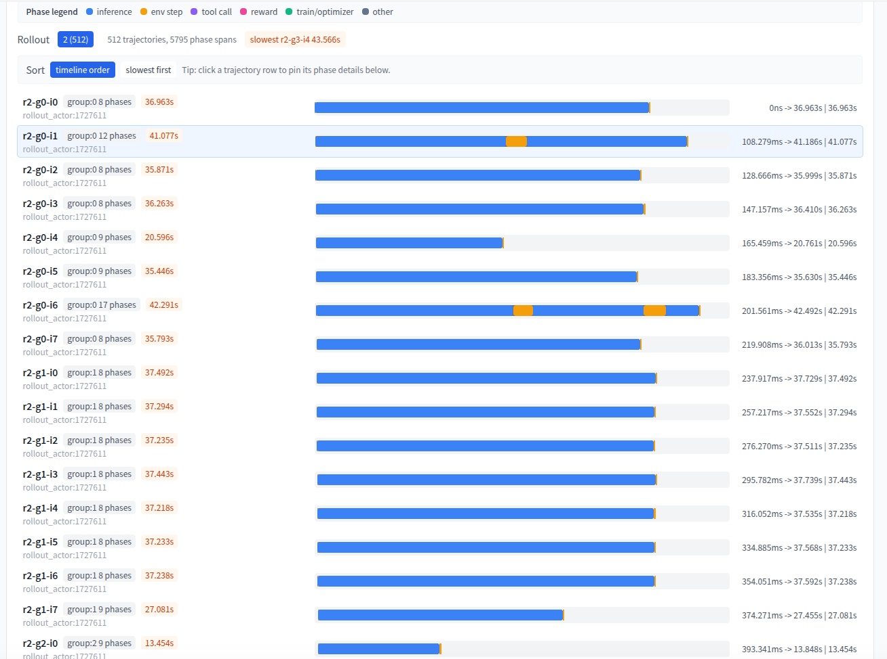
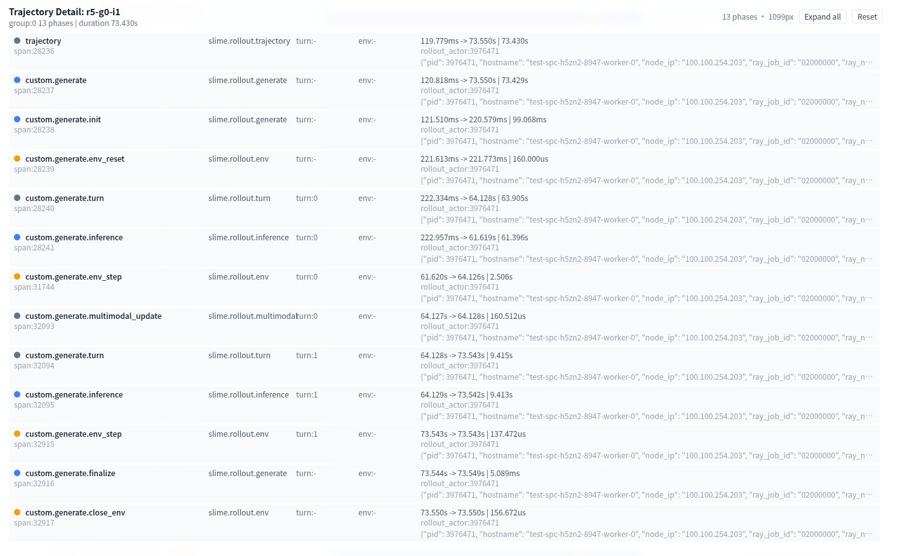
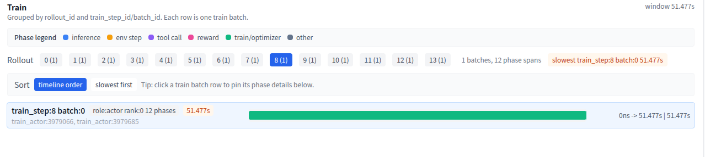
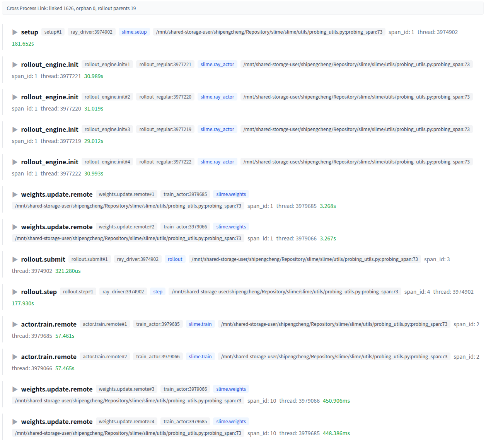
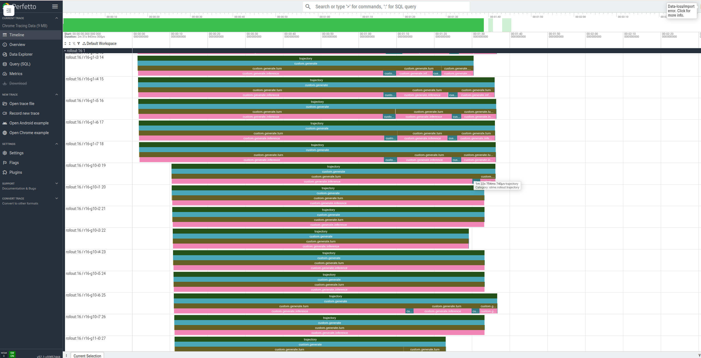

# Agentic RL 诊断系统（Probing-RL）

Probing-RL 是基于 [Probing](../README.md) 的 **Agentic RL 在线诊断工具**：在训练或 rollout 仍在运行时，以 **Sample / Turn / Phase** 粒度观测整条 Agent 轨迹，并支持跨进程 Span 关联、Perfetto 导出、SQL 查询与进程注入调试。它不替代 Slime、veRL、XTuner 等训练框架，而是作为 Sidecar 挂载在各角色进程上，补充框架内置 Profiler 通常缺少的 **样本语义、全链路与在线** 观测能力。

Agentic RL 的性能问题常表现为 GPU 空转，根因却可能在 Sandbox、Tool、Reward 等上游环节跨进程传导。Probing-RL 用于回答：哪条 sample、哪一轮 tool、哪个 phase 拖慢了 rollout，以及 Driver、Rollout Worker、Trainer 之间如何关联。

---

## 适用场景

| 场景 | 说明 |
|------|------|
| Rollout 慢、GPU 利用率低 | 按 sample 找 straggler，查看 inference / env / tool / reward 各 phase 耗时 |
| 多进程 / Ray 分布式 | 自动按 `rollout_id` 链接 Driver 与 Worker 上的 Span |
| 训练与 rollout 流水线 | Train 视图对照 `train_step_id`，看 buffer 与训练是否跟得上 |
| 需要下钻 | 从 RL 视图进入 Process Timeline、Perfetto 或 `probing query` SQL |
| 长跑 Job 现场排查 | `PROBING=1` 启动，或对运行中进程 `probing inject`，配合 REPL / backtrace |

与框架内置 Timeline / PyTorch Profiler **互补**：Kernel 与算子级调优仍用各框架自带工具；样本级 Agent 轨迹诊断用 Probing-RL。

---

## 架构

```text
训练框架（Slime / veRL / XTuner / 自研 Agent Runtime）
  Driver ─ Rollout Workers ─ Sandbox / Tools ─ Trainers
                    │ probing.rl spans + 可选 Ray hook
                    ▼
         Probing Runtime（Rust 引擎 + 列存 + SQL）
           · 动态注入 attach 运行中进程
           · 跨节点 span 聚合
                    ▼
         Web UI：Rollout / Train / Spans / Perfetto / Inference
```

框架在关键边界打 Span 并传递 `rollout_id`、`sample_id`、`phase` 等**通用属性**；Web UI 只读这些契约字段，不依赖框架私有 span 名称（契约定义见 `web/src/rl_contract.rs`）。因此同一套 UI 可对接多种 RL 栈。

---

## 核心概念

| 概念 | 含义 |
|------|------|
| **Sample** | 一条完整 Agent 轨迹（一次 rollout 常含多条 sample） |
| **Turn** | 单轮 Agent 交互（推理 → 环境 / 工具 → 再推理） |
| **Phase** | 轨迹内分段类型，如 `inference`、`env.step`、`tool.call`、`reward` |
| **Rollout** | 一次批量采样任务，由 `rollout_id` 标识 |
| **Train step** | 一次训练更新，由 `train_step_id` / `batch_id` 标识 |

---

## 功能说明

### Rollout 视图



- 一行一个 **sample**，以色条展示各 **phase** 耗时（inference、env.step、tool.call、reward 等）
- 支持按最慢 sample 排序、详情面板固定（pin），便于定位 straggler
- 适用于「512 条轨迹里哪几条特别慢」类问题



### Train 视图



- 按 `train_step_id` / `batch_id` 展示 `train.prepare`、`train.loss`、`optimizer.step` 等阶段
- 用于对照 rollout 与训练是否重叠、buffer 是否成为瓶颈

### 跨进程 Span 关联

分布式 Agentic RL 中 Driver、Rollout Actor、Trainer 往往在不同进程。Probing-RL 通过：

- **`rl.export_context()` / `rl.import_context()`** — 在 RPC 间传递 rollout / sample 上下文（基于 `contextvars`，兼容 async）
- **`rollout_id` + `step_id` + `actor_role`** — 前端将 Worker 上的 child span 挂到 Driver 的 `rollout.step` 下
- **Ray 集成** — `ray.init(_tracing_startup_hook="probing.ext.ray:setup_tracing")` 采集 task / actor 元数据

在 **Spans 视图** 中可查看跨进程的完整调用关系，无需手工合并 Chrome Trace。



### 多层下钻

同一份 span 数据支持不同粒度分析：

| 层级 | 入口 | 典型用途 |
|------|------|----------|
| 逻辑 | Rollout / Train 视图 | 找慢 sample、慢 phase |
| 进程 | Process Timeline | 某 worker 上 span 时间分布 |
| 系统 | Perfetto 导出 | Kernel / 算子时间线 |
| 查询 | `probing query` SQL | 自定义聚合与报表 |
| 运行时 | `probing repl` / backtrace | 不重启 Job，查变量与堆栈 |



### 推理引擎指标（SGLang 等）

除 Agent 轨迹外，Probing 还可抓取推理引擎 Prometheus 指标，在 **`/inference`** 页面展示并发、吞吐、TPOT、TTFT、KV cache 等。


详见 [inference-engine-metrics.md](./inference-engine-metrics.md)。

### 采集与注入

- 启动时设置 `PROBING=1`（HTTP 面板需同时设置 `PROBING_PORT`）
- 对已在运行的进程：`probing -t <pid> inject`
- 可通过 `PROBING_SAMPLE_RATE` 等环境变量调节采样与 retention

---

## 快速开始

### 1. 启动带 Web UI 的训练或 Demo 进程

```bash
export PROBING=1
export PROBING_PORT=8080

python your_train_script.py
```

浏览器打开 `http://127.0.0.1:8080`，进入 Rollout / Train / Spans 等页面。

Ray 相关示例可参考：

```bash
PROBING=1 PROBING_PORT=8080 python examples/ray_job_actor_span_demo.py
```

### 2. 在代码中打 Span（最小契约）

```python
import probing.rl as rl

with rl.context(framework="slime", rollout_id=12, trajectory_id="t-3", actor_role="rollout"):
    with rl.span("inference.generate", phase="inference", turn_id=0):
        ...
    with rl.span("env.step", phase="env.step", turn_id=0):
        ...
    with rl.span("tool.call", phase="tool.call", turn_id=1):
        ...
    with rl.span("reward.compute", phase="reward"):
        ...

# Ray 远程：传递上下文
carrier = rl.export_context()
ray.get(trainer.train.remote(batch, carrier))
```

建议在以下边界打 Span，即可驱动完整 UI：

1. rollout 提交 / 等待  
2. sample 生命周期  
3. agent turn  
4. 推理（inference）  
5. 环境步（env.step）  
6. 工具调用（tool.call）  
7. reward 计算  
8. batch 准备与 optimizer / 权重更新  

### 3. 对运行中进程注入

```bash
probing -t <pid> inject
```

注入后可通过 Unix socket 或 HTTP（若已配置 `PROBING_PORT`）访问同一套 UI 与 API。

---

## 环境变量（常用）

| 变量 | 说明 |
|------|------|
| `PROBING` | 设为 `1` 启用 Probing |
| `PROBING_PORT` | HTTP Web UI 端口（如 `8080`） |
| `PROBING_ASSETS_ROOT` | 前端静态资源目录（如 `web/dist`） |
| `PROBING_SAMPLE_RATE` | Span 采样率 |
| `PROBING_ENGINE_SCRAPE` / `PROBING_ENGINE_SCRAPE_INTERVAL` | 推理引擎指标后台抓取开关与间隔 |

---

## 相关文档

- [README.md](../README.md) / [README.cn.md](../README.cn.md) — 项目总览与 `probing.rl` API 摘要  
- [inference-engine-metrics.md](./inference-engine-metrics.md) — 推理引擎指标展示（SGLang）
