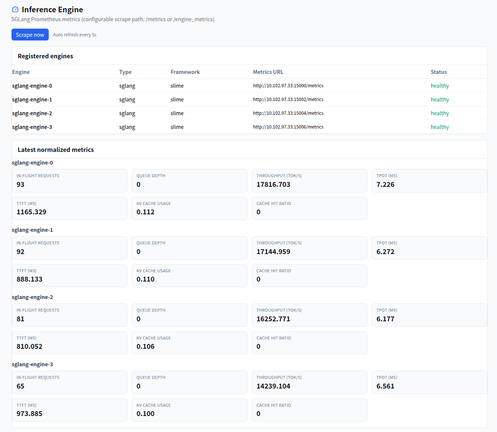
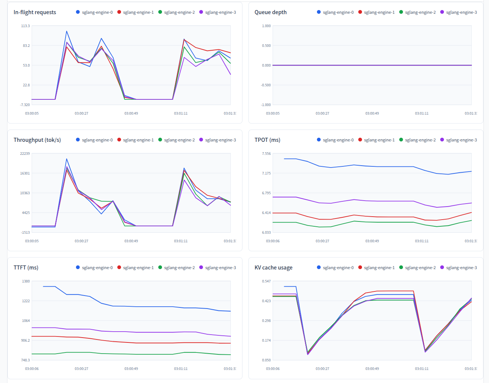

# 推理引擎指标展示（SGLang）

Probing 定期从推理引擎抓取 Prometheus 指标，归一化后在 Web UI 的 **`/inference`** 页面展示。当前已实现 **SGLang** 适配，不依赖 Slime。

## 功能概述

Probing 后台每隔约 5 秒从已注册的推理引擎 **指标端点** 抓取一次 Prometheus 文本，将各引擎不同的指标名映射为统一的 **7 个归一化指标**，供页面上的数字卡片与折线图使用。历史采样写入 SQL 表 `python.inference_engine_metric`（`metric_name` 以 `normalized.` 为前缀）。

指标路径可配置：

| 部署方式 | 默认路径 |
|----------|----------|
| Slime `sglang_router` / model gateway | `/engine_metrics` |
| `sglang.launch_server --enable-metrics` | `/metrics` |

注册引擎时通过 `metrics_path` 指定，或设置环境变量 `PROBING_ENGINE_METRICS_PATH`。

## 数据流

```
SGLang 指标端点（/metrics 或 /engine_metrics）
  → Probing 后台定期抓取（默认每 5 秒）
  → 归一化为 7 个 canonical 指标
  → 写入 python.inference_engine_metric，并更新引擎 registry 中的最新值
  → Web UI /inference 页面轮询展示（卡片 + 折线图）
```

## Web UI 布局

`/inference` 页面包含三个区块：





1. **Registered engines** — 已注册引擎列表（引擎 ID、类型、指标 URL、健康状态）
2. **Latest normalized metrics** — 各引擎 7 项指标的最新数值卡片
3. **Metric trends (time series)** — 7 项指标随时间变化的折线图（默认每 5 秒自动刷新，也可点击 **Scrape now** 立即抓取）

## 归一化指标

页面固定展示以下 7 项指标（内部 key 用于存储与 API，UI 为可读标题）：

| UI 名称 | 内部 key | 含义 |
|---------|----------|------|
| In-flight requests | `inflight_requests` | 当前正在执行、尚未完成的推理请求数量 |
| Queue depth | `queue_depth` | 已进入系统但尚在排队、等待调度的请求数量 |
| Throughput (tok/s) | `throughput_tps` |  token 生成吞吐量，单位 tokens/s |
| TPOT (ms) | `tpot_ms` | Time Per Output Token：每生成一个输出 token 的平均耗时（毫秒） |
| TTFT (ms) | `ttft_ms` | Time To First Token：从请求到达到产出第一个 token 的平均耗时（毫秒） |
| KV cache usage | `kv_cache_usage_ratio` | KV cache 内存池占用比例，取值 0～1 |
| Cache hit ratio | `cache_hit_ratio` | Prefix cache（radix cache）命中率，取值 0～1 |

若某时刻引擎未暴露对应原始指标，或尚无推理负载，卡片可能显示 `—`，折线图可能暂无采样点。

## 如何使用

以下说明如何在 Probing 中接入并展示 **真实 SGLang 推理服务**（`sglang.launch_server`）。

### 前置：构建 Web UI

在仓库根目录执行（需已安装 [Dioxus CLI](https://dioxuslabs.com/learn/0.6/getting_started/) `dx`）：

```bash
cd web
dx build --release
mkdir -p dist
cp -r target/dx/web/release/web/public/* dist/
```

完成后存在 `web/dist/index.html`，后续将 `PROBING_ASSETS_ROOT` 设为 `web/dist`。

### 步骤 1：启动 SGLang 推理服务

在 GPU 节点启动 SGLang，**必须**加上 `--enable-metrics`，指标暴露在 `/metrics`：

```bash
python -m sglang.launch_server \
  --model-path <你的模型路径> \
  --host 0.0.0.0 \
  --port 30000 \
  --enable-metrics
```

确认指标端点可用：

```bash
curl -s http://127.0.0.1:30000/metrics | head
```

### 步骤 2：启动 Probing 并注册引擎

在仓库根目录、另一终端执行：

```bash
export PROBING=1
export PROBING_PORT=8080
export PROBING_ASSETS_ROOT=web/dist

python examples/sglang_inference_metrics_demo.py \
  --engine-url http://127.0.0.1:30000 \
  --engine-id sglang-real \
  --num-requests 0 \
  --keep-alive-seconds 3600
```

说明：

- `PROBING_PORT` **必须设置**，否则只有 Unix socket，浏览器无法访问
- `PROBING_ASSETS_ROOT` 指向已构建的前端目录 `web/dist`
- 默认注册 `http://127.0.0.1:30000`，指标路径为 `/metrics`（由 demo 对外部引擎自动选择）
- 进程保持运行，后台每约 5 秒抓取一次指标

可修改 `--engine-url`、`--engine-id` 或 `PROBING_PORT` 等参数。

### 步骤 3：打开 Web UI

浏览器访问：

```
http://127.0.0.1:8080/inference
```

若在远程机器上运行，需将 `8080` 端口转发到本机后再访问。

### 步骤 4（推荐）：发送推理请求以产生指标

空闲时许多指标为 0。可持续向 SGLang 发 `/generate` 请求，例如：

```bash
while true; do
  curl -s -X POST http://127.0.0.1:30000/generate \
    -H "Content-Type: application/json" \
    -d '{"text":"Explain RL in one paragraph.","max_new_tokens":64}' \
    > /dev/null
  sleep 0.5
done
```

发送负载后，**Throughput**、**TPOT**、**TTFT**、**Cache hit ratio** 等折线会出现非零变化；页面约每 5 秒自动刷新，也可点击 **Scrape now** 立即抓取。

### 常用 API（可选）

| 接口 | 作用 |
|------|------|
| `GET /apis/pythonext/engines/snapshot` | 查看已注册引擎及最新归一化指标 |
| `GET /apis/pythonext/engines/scrape` | 立即触发一次指标抓取 |
| `GET /apis/pythonext/engines/register?router_addr=...&engine_type=sglang&metrics_path=/metrics` | 手动注册引擎 |

### 相关环境变量

| 变量 | 默认值 | 说明 |
|------|--------|------|
| `PROBING_PORT` | （未设置） | 设为 `8080` 等端口以启用 HTTP Web UI |
| `PROBING_ASSETS_ROOT` | （未设置） | Web 静态资源目录，通常为 `web/dist` |
| `PROBING_ENGINE_SCRAPE` | `1` | 是否启用后台定期抓取 |
| `PROBING_ENGINE_SCRAPE_INTERVAL` | `5` | 抓取间隔（秒） |
| `PROBING_ENGINE_METRICS_PATH` | `/engine_metrics` | 注册时未指定 `metrics_path` 的默认指标路径 |
