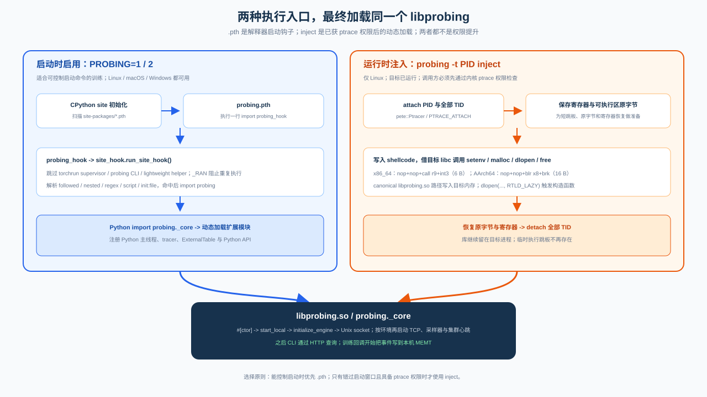
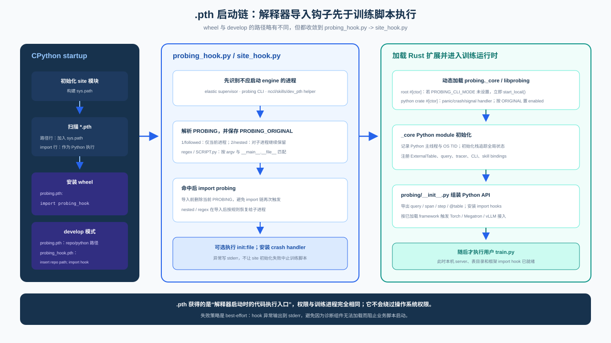
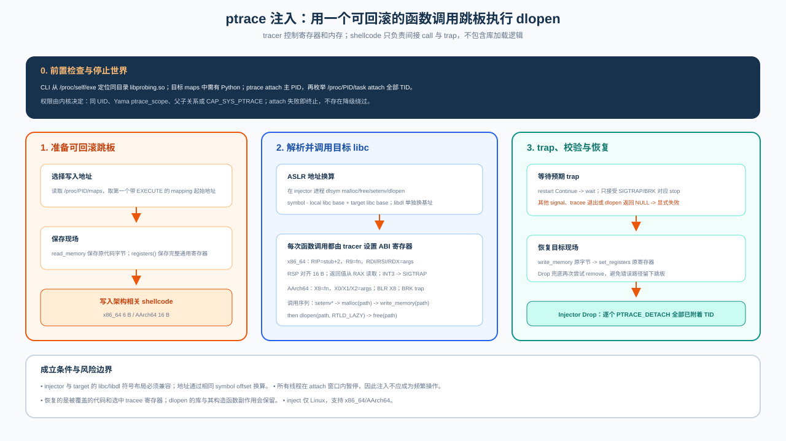
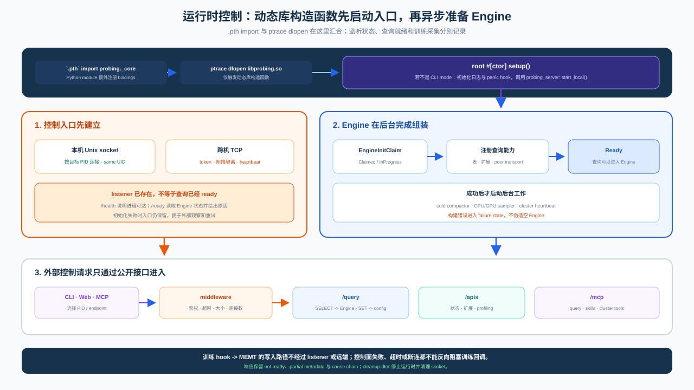
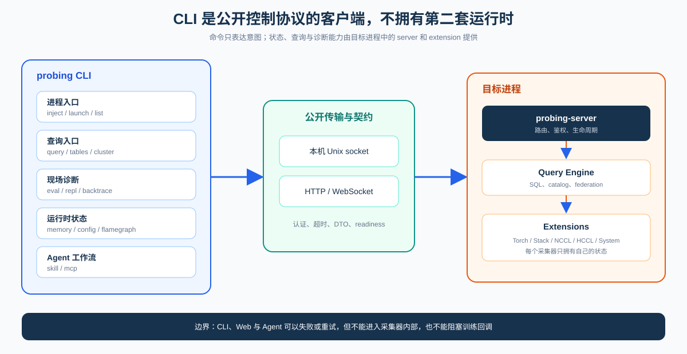

# Activation, Injection, and Runtime Control

Probing enters a target process through one of two paths: a CPython `.pth` startup hook, or Linux
ptrace injection into an already-running process. Both paths load the same `libprobing` and converge
on the same server, query engine, and extension composition root.

The activation path changes **when the library is loaded**. It does not create a second set of data
tables, collectors, or query APIs.

## Two activation paths

| Path | Use when | Trigger | Platform |
|------|----------|---------|----------|
| Startup hook | The training launch environment is controllable | `PROBING=1 python train.py` | Linux, macOS, Windows |
| Runtime injection | The job is already running and cannot restart | `probing -t <pid> inject` | Linux |

Both run with the target process's existing user and permissions. Injection is not a privilege
bypass: same-UID rules, parent/child relationships, Yama `ptrace_scope`, and `CAP_SYS_PTRACE` remain
kernel policy.

## Startup hook

During interpreter startup, Python's `site` module processes the installed `probing.pth`, which
imports `probing_hook.py` and then `site_hook.py`:

1. parse `PROBING`, preserve the original value, and apply process filters;
2. skip excluded subprocesses;
3. import `probing`, loading the Rust-backed `_core` module;
4. let the Rust library constructor prepare the server and extensions;
5. install optional Python-side Torch, crash, and framework integrations.

The `.pth` file only obtains one normal import opportunity. Configuration and readiness still
determine whether collectors and network listeners start.

## Runtime injection

The injector does not encode dynamic-loading policy in shellcode. It writes a tiny
architecture-specific call trampoline, while the tracer controls registers and ABI arguments for
`setenv`, `malloc`, `dlopen`, and `free` in the target process.

The sequence is:

1. attach the main thread and enumerate `/proc/<pid>/task`;
2. save the original instruction bytes and tracee registers;
3. translate libc/libdl symbol addresses from injector mappings to target mappings;
4. write an x86_64 `call` + `INT3` or AArch64 `BLR` + `BRK` trampoline;
5. accept only the expected trap and validate the `dlopen` result;
6. restore bytes and registers, then detach all attached threads.

Error paths also attempt restoration. Restoring the trampoline does not unload a successfully
loaded library; injection is a one-time control operation, not a sampling mechanism.

## Runtime readiness

Library load and query readiness are distinct states:

1. the constructor claims a local Unix socket or configured TCP listener;
2. the engine registers catalogs, data sources, and extensions in the background;
3. readiness moves from claimed/in-progress to ready;
4. CLI, Web, and MCP use documented HTTP interfaces;
5. training hooks append only to local tables and never wait for fan-out queries.

This lets clients distinguish “not injected,” “library loaded but engine initializing,” and “ready
for queries” instead of reporting every case as connection refusal.

## Control entry points and CLI structure

Once the library is ready, the CLI is a client of published protocols; it does not own a second
control implementation:

Invocation stays flat: `probing [-v] [-t TARGET] <command> ...`. Root help groups commands under
Processes, Analyze, Diagnose, Runtime, and Agent without changing their protocol boundaries.
Commands with their own actions, such as `skill` and `mcp`, may retain a second level.

`cluster query` and `cluster nodes` still exist. The target convergence is `query --global` and a
top-level `nodes`; documentation must not present those targets as implemented. Command registration
and per-command text live in `probing/cli/src/cli/commands.rs`; grouped root help lives in `help.rs`.
New commands must continue to use public HTTP/proto contracts.

## Invariants

- Both activation paths converge on one composition root.
- Shellcode only provides a remote call opportunity; collection and query logic stay in the library.
- Engine initialization or query failure must not terminate the host training process.
- Training callbacks perform no network I/O.
- CLI, Web, and MCP use published contracts rather than collector internals.
- Injection failure is explicit and must never be represented as an empty successful result.

## Implementation map

| Concern | Location |
|---------|----------|
| `.pth` and startup filtering | `python/probing.pth`, `python/probing_hook.py`, `python/probing/site_hook.py` |
| ptrace injection | `probing/cli/src/inject/` |
| Rust/Python library entry | root `src/lib.rs` and `probing._core` |
| Server composition root | `probing/server/src/engine.rs` |
| Public contracts | `probing/server/API.md`, `probing/proto/` |

See [Installation](../installation.md), [Core model](../guide/concepts.md), and
[Modularity & boundaries](modularity.md).
