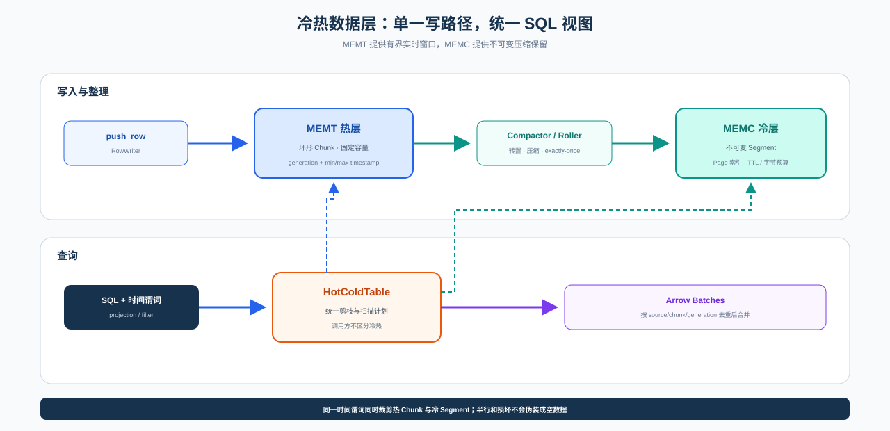
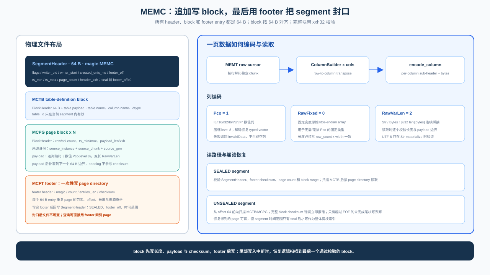
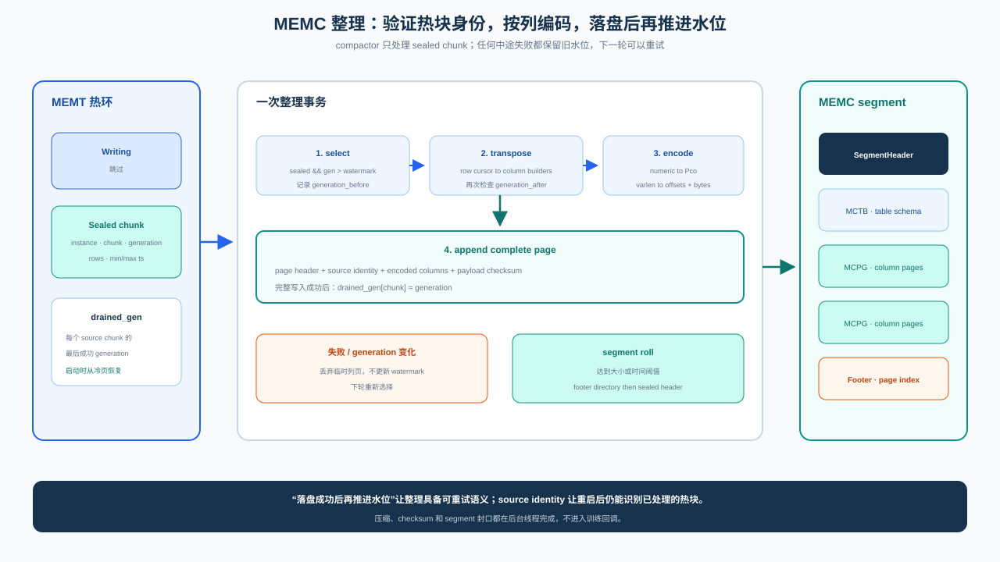

# Data Layer

Probing's data layer is a **per-process, crash-resilient, time-retained data plane** for
observability data (metrics, samples, traces). Every producer writes through one in-house
columnar store, [`probing-memtable`](https://github.com/DeepLink-org/probing), and every
consumer queries it through SQL (DataFusion). It is built as **two tiers**:

- a **hot tier** (`MEMT`): a fixed-capacity ring buffer for the live window — constant memory,
  zero-allocation writes;
- a **cold tier** (`MEMC`): immutable, compressed segments for time retention beyond the ring,
  with whole-file eviction.

A single SQL time predicate prunes and queries both tiers at once.

## Design Goals

- **Bounded resource use.** The hot ring never grows; the cold store is capped by a byte budget
  and TTL.
- **Crash resilience.** A process killed mid-write never surfaces torn rows; cold segments
  recover from a torn tail via forward scan.
- **Time retention.** Data that scrolls out of the hot ring survives in cold segments and stays
  queryable.
- **One write path, one read path.** Producers (server, Python/Torch extensions) all write
  `probing-memtable`; consumers all go through `probing-core::memtable_sql`.
- **Fork safety.** Correct under fork-heavy workloads (PyTorch DataLoader workers).

## Architecture

The hot tier is logically read-only at query time, but MEMT mappings are opened writable so
readers can update per-chunk pin metadata. The cold tier is read via `SegmentReader`. The
`HotColdTable` provider unions them into one scan, deduplicating chunks that exist in both tiers.

## Hot Tier (MEMT)

### File Layout

Every MEMT buffer begins with a 128-byte header, followed by column descriptors, a
crash-recoverable reader-lease array, then chunk data.

**Header v5 (128 bytes):**

| offset | size | field | notes |
|---|---|---|---|
| 0 | 4 | `magic` | `0x4D454D54` (`"MEMT"`) |
| 4 | 2 | `version` | 5 |
| 6 | 2 | `header_size` | 128 (validation) |
| 8 | 2 | `byte_order` | BOM `[0x01,0x02]` |
| 10 | 2 | `ts_col` | timestamp column index + 1 (0 = none) |
| 12 | 4 | `flags` | feature bits (`FLAG_DEDUP`, …) |
| 16 | 4 | `num_cols` | |
| 20 | 4 | `num_chunks` | ring slot count |
| 24 | 4 | `chunk_size` | bytes per chunk |
| 28 | 4 | `data_offset` | 64-aligned |
| 32 | 4 | `write_chunk` | `AtomicU32` — current ring slot |
| 36 | 4 | `refcount` | `AtomicU32` |
| 40 | 4 | `creator_pid` | |
| 44 | 4 | `_pad0` | alignment (was `write_lock` in v2) |
| 48 | 8 | `creator_start_time` | for PID-recycling detection during discovery |
| 56 | 8 | `_reserved` | reserved |
| 64 | 4 | `lease_offset` | absolute offset of the reader-lease array |
| 68 | 4 | `lease_slots` | lease slots per chunk (currently 16) |
| 72 | 56 | `_reserved_v5` | reserved |

Bytes 0–31 are the **cold zone** (immutable after init); bytes 32–63 are the **hot zone**
(atomically mutated), split to avoid false sharing. Each chunk starts with a 40-byte
`ChunkHeader` carrying a `generation` counter and per-chunk `min_ts`/`max_ts` (`AtomicI64`).
Each reader lease atomically stores a process PID plus local reference count and the process
start time. Recycling blocks new leases, preserves live readers, and reclaims leases only when
that exact process instance is dead.

> **v3** vs v2: `_pad0` became `ts_col`; dropped `write_lock` (single-writer model);
> `ChunkHeader` gained `min_ts`/`max_ts` (24 → 40 bytes).
>
> **v4** vs v3: the reserved chunk-header word became atomic `reader_pins`; query mappings
> must permit these metadata writes even though row data is read-only to callers.
>
> **v5** vs v4: unrecoverable aggregate pins were replaced by 16 per-process lease slots per
> chunk. A reader crash no longer permanently blocks ring recycling.

### Backends

The same API backs three storage kinds:

- **Heap** — a private `Vec<u8>`; for in-process use.
- **POSIX shared memory** (`shm_open` + `mmap`) — cross-process, named, unlinked on cleanup.
- **File-backed mmap** — persistent, discoverable files under `<data_dir>/<pid>/`. This is what
  the SQL layer reads.

### Ring Buffer & Generations

Writes append to the current chunk; when a row does not fit, the writer advances to the next ring
slot (wrapping), sealing the previous chunk. Each slot carries a monotonically increasing
`generation` (incremented every time the ring wraps onto it). Readers materialize chunks in
**logical (oldest → newest) order** and re-check the generation after reading — a chunk recycled
mid-read is discarded rather than surfacing torn rows.

### Single-Writer Model (no lock)

MEMT is **single-writer**: exactly one writer owns each buffer (the creator process; any in-process
write is serialized by the caller). There is **no in-buffer write lock** — the writer appends rows
without any CAS or fence on a lock word. Readers are lock-free and never coordinated with the writer
except through the per-chunk `used` / `row_count` `Release` stores and `generation` re-validation.

Why this is safe and sufficient:

- Production uses one writer per table — the Python `ExternalTable` path writes one file per process
  (named `<data_dir>/<pid>/…`); a process restart means a new PID and a fresh file.
- Readers never wrote to the lock anyway; their correctness rides the `Release`/`Acquire` ordering on
  `used`/`row_count` plus the `generation` check on each chunk.
- Removing the lock also removes the fork-safety hazard the PID-stealing spinlock had to guard
  against (a forked child inheriting a cached start time and being mistaken for a recycled PID).

> The **cold tier (MEMC)** has a separate concurrency story — multiple compactor writers are
> distinguished by `writer_id` and segment isolation — and is unaffected by the MEMT single-writer
> model.

### Single-Writer Fast Path

Since data is generated **one row at a time**, the single-row commit path is tuned to be as cheap as
possible:

- **Zero per-row allocation.** The `RowWriter` streaming API encodes fields directly into the ring
  chunk; no `Vec<Value>` is built per row. (The `push_row(&[Value])` convenience API still works but
  asks the caller to materialize a value slice.)
- **No lock, no per-row `catch_unwind`.** With a single writer there is nothing to lock and nothing
  to release on panic, so neither a per-row CAS + `Release` fence nor a `catch_unwind`/`Drop` guard
  is needed.

Reader correctness is independent of the write path: row visibility always rides the `used` /
`row_count` `Release` stores in `finish()`. Measured single-thread `metrics` throughput (M4,
release): plain `push_row` + spinlock ≈ 18.8M rows/s → streaming, lock-free ≈ 29.9M rows/s
(**+59%** end to end).

### Timestamp Metadata

When the schema has an `I64` column named `timestamp` (or `ts`), `ts_col` records it and the write
path maintains per-chunk `min_ts`/`max_ts`. This is the basis for chunk-level time pruning at query
time, and it is **structurally identical** to the cold tier's page/segment time ranges.

## Cold Tier (MEMC)

### Directory & File Naming

Cold segments live in `<data_dir>/<pid>/cold` — co-located with, and scoped like, the hot ring
files, so cold data never mixes across processes. Each segment is named
`<writer_id>-<seq>.memc`, where `writer_id` is a hash of `(pid, start_time)` and `seq` is a
monotonically increasing sequence the `ColdStore` recovers on open.

### Segment Format

MEMC must do more than compress old rows to disk. Hot slots are recycled, the process can exit at
any byte boundary, and readers must distinguish "not committed yet" from "committed but corrupt."
The segment therefore carries its own commit protocol and source identity instead of relying on a
separate transaction log.

A segment is a sequence of 64-aligned blocks. `MCTB` declares a table and schema, `MCPG` stores one
column page, and `MCFT` is the page directory written at seal time. Integrity checks use
**xxh3-64 truncated to 32 bits**.

**Segment header (64 bytes):** `magic` (`"MEMC"`), `version` (2), BOM, `flags` (bit 0 = sealed),
`writer_pid`, `writer_start`, `created_unix_ms`, `footer_off` (0 until sealed), segment-wide
`ts_min`/`ts_max`, `page_count`, header checksum.

The writer appends the header, table definitions, and column pages first. It writes the footer only
after every payload and checksum is complete, then rewrites the header as sealed. The sealed bit is
therefore the segment commit point. Before commit, a reader accepts only complete blocks found by a
forward scan. After commit, any footer, block, or payload validation failure is corruption. The
asymmetry follows causality: an unsealed tail may simply be unfinished, while a sealed segment has
already declared itself complete and cannot reinterpret corruption as normal truncation.

The page/block header carries `table_id`, `row_count`, `col_count`, `ts_min`/`ts_max`,
`payload_len`, `payload_xxh`, and — crucially for restart dedup — `source_instance`, `source_gen`,
and `source_chunk` (the hot MEMT identity plus chunk generation/index this page was drained from;
`u32::MAX` = not applicable). The header is itself checksummed, including the complete source
identity.

MEMC v2 readers explicitly reject v1 segments because v1 has no source instance and cannot safely
participate in restart dedup. Sealed v1 files remain eligible for retention eviction; deployments
that need their historical rows must archive or convert them before upgrading.

A single segment holds pages from **multiple tables**, distinguished by `table_id`. This decouples
file/directory count from table count: hundreds of tables share one set of segment files.

### Why encoding is columnar

Once off the hot path, the compactor transposes rows so each data class can use its own statistical
structure. Numeric columns use Pco, which is especially effective for monotonic timestamps; `u8`
remains `RawFixed` to avoid useless compression; strings and byte arrays use length-prefixed
`RawVarLen`. The page header fixes the choice so readers never guess. Moving transpose and
compression to the cold tier is what lets MEMT retain a simple, allocation-free row write path.

### Recovery boundary

A sealed segment uses its footer to locate pages, and any integrity failure fails the SQL scan; a
query never succeeds with silently missing cold pages. An unsealed segment has made no completeness
claim, so a forward scan may drop the final incomplete header or payload. A fully written block
with a bad checksum is still an error. Recovery neither stitches partial rows nor guesses writer
intent from payload contents.

!!! warning "Durability"
    Pages are not `fsync`'d individually (only `sync_data` on seal). A `SIGKILL` may lose
    not-yet-flushed tail pages of the open segment. This is acceptable for observability data but
    is an explicit trade-off.

## Compactor (Roller)

The `Compactor` drains newly-sealed hot chunks into cold segments.

The compactor cannot hold the hot tier while compressing; cold-storage jitter would otherwise feed
back into collection. A transaction snapshots a sealed chunk identity and transposes and encodes
outside the hot path, then rereads the generation before commit. If the ring recycled the slot in
the meantime, the result is discarded. `drained_gen` advances only after a complete page append, so
failure causes a retry rather than a false claim that data was retained.

Segment rolling is constrained by both size and age. Size bounds fragmentation and scan
granularity; age prevents low-rate tables from remaining indefinitely in an unsealed segment. An
explicit flush uses the same seal protocol. Retention deletes only the oldest sealed segments past
the capacity or TTL boundary and protects the newest and any segment another writer may still have
open. Compaction, rolling, and eviction therefore share one rule: destructive decisions apply only
to committed objects.

### Exactly-Once Across Restarts

`drained_gen` is in-memory, so a naive restart over a persistent cold dir would re-compact
chunks still resident in the hot ring, producing duplicate rows. `prime_from_cold()` rebuilds the
watermark on startup: it scans existing cold segments and, per
`(table, source_instance, source_chunk)`, takes the max `source_gen`, merging it into `drained_gen`
the first time a table instance is seen. The result is **exactly-once** across restarts without
confusing a same-name replacement whose generations restart from the beginning.

## Runtime Owner

`ColdCompactor` is process-global because multiple background owners would compete for the same hot
sources and advance duplicate watermarks. Each pass rediscovers tables that appear under
`<data_dir>/<pid>/`, drains them into one `ColdStore`, then applies rolling and budget constraints.
Startup reconstructs watermarks from cold segments; shutdown seals the open segment through the
same commit protocol.

Discovery, segment enumeration, write/roll, and retention I/O are fallible operations. The worker
logs failures and records an observable `CompactorRuntimeStats` snapshot (`error_count` plus the
operation-qualified `last_error`). Startup priming fails closed, because continuing without recovered
watermarks could duplicate cold rows; retention never reports success after an unreadable directory
or metadata failure.

It is **opt-in** (off by default) to avoid spawning a compaction thread in every forked worker.
Configuration is applied via the `MemTableProbeExtension` option surface or environment variables; the
server calls `start_cold_compaction_from_env()` at engine init.

## SQL Integration

### Catalog Discovery

mmap files under `<data_dir>/<pid>/` are exposed as DataFusion tables, with the filename mapping
to `(schema, table)`:

- first `.` splits schema vs table — `acme.actors` → schema `acme`, table `actors`;
- no `.` → schema `memtable` (e.g. `metrics` → `memtable.metrics`).

`DynamicMmapCatalog` merges these dynamic schemas with the static `probe` catalog. A query like
`SELECT … FROM probe.memtable.metrics` resolves through `MmapFileSchemaProvider::table()`.

### Providers

- **`RingMmapTable`** — lazy provider over a hot ring file. Materializes Arrow batches at `scan()`
  time, pruning chunks whose `[min_ts, max_ts]` cannot match the query's time predicate.
- **`HotColdTable`** — unions a hot ring with its cold segments under one logical table (keyed by
  on-disk basename, so names never collide across schemas). This is what the catalog returns for
  ring tables.

### Three-Level Time Pruning

One time predicate prunes both tiers, in increasing granularity:

1. **Segment level** — skip a sealed cold segment whose header `ts_range` cannot match (no mmap).
2. **Page level** — skip cold pages outside the range via the page directory.
3. **Chunk level** — skip hot chunks outside the range via their `min_ts`/`max_ts`.

Hot and cold batches are handed to the scan as two partitions, so projection, filter, and limit
pushdown apply uniformly across both.

### Hot∪Cold Exactly-Once

A compacted chunk still lives in the hot ring until overwritten, so a naive union would
double-count it. `cold_scan` returns the set of `(source_chunk, source_gen)` the cold pages came
from; the hot side then **excludes** any chunk whose `(index, current generation)` is in that set.
Each row is counted exactly once, and the dedup is immune to ring recycling (the generation check
re-validates).

Runtime switches and capacity values are configuration contracts and are centralized under
[Environment variables — Data storage](../reference/env-vars.md#data-storage) rather than repeated
inside the storage architecture.

## Guarantees & Known Limits

**Guaranteed:**

- No torn rows on reads (generation re-validation); cold torn-tail recovery.
- Exactly-once across tiers (query dedup) and across restarts (`prime_from_cold`).
- Bounded hot memory; bounded cold bytes/TTL.
- Single-writer, lock-free hot path (MEMT); readers lock-free via generation re-validation.

**Known trade-offs (P2 backlog):**

- **Cold dir is per-PID.** Cross-process isolation is clean, but cold data is not persistent across
  restarts by default (a new PID is a new cold dir). `prime_from_cold` makes restart dedup correct
  whenever a persistent cold dir is configured.
- **No per-page `fsync`** — a `SIGKILL` may lose the open segment's not-yet-flushed tail.
- **No segment-level manifest** — multi-segment queries open each segment header to prune.
- **Pco level is fixed (8)** — not adapted per column.
- **Runtime is single-process per agent** — each training process owns local memtables. Cross-node
  aggregation is explicit via the `global` federated catalog (`global.schema.table`), HTTP
  `/apis/cluster/query`, and aggregate pushdown in `probing-core::federation`.

## Testing

The data layer ships with unit and end-to-end tests: hot-ring lock/recycle/fork tests
(`probing-memtable`), MEMC format/recovery/compactor tests (including restart-dedup with a negative
control), and SQL end-to-end tests that drain through the runtime owner and query the union through
the real catalog path (`probing-core::memtable_sql`).
