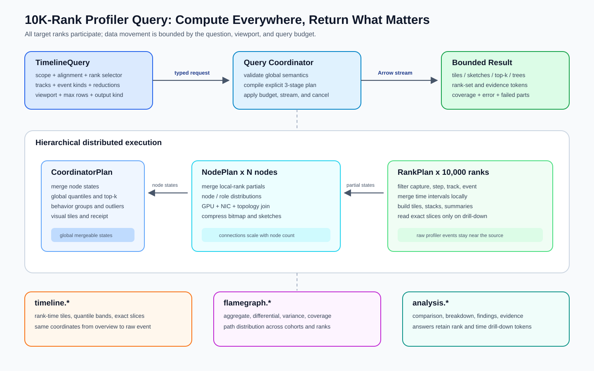
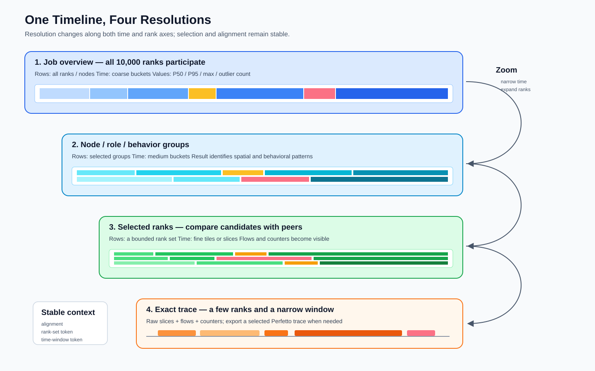
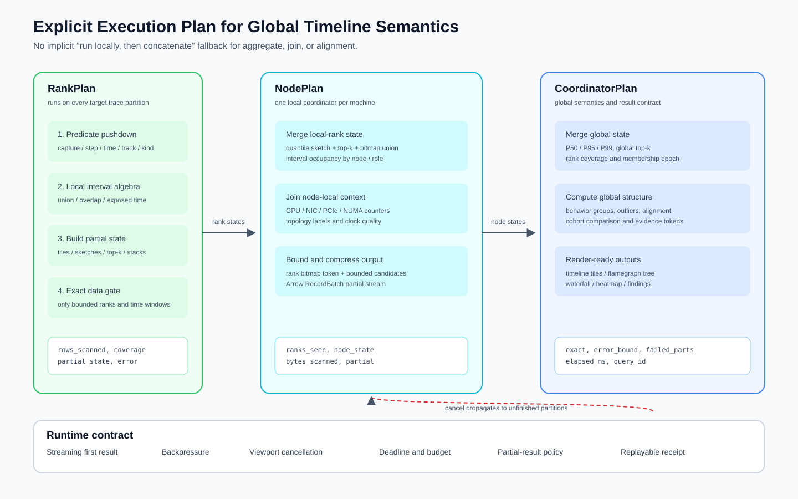
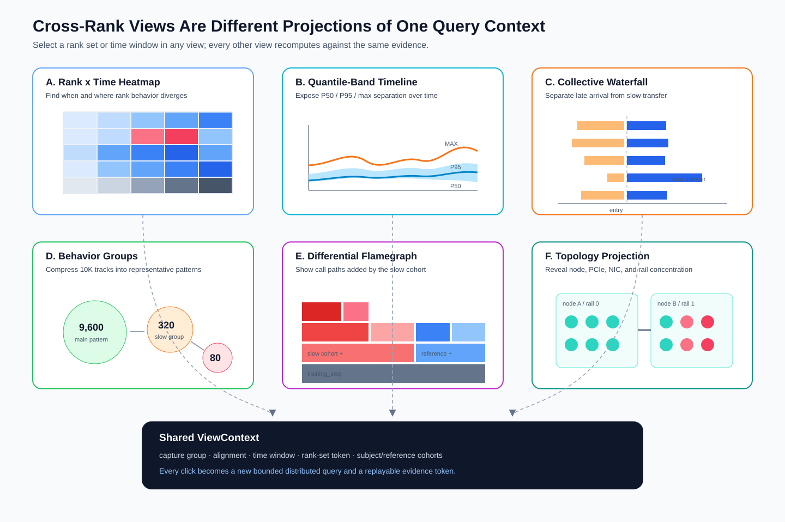

# Distributed Profiler Query and Visualization

> Status: architecture design. Short-window Torch Profiler capture,
> `python.profile_capture` / `python.profile_hotspot`, and basic federation exist today. The unified
> `timeline.*` model and 10K-rank execution described here are not all implemented.

Related foundations: [Profiling](profiling.md) · [Federation](federation.md) ·
[Distributed membership](distributed.md)

## 1. Goals and architecture

A capture with 500,000 events on each of 10,000 ranks contains five billion rows. Centralizing all
events makes network, coordinator memory, sorting, and browser work scale with raw trace volume.

The target is:

> Every selected rank participates, while each tier exchanges only what the question, time window,
> and display resolution require.



Profiler adapters normalize Torch Profiler, TorchProbe, NCCL/HCCL, Python/native stacks, and GPU/NIC
counters into timeline and call-path semantics. Rank-local reduction feeds node partials and a global
coordinator; SQL, agents, and visualizations consume the same evidence coordinates.

The design requires complete rank participation, local reduction, continuous drill-down from job to
exact event, and shared quality metadata. It does not render one full timeline per rank on first load
or concatenate independently evaluated complex SQL and call that a global result.

## 2. Unified data model

The model is virtual: implementations may read trace partitions, MEMT/MEMC, summaries, or external
profiler files.

| Entity | Meaning |
|--------|---------|
| `timeline.capture` | Per-rank participation, time range, drops, clocks, and errors |
| `timeline.track` | CPU thread, GPU stream, logical, or counter track hierarchy |
| `timeline.slice` | Step, op, kernel, memcpy, collective, or wait interval |
| `timeline.flow` | Launch, synchronization, wait, or cross-rank causality edge |
| `timeline.counter` | Time-varying GPU, NIC, CPU, or memory value |
| `timeline.tile` | Multi-resolution time/rank aggregate for overview queries |

Capture manifests distinguish missing captures from captures with no matching event. Slices carry
step, correlation, operation, communicator, collective sequence, stack, and byte coordinates. Flows
prefer logical keys and expose method/confidence when inferred.



Tiles reduce both time and rank resolution. Per-rank occupancy first unions overlapping intervals
inside each bucket; only then does the coordinator compute P50/P95/max and outlier counts. Zooming or
narrowing the rank set selects finer tiles and eventually exact slices.

Flamegraph frames carry stable path identity, inclusive/self values, rank coverage, quantiles,
outlier count, subject/reference deltas, and a rank-set token. Compressed bitmaps or server tokens
replace per-frame arrays of 10,000 rank IDs.

Current `profile_capture` and `profile_hotspot` remain useful capture/hotspot summary views. Full
Kineto events can map to the same track/slice/flow model without making routine SQL scan Chrome
`traceEvents`.

## 3. Distributed query and execution

Web and Agent clients issue a typed `TimelineQuery`; SQL remains available over virtual results.

```yaml
scope: {capture_group_id: group-42, steps: {from: 1000, to: 1020}, ranks: all}
alignment: {kind: global_step, anchor: step_begin}
tracks: {group_by: [node, behavior_cluster], include: [step, phase, gpu, collective]}
events: {kinds: [cpu_op, gpu_kernel, collective, synchronization]}
reduce: {time: interval_occupancy, ranks: [p50, p95, max, outlier_count]}
resolution: {width_pixels: 1600, max_rows: 200, detail: auto}
output: {kind: timeline_tiles}
```

Alignment is explicit: wall clock, global step, collective, operation, or custom marker. Rank
selectors address all ranks, a node/role/cohort, outliers, or a small explicit set. Large selections
continue through `rank_set_token`.



| Plan | Work |
|------|------|
| Rank | filter, time prune, interval union, local top-k, folded stacks |
| Node | merge local ranks and join GPU/NIC/PCIe/NUMA context |
| Coordinator | global quantiles, outliers, behavior cohorts, views, and receipt |

The exchange uses mergeable quantile sketches, bounded top-k states, compressed rank sets, interval
occupancy, path hashes, and collective alignment tuples. Exact slices move only for a bounded rank
set and narrow time window. Hierarchical transport follows
[coordinator → local0 → leaf](federation.md#hierarchical-fan-out), with explicit merge functions.

Arrow batches stream results and propagate cancellation. Each result records membership epoch,
expected/seen ranks and nodes, failed partitions, rows/bytes scanned, resolution, exactness, error
bound, partial status, and elapsed time.

## 4. Cross-rank visualization



All views share capture, alignment, time window, rank-set token, subject/reference cohorts, and event
filters.

| View | Primary question |
|------|------------------|
| Rank × Time heatmap | Which rank groups and periods are abnormal? |
| P50/P95/max timeline | When does the tail diverge from typical ranks? |
| Collective waterfall | Are ranks arriving late or transferring slowly? |
| Behavior cohorts | How many execution patterns exist, and which ranks share them? |
| Operation × Rank heatmap | Which op/kernel creates the skew? |
| Topology projection | Does the anomaly follow node, PCIe, NIC, or rail layout? |

Behavior cohorts expose representative ranks, within-cohort variance, topology distribution, and a
rank-set token. Collective views separate predecessor compute, entry, ready, transfer, and complete.

Flamegraphs support aggregate, differential, variance, and coverage modes. Selecting a frame opens
its contributing rank set and then exact timelines. Timeline, flamegraph, waterfall, and agent
analysis must navigate the same evidence chain rather than act as disconnected pages.

## 5. Correctness and resource boundaries

| Decision | Required boundary |
|----------|-------------------|
| local compute, global merge | every cross-rank operation declares mergeable state and coordinator function |
| multi-resolution first | overview returns tiles/sketches; exact events require bounded drill-down |
| interval semantics | union overlaps before wall-time aggregation |
| explicit alignment | every result records anchor and clock/error assumptions |
| explicit coverage | missing capture, no match, dropped event, and failed partition are distinct |
| bounded resources | rank/time/pixel/row/byte/time budgets constrain every query |
| traceability | findings link back to query, rank set, time window, slice, or path |

Approximate overview results expose `exact`, `error_bound`, `coverage`, and `partial`. Unsupported
global JOINs, window functions, non-mergeable distinct counts, and per-rank LIMIT masquerading as
global top-k must fail or use an explicit coordinator plan.

Do not emit one Chrome Trace JSON for 10,000 ranks. Full exports retain a manifest and partitions;
selected ranks may be converted to Perfetto/Chrome format. Timeline tiles, bounded exact slices,
distributed flamegraph trees, and structured SQL/Agent results all carry the same query receipt.
