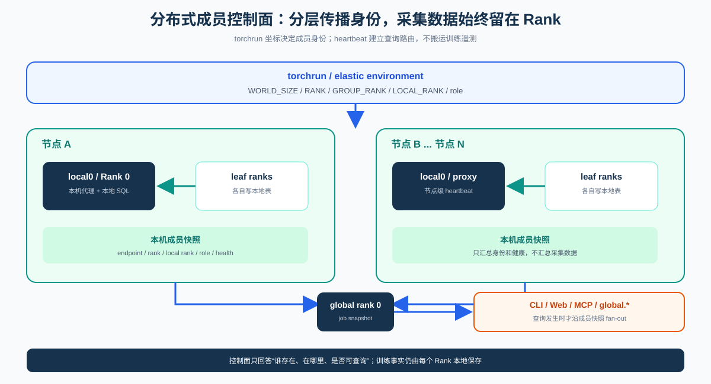
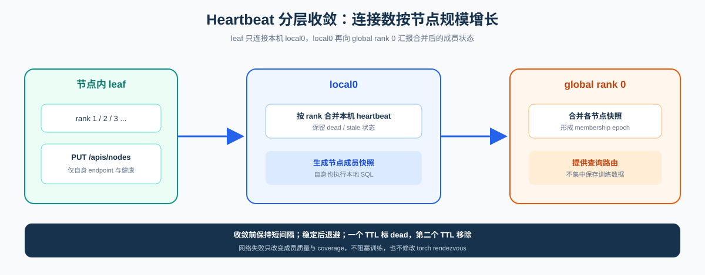
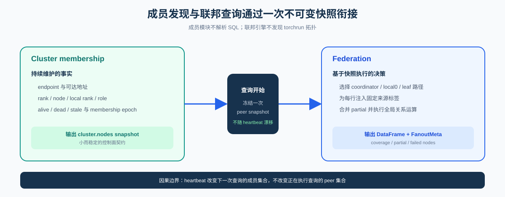

# 分布式成员与控制面

本文说明 Probing 如何发现和维护一个分布式训练作业中的探针成员。每个 rank 仍只写本地
表；跨 rank SQL 的 catalog、执行路径和结果正确性由[联邦查询引擎](federation.zh.md)定义。

> 状态：当前实现。成员注册位于 `probing-server`，不会修改 torch rendezvous 数据，也不
> 阻塞 `init_process_group`。

## 1. 总体结构



| 角色 | 责任 | 不负责 |
|------|------|--------|
| leaf rank | 上报自身 endpoint、rank 与 role；执行本地 SQL | 维护全局成员或递归 fan-out |
| local0 | 汇总本机 rank 心跳；作为分层查询的节点代理 | 改写训练 rendezvous |
| global rank 0 | 提供作业成员快照和查询入口 | 集中保存训练采集数据 |
| `cluster.nodes` | 当前 endpoint membership 与健康状态 | 代替 torch process group |

成员控制面和数据面分离：heartbeat 只传播少量身份与健康元数据，训练采集结果保留在 rank
本地，直到查询发生。

## 2. 集群成员生命周期 {#cluster-membership}

### 2.1 启动条件

| 条件 | 当前行为 |
|------|----------|
| `PROBING=1/2` | 当前进程已启用 Probing |
| `WORLD_SIZE > 1` | 单进程不启动集群 worker |
| `PROBING_TORCHRUN_CLUSTER != 0` | 默认开启 torchrun 集群初始化 |
| `PROBING_CLUSTER_REPORT != 0` | 默认开启周期 heartbeat |
| 非 elastic supervisor | supervisor 不绑定训练 rank 的 HTTP 端口 |

Rust 动态库构造函数调用 `maybe_start_torchrun_cluster()`：绑定 HTTP、通过 job TCPStore
发现 master/local0 地址，并启动异步 heartbeat worker。Python 不再 patch
`torch.distributed.init_process_group`；`setup_torchrun_cluster()` 仅保留为显式入口和测试门面。

### 2.2 分层注册



TCPStore 只使用 Probing 自己的 key 前缀：

```text
probing/torchrun/<run_id>/master
probing/torchrun/<run_id>/node/<group_rank>/local0
```

它与 torch rendezvous 共用 endpoint，但不读写 rendezvous key。`PUT /apis/nodes` 按 rank
合并 heartbeat；`GET /apis/nodes` 和 `cluster.nodes` 返回排序后的当前快照。

注册至少携带 `rank`、`world_size`、`group_rank`、`local_rank`、`host`、`addr` 和 `role`。
其中 `addr` 必须是 peer 可访问的探针地址，而不是默认假设 rendezvous 地址就是当前节点地址。

### 2.3 收敛、退避与失效

- 成员未凑齐时维持基础间隔，优先快速收敛；
- 全员 alive 后按因子指数退避，降低长任务的控制面开销；
- 一个 stale TTL 未收到 heartbeat 时标记 `dead`，第二个 TTL 后从视图移除；
- 实际最大 heartbeat 间隔受 stale 安全窗口约束，不能大于
  `STALE_SEC - STALE_SEC/4 - 1`。

默认 `STALE_SEC=25` 时，最大安全间隔约为 18 秒；若需要稳定后约 60 秒上报，应把 stale
同时提高到至少约 90 秒。查询必须基于一次 `cluster.nodes` 快照，并在结果中报告成员失败，
不能把训练中动态变化的视图伪装成静态全集。

训练脚本调用 `probing.set_role(...)` 后，可通过 `refresh_node_role()` 立即补发 heartbeat，
使 `_role` 联邦标签及时更新。

## 3. 发现与控制入口

| 需求 | 入口 | 范围 |
|------|------|------|
| 本机探针进程 | `probing list` | 本机 socket/process 发现 |
| 远程探针状态 | `probing -t host:port list` | 单 endpoint |
| 作业成员快照 | `probing -t rank0:port cluster nodes` | `cluster.nodes` |
| 单 rank SQL | `probing -t endpoint query "..."` | 本地 `probe.*` |
| 跨 rank SQL | `cluster query` 或 `global.*` | 交给 federation |

HTTP 监听与 Engine readiness 是两个状态。成员可以先发现 endpoint，再由 readiness 判断该
rank 是否已经能够执行查询；不能用“连接成功”替代“查询引擎已就绪”。

## 4. 与联邦查询的边界



成员模块不解析 SQL，也不合并 DataFrame。联邦引擎不发现 torchrun 拓扑，只消费
`cluster.nodes` 契约。万 rank 下的 coordinator → local0 → leaf 查询拓扑、失败传播和 API
字段统一见[联邦查询引擎 — 分层 fan-out](federation.zh.md#hierarchical-fan-out)。

## 5. 配置

| 变量 | 默认 | 作用 |
|------|------|------|
| `PROBING_TORCHRUN_CLUSTER` | `1` | 启用 torchrun 集群初始化 |
| `PROBING_CLUSTER_REPORT` | `1` | 周期性 heartbeat |
| `PROBING_CLUSTER_REPORT_BACKOFF` | `1` | 收敛后退避 |
| `PROBING_CLUSTER_REPORT_INTERVAL_SEC` | `10` | 基础间隔 |
| `PROBING_CLUSTER_REPORT_MAX_INTERVAL_SEC` | `120` | 配置上限，仍受 stale 钳制 |
| `PROBING_CLUSTER_REPORT_BACKOFF_FACTOR` | `2` | 退避倍数 |
| `PROBING_CLUSTER_STALE_SEC` | `25` | dead/移除 TTL 基准 |
| `PROBING_CLUSTER_DISCOVER_TIMEOUT_SEC` | `2` | TCPStore 发现超时 |
| `PROBING_CLUSTER_REPORT_TIMEOUT_SEC` | `5` | heartbeat PUT 超时 |
| `PROBING_PORT` | rank0 常用 `18080` | global0 固定端口；其他 rank 通常绑定随机端口 |
| `PROBING_ADVERTISE_ADDR` | 自动推断 | 对 peer 发布的可达地址 |
| `PROBING_NODE_HOST` | 自动推断 | UI 与标签使用的主机身份 |

完整列表见[环境变量](../reference/env-vars.zh.md#集群)。所有 peer 必须使用一致的
`PROBING_AUTH_TOKEN`；内部发现、heartbeat 与查询请求都要携带凭据，健康检查端点可保持公开。

## 6. 设计约束与实现位置

- heartbeat 失败不得终止宿主训练进程；按 debug/状态表暴露并重试。
- 训练 callback 不发送 heartbeat；所有网络操作在服务端异步 worker 中执行。
- `cluster.nodes` 是 endpoint membership，不保证等同于理想 torch rank 集合。
- `pulsing.*` 等外部 mmap 表不会被隐式合并进 `cluster.nodes`。
- 跨节点 wall-clock 需要 NTP/PTP；成员发现本身不提供时钟同步。

| 关注点 | 位置 |
|--------|------|
| torchrun 初始化与 heartbeat | `probing/server/src/torchrun_cluster.rs` |
| 节点注册与快照 | `probing/core/src/core/cluster.rs` |
| HTTP 契约 | `probing/server/API.md`、`tests/regression/spec/api_spec.json` |
| 多机示例 | `examples/cluster/run_multinode.sh` |

查询语义见[联邦查询引擎](federation.zh.md)，表列见
[SQL 表目录](../reference/sql-tables.zh.md#cluster-nodes)。
