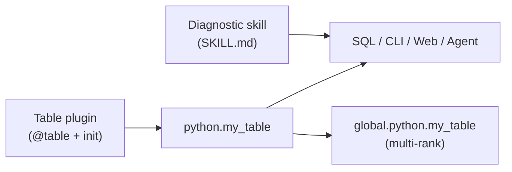

# Extensibility

Probing exposes **four public extension paths**. Everything else (Rust collectors, HTTP handlers, import hooks) is internal to the core project.

| Path | You contribute | Consumers use |
|------|----------------|---------------|
| **1. Table plugin** | Python dataclass + `@table` | `SELECT … FROM python.*` (CLI, Web, scripts) |
| **2. Diagnostic skill** | `SKILL.md` + optional `steps.yaml` | Agent / `probing skill run …` / Web |
| **3. REPL Magic** | IPython `Magics` subclass | Python page / `probing eval` REPL |
| **4. Vendor package** | Standalone pip `probing-<vendor>` | Auto-discovered skills + magics (+ optional tables) |

**Decision rule:** expose **data** → table plugin; **how to investigate** → skill; **REPL shortcuts** → magic; **vendor/ecosystem bundle** → publish `probing-nvidia`-style package.



---

## Path 1: Table plugin {#path-1-table-plugin-dataclass--table}

A table plugin is a Python module that:

1. Declares one or more **dataclass** tables with `@table`
2. Writes rows at runtime with `.save()` or `.append()`
3. Optionally defines `init()` / `deinit()` for setup and teardown

Registered tables appear under the **`python`** schema, e.g. `python.my_metrics`. In distributed training, query **`global.python.my_metrics`** to fan out across ranks (Probing adds `_host`, `_addr`, `_rank`, and `_role` automatically). `_role` is the source node's parallel-role key (e.g. `dp=2,pp=1,tp=0`), resolved from the cluster `nodes` registry — see [Distributed](distributed.md).

### Minimal example

```python
# my_plugin/__init__.py
from dataclasses import dataclass

from probing import table


@table
@dataclass
class MyMetrics:
    step: int
    loss: float


def init():
    """Called when the plugin is loaded via python.enabled."""
    MyMetrics.init_table()


def deinit():
    """Called when the plugin is unloaded via python.disabled."""
    MyMetrics.drop()
```

Write data from training code:

```python
MyMetrics(step=trainer.global_step, loss=loss.item()).save()
```

Query:

```sql
SELECT step, avg(loss) AS avg_loss
FROM python.my_metrics
GROUP BY step
ORDER BY step;
```

Reference implementation: `python/probing/ext/example.py`.

### Table naming

- Default: class name converted to **snake_case** (`MyMetrics` → `my_metrics`)
- Explicit: `@table("custom_name")` on the dataclass

The first appended row fixes column types. Changing fields later requires a new table name or `MyMetrics.drop()` before re-init.

### API added by `@table`

| Method | Purpose |
|--------|---------|
| `init_table()` | Create or attach mmap backing store |
| `save()` | Append one row (instance method) |
| `append(row)` / `append_many(rows)` | Append from class |
| `take(n)` | Read last *n* rows (debugging) |
| `drop()` | Remove table |

Storage is mmap-backed under the probing data directory. Rows survive process crashes and are visible to any attached probing client.

### Enable a plugin

Load the module and call `init()` by setting **`python.enabled`** to an import path (same string passed to `load_extension()`):

```bash
# After probing is attached (PROBING=1 or probing inject)
probing -t <pid> config python.enabled=my_plugin

# Or via SQL
probing -t <pid> query "SET python.enabled='my_plugin'"
```

Unload:

```bash
probing -t <pid> config python.disabled=my_plugin
```

The module must be importable in the target process (installed package or on `PYTHONPATH`). Probing calls `init()` after import; `deinit()` runs on disable.

**Alternative:** import the module directly in your training script. The `@table` decorator registers the table on import; use `init()` / `deinit()` only when you need explicit lifecycle control via `python.enabled`.

### Framework integration

Hook your framework inside the plugin module—still write to `@table` rows:

```python
def init():
    MyMetrics.init_table()
    import torch
    torch.nn.Module.register_forward_hook(_record_module_stats)
```

Official integrations (torch, ray) use the same pattern internally; third-party plugins should not add separate HTTP or hook APIs.

### Integration examples

**Weights & Biases (bridge)**

```python
@table("wandb_run")
@dataclass
class WandbRun:
    run_id: str
    step: int
    loss: float

def init():
    WandbRun.init_table()

def on_wandb_log(step: int, loss: float):
    import wandb
    if wandb.run:
        WandbRun(run_id=wandb.run.id, step=step, loss=loss).save()
```

**Custom training metrics**

```python
@table
@dataclass
class StepStats:
    step: int
    lr: float
    grad_norm: float
```

```sql
SELECT step, lr, grad_norm
FROM python.step_stats
WHERE step > (SELECT max(step) - 100 FROM python.step_stats);
```

---

## Path 2: Diagnostic skill {#path-2-diagnostic-skill}

A **skill** packages domain knowledge for *how* to investigate a problem. It does not collect data (use Path 1 for that). Each skill is a directory with a **`SKILL.md`** the agent can read, plus an optional machine-readable step list (`steps.yaml`).

Built-in diagnostics live under `skills/<id>/` and run via `probing skill run …`. Install into Cursor/Claude/Codex with `./skills/install.sh`.

### Directory layout

```
skills/
├── catalog.yaml                 # index (id, category, path)
└── my_check/
    ├── SKILL.md                 # required — agent + human readable
    ├── steps.yaml               # optional — deterministic CLI runner
    └── reference.md             # optional — deep dives, links
```

### `SKILL.md` format

Frontmatter tells **when** to invoke the skill (for Agent routing). The body tells **how** to think about the problem. Executable steps can live in the body *or* in `steps.yaml`.

```markdown
---
name: my_check
description: >
  Inspect custom plugin metrics in python.my_metrics.
  Use when the user asks about plugin data, missing metrics,
  or custom training counters from a table plugin.
category: performance
tables: [python.my_metrics]
parameters:
  limit: { type: integer, default: 20 }
---

# My check

## When to use

- User enabled a table plugin but sees empty charts or SQL results
- Training runs but `python.my_metrics` has no recent rows

## Prerequisites

Enable the plugin in the target process:

```bash
probing -t <pid> config python.enabled=my_plugin
```

## Procedure

1. Confirm the table exists in `information_schema.tables`
2. Fetch the last `{limit}` rows ordered by step
3. If empty, warn that the plugin is not writing or not enabled

## Reading results

- Steady `loss` with increasing `step` → plugin is healthy
- No rows → check `python.enabled` and that training code calls `.save()`

## Related skills

- `health_overview` — first triage when unsure where to start
```

### `steps.yaml` (optional, for deterministic runs)

When present, CLI and Web Agent execute steps **without** relying on the LLM to invent SQL. Schema:

```yaml
# skills/my_check/steps.yaml
apiVersion: probing.dev/v1
kind: Skill

metadata:
  id: my_check
  title: "Check my plugin metrics"

spec:
  parameters:
    - name: limit
      type: integer
      default: 20

  steps:
    - id: recent_metrics
      title: "Recent plugin rows"
      type: sql
      sql: |
        SELECT *
        FROM python.my_metrics
        ORDER BY step DESC
        LIMIT {limit}
      on_empty: warn
      empty_message: "No rows — enable plugin: python.enabled=my_plugin"

  interpretation:
    rules: []

  summary_template: |
    Checked python.my_metrics (last {limit} steps).
```

Splitting **SKILL.md** (knowledge + routing) from **steps.yaml** (execution) lets agents improvise when needed while keeping reproducible runs for CI and `probing skill run`.

### Consumers

```bash
probing skill list
probing -t <pid> skill run my_check
probing -t <pid> skill run slow_rank --set step_window=30 --global

probing skill install    # skills/ -> .cursor/.claude/.agents skill dirs
./skills/install.sh
probing skill update
```

Python tool API (discovery / plan only — execution is Rust CLI or MCP):

```python
from probing.skills.tools import list_skills, plan_skill_run
plan_skill_run("health_overview")  # returns CLI command + step SQL preview
```

**Execution SSOT:** `probing-skills` crate — CLI `probing skill run`, MCP `run_skill` /
`plan_skill`, Web Investigate Agent (WASM). Python `GET /apis/pythonext/skills/*` endpoints
are discovery-only (catalog, routing, load JSON).

Web Agent loads skill frontmatter for routing (`description` + `tables`), injects `SKILL.md`
body into context, and runs `steps.yaml` via the shared Rust runner when present.

### Register a skill

1. Add `skills/my_check/SKILL.md` (required)
2. Add `skills/my_check/steps.yaml` if you want deterministic execution
3. Register in `skills/catalog.yaml`
4. Run `./skills/install.sh` so agents discover the skill
4. Validate: `python -m probing.skills validate`

Skills may reference **any** SQL table—Path 1 plugin tables, built-in tables (`cpu.utilization`, `gpu.utilization`, `python.torch_trace`, …), and `global.*` for multi-rank fan-out.

See `skills/README.md` and [AGENTS.md](https://github.com/DeepLink-org/probing/blob/main/AGENTS.md) for routing, install, and cluster fan-out.

---

## Path 3: REPL Magic {#path-3-repl-magic}

**Magics** are IPython line commands (e.g. `%query`). Built-ins live under `python/probing/repl/*_magic.py`. Third parties register via the **`probing.magics`** entry point (`Magics` subclass).

Bundle magics with skills in a **`probing-<vendor>`** package (Path 4) rather than a one-off unnamed pip project.

---

## Path 4: Vendor extension package (`probing-<vendor>`) {#path-4-vendor-extension-package-probing-vendor}

Ecosystem partners (NVIDIA, Huawei, cloud vendors, framework teams) should publish **standalone pip packages** with a unified name:

| Layer | Convention | Examples |
|-------|------------|----------|
| PyPI / wheel | `probing-<vendor>` (kebab-case) | `probing-nvidia`, `probing-huawei` |
| Import package | `probing_<vendor>` (snake_case) | `probing_nvidia`, `probing_huawei` |
| Entry point key | Usually the vendor slug | `nvidia = "probing_nvidia:skill_root"` |

Layout:

```
probing-nvidia/
├── pyproject.toml
└── src/probing_nvidia/
    ├── __init__.py       # skill_root()
    ├── magics.py         # probing.magics
    └── skills/
        ├── catalog.yaml
        └── …/
```

### Discovery: entry points only

Skills and magics use the **same** setuptools registry:

| Group | Registers |
|-------|-----------|
| `probing.skills` | `skill_root()` → directory with `catalog.yaml` |
| `probing.magics` | `Magics` subclass |

Use the **same vendor slug** in both groups. With `pip install -e .`, edits under `skills/` or `magics.py` apply immediately — entry points resolve to real source paths.

`package-data` only ships files inside the wheel; probing does **not** scan it for discovery.

Prefix skill ids and magic commands (`nvidia_nccl_triage`, `%nvidia_smi`) to avoid runtime overrides.

```toml
[project]
name = "probing-nvidia"
dependencies = ["probing", "ipython>=8.0"]

[project.entry-points."probing.skills"]
nvidia = "probing_nvidia:skill_root"

[project.entry-points."probing.magics"]
nvidia = "probing_nvidia.magics:NvidiaMagic"

[tool.setuptools.package-data]
probing_nvidia = ["skills/**"]
```

```bash
pip install -e .   # dev: register once, iterate on skills/magics
python -m probing.extensions extensions
probing skill list
```

Template: `examples/probing-acme/`.

Optional `@table` plugins in the same package: `python.enabled=probing_nvidia`.

---

## Path 5: NCCL profiler plugin (C cdylib) {#path-5-nccl-profiler-plugin}

For **fine-grained NCCL wait decomposition** (culprit vs victim), use the standalone Rust profiler loaded by NCCL itself—not a Python table plugin.

### Enable in training

```bash
export NCCL_PROFILER_PLUGIN=$(python -m probing.nccl --plugin-path)
export NCCL_PROFILE_EVENT_MASK=$(python -m probing.nccl --event-mask)  # default 94
export PROBING=2
torchrun --nproc_per_node=8 train.py
```

Requires **NCCL ≥ 2.26** (PyTorch 2.8+). The plugin exports **`ncclProfiler_v4`** (NCCL 2.27+) and **`ncclProfiler_v3`** (NCCL 2.26) and writes mmap tables consumed by probing SQL:

| Table | Content |
|-------|---------|
| `nccl.proxy_ops` | Per-proxy-op wait: `send_gpu_wait_ns` (culprit), `recv_wait_ns` (victim), `tp_rank`/`pp_rank`/`dp_rank` |
| `nccl.coll_perf` | Collective-level timing (v4) |
| `nccl.inflight_ops` | Watchdog snapshots of hung in-flight ops (`PROBING_NCCL_INFLIGHT_THRESHOLD_SECS`) |
| `nccl.net_qp` | Optional NetPlugin IB QP timing (mask bit 128) |
| `nccl.profiler_counters` | Pool/ring health counters (`pool_exhausted`, `write_errors`, …) |

### Query and diagnose

```sql
SELECT rank, sum(send_gpu_wait_ns), sum(recv_wait_ns)
FROM nccl.proxy_ops
GROUP BY rank
ORDER BY 3 DESC;
```

```bash
probing -t <pid> skill run nccl_culprit_victim
```

**Culprit** ranks show high `send_gpu_wait_ns` (local GPU slow); **victim** ranks show high `recv_wait_ns` (waiting on peers/network). See [NCCL profiler plugin](nccl-profiler.md) for schema, mock workflow, and smoke-test checklist.

Coarse collective latency (`python.comm_collective`) remains available without the plugin; skills `slow_rank` and `comm_bottleneck` optionally join `nccl.proxy_ops` when present.

### macOS / dev without NCCL

```bash
PROBING=1 PROBING_NCCL_MOCK=1 python -m probing.nccl --seed-mock
```

Seeds synthetic culprit (rank 2, high `send_gpu_wait_ns`) and victim (rank 5, high `recv_wait_ns`) for skill/SQL testing.

### Build

```bash
make nccl-profiler-lib   # Linux .so → python/probing/libs/
```

Crate: `probing/extensions/nccl-profiler/`.

---

## Best practices

### Keep rows small

Write scalars and small structs per step—not full model state or weight tensors.

```python
# Good
MyMetrics(step=step, loss=float(loss)).save()

# Avoid
MyMetrics(step=step, payload=model.state_dict()).save()
```

### Handle errors in the writer

Sampling hooks should not crash training:

```python
def _safe_record(step: int, loss):
    try:
        MyMetrics(step=step, loss=float(loss)).save()
    except Exception:
        pass  # or log once
```

### Prefer append over pull

Push rows when events happen (step end, collective complete). Do not implement “scan entire process state on every SQL query”—`@table` is append-only storage, not a lazy snapshot API.

### Use `global.*` for multi-rank analysis

```sql
-- Align by parallel role across ranks (each row also carries a `role` column
-- written at record time; `_role` is the federation tag for the source node).
SELECT _role, _rank, avg(duration_ms) AS avg_ms
FROM global.python.comm_collective
WHERE global_step > 100
GROUP BY _role, _rank
ORDER BY avg_ms DESC;
```

---

## Not public extension APIs

The following exist for core development only. **Do not** build third-party plugins on them:

| Mechanism | Why not public |
|-----------|----------------|
| Rust `ProbeExtension` / `ProbeDataSource` | Compiled into probing; no dynamic plugin loading |
| `@ext_handler` / `/apis/pythonext/*` | Internal HTTP surface; contract-tested for core handlers |
| `add_module_callback` import hook | Used for official torch/ray integration |
| `probing-*` CLI external binaries | Separate tools, not data plugins |

To extend Probing, use **Path 1 (table plugin)**, **Path 2 (diagnostic skill)**, **Path 3 (REPL Magic)**, **Path 4 (`probing-<vendor>` package)**, or **Path 5 (NCCL profiler cdylib)** for fine-grained collective wait data.

---

## Related docs

- [Data layer](data-layer.md) — mmap memtable storage behind `python.*`
- [Distributed](distributed.md) — `global.*` federation and cluster queries
- [SQL analytics guide](../guide/sql-analytics.md) — querying patterns
- `skills/README.md` — skill authoring in depth
- `AGENTS.md` — agent install and invoke
