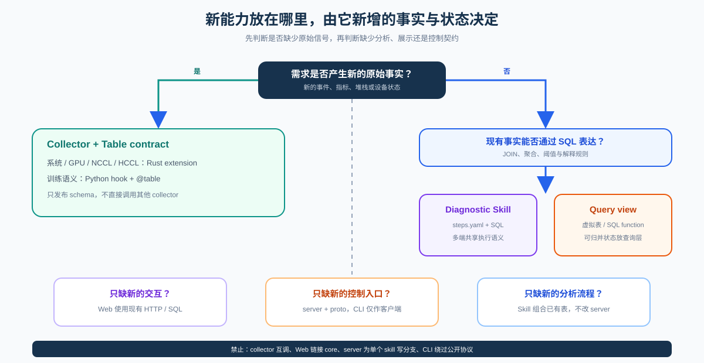
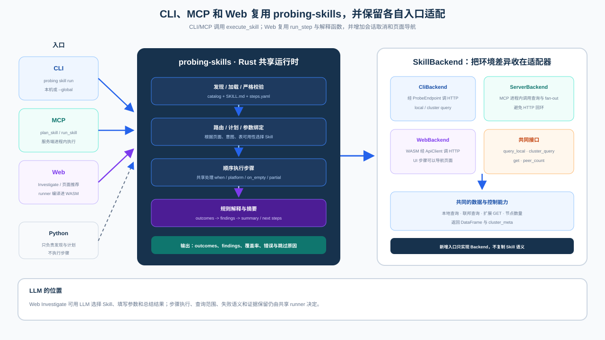

# Extensibility

This page defines the public extension paths and their boundaries. Detailed `@table` methods live in
[CLI & Python API](../api-reference.md#table-dataclass-plugins), skill fields in
[Skill Format](../reference/skill-format.md), and NCCL deployment/schema in
[NCCL Profiler](nccl-profiler.md). Those details are not duplicated here.

## Extension model

| Extend | Public mechanism | Contract produced |
|--------|------------------|-------------------|
| training/framework data | Python `@table` plugin | `python.<table>` |
| diagnostic method | `SKILL.md` + `steps.yaml` | reproducible SQL workflow |
| REPL shortcut | `probing.magics` entry point | IPython magic |
| vendor capability bundle | `probing-<vendor>` wheel | skills, magics, optional tables |
| NCCL internal events | NCCL Profiler C ABI cdylib | `nccl.*` tables |

New facts become tables; new analysis queries published tables. A skill must not require a server
special case, and collectors must not call each other.



## Table plugin {#path-1-table-plugin-dataclass--table}

`@table` turns a dataclass into a fixed append-only schema:

```python
from dataclasses import dataclass
from probing import table

@table
@dataclass
class StepStats:
    local_step: int
    global_step: int
    loss: float

def init():
    StepStats.init_table()
```

The training path calls `.save()`; SQL reads `python.step_stats` or
`global.python.step_stats`. Import directly, or manage the module with
`probing -t <pid> config python.enabled=<module>`.

Constraints:

- field types are fixed after table creation;
- rows contain scalars/small structures, not model weights;
- writer failures are logged and isolated from training;
- use Probing step/rank/role coordinates and SQL JOINs across signals;
- append facts at event time rather than scanning process objects at SQL time.

See [API reference](../api-reference.md#table-dataclass-plugins) and
[Environment variables](../reference/env-vars.md).

## Diagnostic skill {#path-2-diagnostic-skill}

Skills package what to query, how to interpret it, and what to do next:

```text
python/probing/bundled_skills/<id>/
  ├─ SKILL.md       routing and interpretation
  └─ steps.yaml     parameterized SQL and deterministic rules
```



| Stage | Owner |
|-------|-------|
| content SSOT | `python/probing/bundled_skills/`; root `skills/` is a symlink alias |
| discovery | Python entry point / skills HTTP API |
| load, validate, execute, interpret | Rust `probing-skills` |
| interaction | CLI, Web WASM, and MCP adapters |

Python tools are discovery/plan only; clients must not duplicate the YAML runner. See
[Skill Format](../reference/skill-format.md) and [Diagnostic Skills](../guide/skills.md).

## REPL and vendor packages {#path-3-repl-magic}

REPL magics register IPython `Magics` subclasses through `probing.magics`. Third parties normally
bundle magics with skills and optional tables in one vendor wheel.

### Vendor package convention {#path-4-vendor-extension-package-probing-vendor}

| Layer | Convention | Example |
|-------|------------|---------|
| wheel | `probing-<vendor>` | `probing-nvidia` |
| import package | `probing_<vendor>` | `probing_nvidia` |
| skill / magic ids | vendor-prefixed | `nvidia_nccl_triage` |

```toml
[project]
name = "probing-nvidia"
dependencies = ["probing"]

[project.entry-points."probing.skills"]
nvidia = "probing_nvidia:skill_root"

[project.entry-points."probing.magics"]
nvidia = "probing_nvidia.magics:NvidiaMagic"
```

Entry points are the discovery contract; package data only ships files. Template:
`examples/probing-acme/`. Optional table modules still require explicit `python.enabled` activation.

## NCCL Profiler special case {#path-5-nccl-profiler-plugin}

NCCL loads this profiler through its C ABI, not Python plugin discovery. It writes `nccl.*` mmap
tables consumed by ordinary SQL, skills, and federation. ABI versions, event masks, schemas, mocks,
and hardware acceptance are maintained only in [NCCL Profiler](nccl-profiler.md).

The same boundary applies: the plugin produces data and never calls skills, Web, or other collectors.

## Not public extension APIs

| Mechanism | Status |
|-----------|--------|
| Rust `ProbeExtension` / `ProbeDataSource` | built-in contract; compiled into Probing |
| `@ext_handler` / `/apis/pythonext/*` | core HTTP implementation |
| `add_module_callback` import hook | official framework integration internal |
| `probing-*` external CLI binaries | separate tool discovery, not data plugins |

When a third party needs control, extend a published table, skill, or documented HTTP/proto contract
instead of importing internals. See [Modularity & Boundaries](modularity.md).

## Acceptance checklist

1. New facts are tables, not callback chains.
2. New analysis uses only SQL/documented HTTP.
3. Writer failure is isolated from the host training path.
4. Multi-rank analysis uses fixed federation tags.
5. Skills pass `python -m probing.skills validate`.
6. User-visible schemas/config/APIs update reference and contract tests.

Related: [Data Layer](data-layer.md) · [Federation](federation.md) ·
[SQL Tables](../reference/sql-tables.md) · [Core model](../guide/concepts.md)
