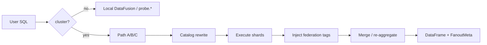
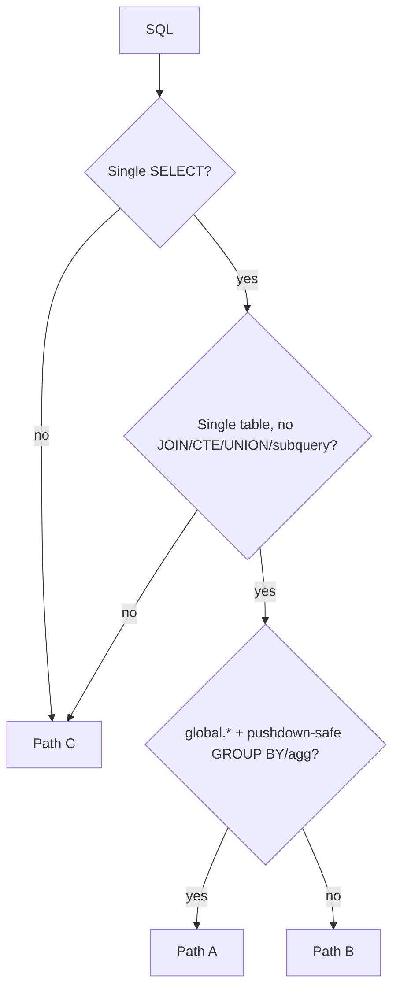

# Federated Query Engine

Cross-rank SQL semantics for the `global` catalog. User-visible behavior is specified here;
implementation: `probing/core/src/core/federation/`. On conflict, align code to this document.

See also: [Core model](../guide/concepts.md) · [Distributed overview](distributed.md) · [SQL Analytics](../guide/sql-analytics.md)

---

## 1. Execution model

Each rank writes only to local memtables (`python.comm_collective`, `nccl.proxy_ops`, …).
A coordinator query:

1. Executes `probe.*` on each peer (via HTTP)
2. Merges partial results
3. Injects federation tag columns (`_host`, `_addr`, …)

### Invariants

| Invariant | Definition |
|-----------|------------|
| Write local, read on demand | No central store on the training path; fan-out only for `cluster query` / `global.*` |
| Single engine entry | CLI, Web, skills, `probing.query()` share `Engine::async_query` |
| Partial failure | Peer timeout → omit shard, record `nodes_failed`; query continues |
| No cross-rank JOIN | `global.a JOIN global.b` unsupported; join inside one process (path C) |

**Entry points**

| Caller | How | Fan-out? |
|--------|-----|----------|
| Single-rank debug | `probing -t <pid> query "…"` | No |
| Cluster diagnosis | `probing -t rank0:8080 cluster query "…"` | Yes |
| Web training heatmap | `GET /apis/training/step_matrix?cluster=true` | Yes |
| In-process | `probing.query("… global.…")` on rank 0 | Depends on SQL |

---

## 2. Two catalogs and federation tags

### 2.1 `probe` vs `global`

| Catalog | Meaning |
|---------|---------|
| **`probe.*`** | Tables in the **current process** |
| **`global.*`** | **Federated mirror** of the same table: local scan + lazy peer fetch, merged |

When the user writes `FROM python.comm_collective` with `cluster=true`, the engine rewrites to `global.python.comm_collective` and routes accordingly.

Peers **always** execute `probe.*` to prevent recursive federation.

### 2.2 Six federation tag columns (fixed)

Distinct from in-table `rank`, `role`, etc. — tags mean **which probe endpoint returned the row**.

| Tag | Meaning | Source |
|-----|---------|--------|
| `_host` | Source hostname | `cluster.nodes.host` |
| `_addr` | Probe `host:port` | `cluster.nodes.addr` |
| `_rank` | Global torch rank | `RANK` |
| `_node_rank` | Node / worker group rank | `GROUP_RANK` |
| `_local_rank` | GPU index on node | `LOCAL_RANK` |
| `_role` | Parallel key, e.g. `dp=2,pp=1,tp=0` | Registry / `set_role` |

Missing integers → `-1`; missing `_role` → `""`.

**Projection rules**

- `SELECT * FROM global.t` → auto-expand six tag columns (`EXCLUDE` rewrite)
- `SELECT rank, avg_ms …` → tags **not** auto-appended; list `_rank` explicitly if needed
- Tags are injected at **coordinator merge**, not stored in peer memtables

---

## 3. Example SQL

Reference queries against federated tables. Prefer path A (aggregate pushdown) when the
SQL matches §4.2 conditions.

### 3.1 `global.python.comm_collective` — rank and host aggregates

```sql
SELECT _role, _rank, rank,
       avg(duration_ms) AS avg_ms, max(duration_ms) AS max_ms
FROM global.python.comm_collective
WHERE global_step >= (SELECT max(global_step) - 50 FROM global.python.comm_collective)
GROUP BY _role, _rank, rank
ORDER BY avg_ms DESC;
```

**Per-host aggregate**

```sql
SELECT _host, _node_rank,
       count(DISTINCT _rank) AS ranks_on_host,
       avg(duration_ms) AS avg_comm_ms
FROM global.python.comm_collective
WHERE global_step >= (SELECT max(global_step) - 100 FROM global.python.comm_collective)
GROUP BY _host, _node_rank
ORDER BY avg_comm_ms DESC;
```

### 3.2 `python.trace_event` — step duration (path C, same-rank JOIN)

```sql
SELECT s.attributes, s.time AS start_time,
       CAST((e.time - s.time) / 1000 AS DOUBLE) AS duration_us
FROM python.trace_event s
JOIN python.trace_event e
  ON s.span_id = e.span_id AND e.record_type = 'span_end'
WHERE s.record_type = 'span_start' AND s.name = 'train.step';
```

Coordinator aggregates to `(rank, step) → duration_ms` for UI coloring. HTTP: `GET /apis/training/step_matrix?cluster=true`.

### 3.3 `global.python.comm_collective` — step × rank long format

```sql
SELECT global_step, _rank, _host, op, sum(duration_ms) AS comm_ms
FROM global.python.comm_collective
WHERE global_step >= (SELECT max(global_step) - 120 FROM global.python.comm_collective)
GROUP BY global_step, _rank, _host, op;
```

### 3.4 `global.nccl.proxy_ops` — wait decomposition

```sql
SELECT seq, coll_func, _rank,
       sum(send_gpu_wait_ns) AS gpu_wait,
       sum(recv_wait_ns) AS recv_wait
FROM global.nccl.proxy_ops
WHERE seq >= (SELECT max(seq) - 50 FROM global.nccl.proxy_ops)
GROUP BY seq, coll_func, _rank;
```

### 3.5 Slowdown ratios (window functions → path C)

```sql
WITH per_rank_step AS (
  SELECT global_step, _rank, max(duration_ms) AS max_op_ms
  FROM global.python.comm_collective
  WHERE global_step >= (SELECT max(global_step) - 500 FROM global.python.comm_collective)
  GROUP BY global_step, _rank
),
step_cp AS (
  SELECT global_step,
         avg(max_op_ms) / NULLIF(min(max_op_ms), 0) AS step_slowdown_ratio
  FROM per_rank_step
  GROUP BY global_step
)
SELECT avg(step_slowdown_ratio) AS job_slowdown_proxy,
       count(*) FILTER (WHERE step_slowdown_ratio > 1.1) AS slow_steps
FROM step_cp;
```

**Per-step max-op ratio across ranks**

```sql
WITH per_step AS (
  SELECT global_step, _rank, _host, sum(duration_ms) AS step_ms
  FROM global.python.comm_collective
  WHERE global_step >= (SELECT max(global_step) - 300 FROM global.python.comm_collective)
  GROUP BY global_step, _rank, _host
)
SELECT _rank, _host,
       sum(CASE WHEN step_ms = max(step_ms) OVER (PARTITION BY global_step) THEN 1 ELSE 0 END)
         * 1.0 / count(*) AS worst_fraction
FROM per_step
GROUP BY _rank, _host
ORDER BY worst_fraction DESC;
```

At wan scale, split into two steps: path A for `per_step`, then coordinator aggregation.

### 3.6 Parallel topology columns

```sql
SELECT _role, _rank, global_step, sum(duration_ms) AS comm_ms
FROM global.python.comm_collective
WHERE global_step >= (SELECT max(global_step) - 80 FROM global.python.comm_collective)
GROUP BY _role, _rank, global_step;

SELECT pp_rank, tp_rank, dp_rank, rank, seq, coll_func,
       sum(send_gpu_wait_ns) AS gpu_wait, sum(recv_wait_ns) AS net_wait
FROM global.nccl.proxy_ops
WHERE seq >= (SELECT max(seq) - 100 FROM global.nccl.proxy_ops)
GROUP BY pp_rank, tp_rank, dp_rank, rank, seq, coll_func;
```

### 3.7 Same-rank JOIN — `comm_collective` × `torch_trace` (path C)

```sql
SELECT c.global_step, c.rank, c.role,
       sum(c.duration_ms) AS comm_ms,
       sum(CASE WHEN t.stage LIKE 'post forward' THEN t.duration ELSE 0 END) AS compute_sec
FROM python.comm_collective c
JOIN python.torch_trace t
  ON c.global_step = t.global_step AND c.rank = t.rank AND c.role = t.role
WHERE c.global_step >= (SELECT max(global_step) - 50 FROM python.comm_collective)
GROUP BY c.global_step, c.rank, c.role;
```

Coordinator receives per-peer results, then `GROUP BY _rank`. `comm + gpu` alignment needs coordinator-side merge of two aggregation passes (v2); `global.comm JOIN global.gpu` is not supported yet.

### 3.8 Step lag and backtrace filters

```sql
SELECT _host, _rank, _local_rank, max(global_step) AS last_step
FROM global.python.comm_collective
GROUP BY _host, _rank, _local_rank
HAVING max(global_step) < (SELECT max(global_step) - 5 FROM global.python.comm_collective);

SELECT _host, _rank, func, file, lineno
FROM global.python.backtrace
WHERE func LIKE '%collective%' OR func LIKE '%nccl%';
```

---

## 4. Engine specification

Implementation: `probing/core/src/core/federation/`; `cluster=true` routing:
`probing/server/src/server/cluster_fanout.rs`.

### 4.1 Pipeline



**Conventions**

| Item | Semantics |
|------|-----------|
| Response | `dataframe` + `meta.nodes_queried` + `meta.nodes_failed` |
| Peer set | Snapshot of `cluster.nodes`, **excluding** coordinator listen addrs |
| Peer execution | Always `probe.*`; peers must not fan-out again |
| Concurrency | Parallel peer requests; latency ≈ slowest peer + coordinator merge |
| Timeout | Failed peer → `nodes_failed`; default 2s (`PROBING_REMOTE_QUERY_TIMEOUT_SECS`) |
| Hierarchical fan-out | Default on: coordinator → local0 → leaves; see [Hierarchical fan-out](hierarchical-fanout.md) |

### 4.2 Path selection

`cluster=false` → local only.

`cluster=true` — **AST-based** (not substring):



| Path | When | §3 examples |
|------|------|-------------|
| **A — aggregate pushdown** | Single-table `global.*`; `GROUP BY` and/or `count/sum/min/max/avg`; merge-safe | ①②④⑤, role views |
| **B — federated scan** | Single-table `global.*`; not A (no agg, non-merge agg, or `ORDER BY`/`LIMIT` when A cannot apply) | Raw row probes with filters |
| **C — broadcast** | JOIN, comma join, UNION, CTE, scalar/IN/EXISTS subqueries, multi-statement, parse failure | ③ span heatmap, compute join, window CTE |

Parse failure → **conservative path C** (correctness over speed).

### 4.3 Catalog rewrite

| Stage | Input | Output |
|-------|-------|--------|
| User → coordinator | `python.t` / `probe.t` | `global.{schema}.t` (known schemas: `cluster/process/files/python/memtable/gpu/rdma`) |
| User already uses `global.*` | unchanged | — |
| Coordinator → peer | any `global.*` | `probe.*` |
| `SELECT *` + `global.*` | `SELECT * FROM global.t` | `SELECT * EXCLUDE (six tags), six tags FROM global.t` |
| Explicit column list | `SELECT rank, avg_ms …` | tags **not** auto-appended |

Path A per-node SQL: strip tag columns from SELECT/GROUP BY; inject after coordinator merge.

### 4.4 Federation tags

Fixed six columns, stable order: `_host`, `_addr`, `_rank`, `_node_rank`, `_local_rank`, `_role`.

| Rule | Detail |
|------|--------|
| Injection timing | Before merge, one value per shard |
| Missing values | Int tags → `-1`; `_role` → `""` |
| vs data columns | Table `rank`/`role` = collected values; `_rank`/`_role` = probe identity |
| Path consistency | Same semantics on A / B / C |

### 4.5 Path A — aggregate pushdown

**Goal:** ~80% of cluster diagnostics without pulling raw rows from every rank.

**Per-node SQL**

1. `FROM probe.{schema}.{table}`
2. Push full WHERE (subqueries excluded by §4.2 routing — they must never reach peers)
3. SELECT: drop tag columns; keep aggs and data GROUP BY columns
4. GROUP BY data columns only

**Coordinator merge**

| Original agg | Merge function |
|--------------|----------------|
| `count`, `sum` | `sum` |
| `min` | `min` |
| `max` | `max` |
| `avg` | not exact distributed merge → **not path A** |
| `count(distinct)` grouped **only** by tag columns | per-node rows are final; concat, no merge |
| `count(distinct)` otherwise (data GROUP BY or no GROUP BY) | cross-node merge would overcount → **not path A** |

**ORDER BY / LIMIT:** applied on coordinator **after** merge; global top-K for LIMIT.

**Partial failure:** successful partials still merge; failed addrs in `nodes_failed`.

### 4.6 Path B — federated scan

Lazy partitions: partition 0 = local scan; 1..N = one peer each, fetched on first poll.

| Operator | Rule |
|----------|------|
| Filter | Push only if exactly translatable to peer SQL |
| Projection | User-selected columns only; tags appended at coordinator |
| `LIMIT` | **Global top-K** at coordinator only — never per-peer LIMIT |

Remaining DataFusion plan runs above the federated scan at coordinator scope.

### 4.7 Path C — broadcast {#path-c-broadcast}

**Goal:** SQL that must run on **one process memtable set** (JOIN, CTE, windows).

1. Same user SQL on coordinator and each peer (`global.*` → `probe.*` on peer)
2. Independent result sets per shard
3. Row concat with column alignment
4. Inject six tags per shard

No second relational algebra at coordinator — result is concat, not join across shards.

At large `world_size`, prefer path A partials plus coordinator re-aggregation over a single path C query with windows.

### 4.8 Degradation and edge cases

| Case | Behavior |
|------|----------|
| No peers registered | Single-node; `nodes_queried=1` |
| All peers fail | Local shard only, or empty + correct schema |
| Partial peer failure | Merge successes; `nodes_failed` lists addrs |
| Empty table | Empty DataFrame; schema includes requested cols + tags if applicable |
| `cluster.nodes` ≠ torch ranks | Tags reflect probe registration, not ideal rank layout |

### 4.9 Explicit non-goals

| Not supported | Reason |
|---------------|--------|
| `global.a JOIN global.b` | No co-located join key across ranks; use path C same-process join |
| Filters that cannot translate exactly | Avoid silent wrong results |
| Distributed `count(distinct)` merge | Not decomposable |
| One raw + multi-CTE query at wan scale | Memory/latency; use diagnostic chains |
| Peer recursive fan-out | HTTP loops and amplification |

### 4.10 SQL pattern → path reference

| §3 pattern | Path | Engine note |
|------------|------|-------------|
|---------|------|---------------------|
| Rank / slow-node leaderboard | A | `GROUP BY _rank` / `_host`; merge + inject |
| step×rank comm heatmap long | A | `GROUP BY global_step, _rank, _host, op` |
| Span heatmap | C | Same-rank `trace_event` self-join; concat + tag |
| Job slowdown / worst_fraction | C or two-step A | Windows → C; or split chain |
| Compute vs comm | C | `probe.comm JOIN probe.torch_trace`; then `GROUP BY _rank` |
| Hang / backtrace | A or B | Single-table `GROUP BY _rank` or filtered raw |

---

## 5. Regression queries

Engine changes must pass these on mock multi-node and real clusters:

| # | Pattern | SQL reference | Path |
|---|---------|---------------|------|
| 1 | step×rank comm heatmap | §3.1 ④ | A |
| 2 | Slow-node leaderboard | §3.1 ② | A |
| 3 | Job slowdown proxy | §3.2 first query | C or two-step A |
| 4 | Compute vs comm | §3.4 | C + coordinator re-agg |
| 5 | NCCL compute/network | §3.1 ⑤ | A |

**Tags:** six columns consistent on A/B/C; stable `SELECT *` expansion; broadcast JOIN tags match scan tags.

**Federation:** mock ≥2 peers — row counts, `_addr` provenance, `nodes_failed`; path A `sum` matches naive full `GROUP BY`; path B `LIMIT` is global top-K.

---

## 6. Related

| Document | Content |
|----------|---------|
| [Distributed overview](distributed.md) | `cluster query` usage |
| [Hierarchical fan-out](hierarchical-fanout.md) | Wan-scale HTTP topology |
| [Core model](../guide/concepts.md) | Catalogs, federation tags |
| [SQL Tables](../reference/sql-tables.md) | Columns and `cluster.nodes` |
| [NCCL Profiler](nccl-profiler.md) | §3.1 ⑤, `nccl.proxy_ops` |
| [API — step_matrix](../api-reference.md) | §3.1 ③ heatmap |

Implementation: `probing/core/src/core/federation/` · Control plane: `probing/server/src/server/cluster_fanout.rs`
