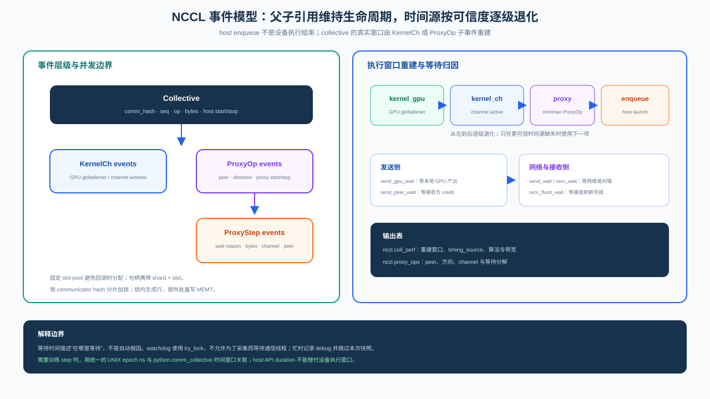
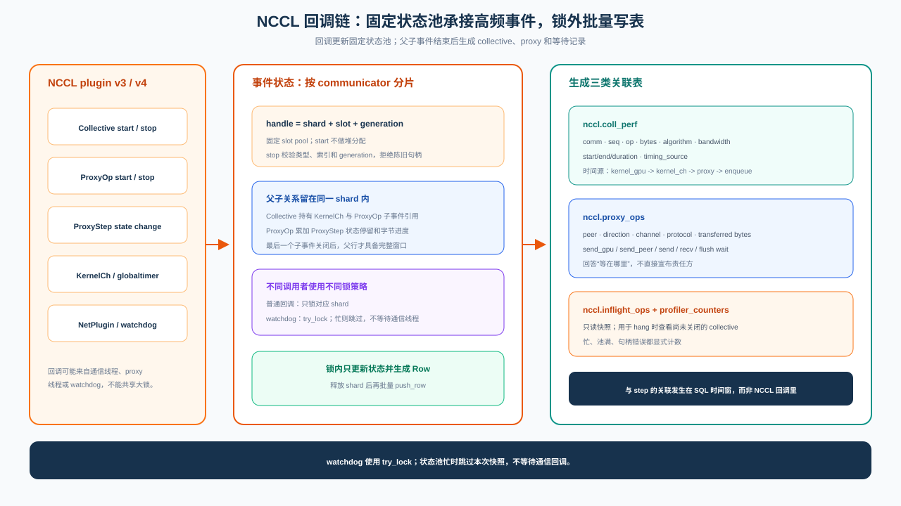

# NCCL Profiler 架构

NCCL Profiler 的目标不是把 NCCL 回调逐条存下来，而是回答一个分布式因果问题：一次 collective
变慢时，时间消耗在本 rank 尚未产出、等待对端、网络传输，还是设备执行。这个结论不能由单个
时间戳给出，因此设计重点是保留事件之间的生命周期关系，并让查询层能够跨 rank 对齐证据。

## 观测边界：为什么必须进入 NCCL

PyTorch API 层知道 `global_step` 和并行角色，但同步调用的返回时间、异步调用的 `work.wait()` 都只是
host 侧边界，不能代表设备和 proxy 何时真正完成。PyTorch Flight Recorder 保存 watchdog 环形记录，
适合超时后的 collective 对齐，却不能持续分解正常通信的等待。只有 NCCL profiler plugin 能直接看到
Collective、KernelCh、ProxyOp、ProxyStep 与 NetPlugin 回调。

这三种证据因此保持独立：Python 层提供训练坐标，NCCL 层恢复运行时执行与等待，Flight Recorder
保存超时现场。它们不在回调路径互相调用，而是在查询时通过 communicator、sequence、rank 和 epoch
纳秒窗口关联。这样既保留各层真实的时间语义，也避免为方便 JOIN 而把 Python 状态带入 NCCL 通信线程。

插件同时导出 `ncclProfiler_v4` 与 `ncclProfiler_v3`，由 NCCL 协商 ABI。v4 能提供 GPU globaltimer、
per-communicator 信息和更完整的 peer 等待；v3 缺少的证据必须通过 `timing_source` 和默认值显式退化，
不能伪装成同等精度。

## 事件生命周期：完成时间来自子事件

collective 的 `stopEvent` 只表示 host enqueue 已结束，kernel 和 proxy 可能仍在运行。如果在这里立即
写行，`exec_time` 实际测到的只是 launch 开销。插件因而把 Collective 作为父对象，持有仍然活动的
KernelCh 和 ProxyOp；ProxyOp 再持有 ProxyStep 的进展。只有最后一个子事件关闭，父对象才获得完整
执行窗口并进入发布阶段。

计时信号按证据质量逐级退化：优先使用 GPU globaltimer，其次使用 KernelCh 活动窗口，再其次使用
ProxyOp 包络，最后才退回 host enqueue。选择结果写入 `timing_source`。这个字段不是展示信息，而是
查询解释的组成部分：两个 `exec_time_ns` 只有在时间源质量可比较时才应直接比较。

ProxyStep 不作为无限增长的明细表发布，而是在 ProxyOp 生命周期内累积为发送端 GPU 等待、peer
credit 等待、网络发送、接收和 flush 等待。这一决策用有界状态换取诊断所需的等待分解，避免消息
切片数量直接放大存储量。等待字段仍只是证据：高 `send_gpu_wait_ns` 指向本 rank 产出不足，高
`recv_wait_ns` 指向等待对端或网络；最终的 culprit/victim 判断还必须结合相同 sequence 的其他 rank、
并行拓扑和系统状态。

## 回调并发：通信线程不能为诊断让路

回调来自 host、proxy、NetPlugin 和 watchdog 等不同线程。若它们共享一把大锁或在回调中动态扩容，
诊断器本身就可能改变通信时序。插件使用固定容量 slot pool，并按 communicator hash 分片；一次回调
通常只触碰一个 shard，容量和最坏分配成本在启动时已经确定。

handle 由 shard、slot 和 generation 组成。slot 被回收后 generation 改变，因此迟到的 stop 回调
无法关闭后来复用该 slot 的新事件。锁内只更新父子关系、状态和计数，并在事件完成时生成独立 row；
真正的 MEMT 追加发生在释放 shard 锁之后。这样存储抖动不会扩大 NCCL 临界区。

watchdog 采用 `try_lock`。分片繁忙时，它宁可跳过一次在途快照并增加计数，也不等待通信线程。
这是诊断系统的优先级决策：允许可见的数据缺口，不允许为了观测 hang 而制造新的 hang。

## 发布模型：表代表不同阶段的事实

完成的通信首先写入 `nccl.coll_perf`，其中保存重建后的执行窗口、算法、协议、消息规模和
`timing_source`。同一通信的 proxy 等待被压缩到 `nccl.proxy_ops`，用于解释时间消耗在生产、peer
还是网络。尚未结束的事件没有完成行，watchdog 通过只读快照写入 `nccl.inflight_ops`，补上“永远
不会触发 stop”的挂死盲区。启用 NetPlugin 后，QP 完成时延独立进入 `nccl.net_qp`，不强行嫁接到
尚未证明的一次 collective 上。

这些表不是四套相互竞争的答案，而是事件生命周期的四个投影。查询先用 `coll_perf` 找异常窗口，再用
`proxy_ops` 分解等待；没有完成记录时转向 `inflight_ops`；只有出现网络等待证据时才继续关联
`net_qp` 与 RDMA 指标。跨 rank 查询通过 `global.nccl.*` 在各进程本地过滤后汇总，训练 step 则由
epoch 纳秒窗口与 Python 层坐标连接。聚合与因果判断属于查询层，不回灌到 collector。

`nccl.profiler_counters` 是上述证据的完整性边界。pool 耗尽、陈旧 handle、写入失败和 watchdog
跳过都会计数；诊断结果必须先检查这些信号，才能判断“没有事件”究竟是没有异常还是采集不完整。

## 失败边界与实现约束

NCCL 回调路径遵守三个约束：不等待远程节点，不执行跨 collector 调用，不因诊断失败改变 NCCL 的
返回路径。状态池满时丢弃并计数，MEMT 写失败在锁外记录，watchdog 竞争失败只跳过快照。由此得到的
数据可能带有明确缺口，但训练通信仍保持原有控制流。

精确表 schema 见 [SQL 表参考](../reference/sql-tables.zh.md)，环境与容量开关见
[环境变量](../reference/env-vars.zh.md)，部署和查询示例见
[性能分析示例](../examples/performance-analysis.zh.md)，跨 rank 诊断编排见
[诊断 Skills](../guide/skills.zh.md)。实现位于 `probing/extensions/nccl-profiler/`。
