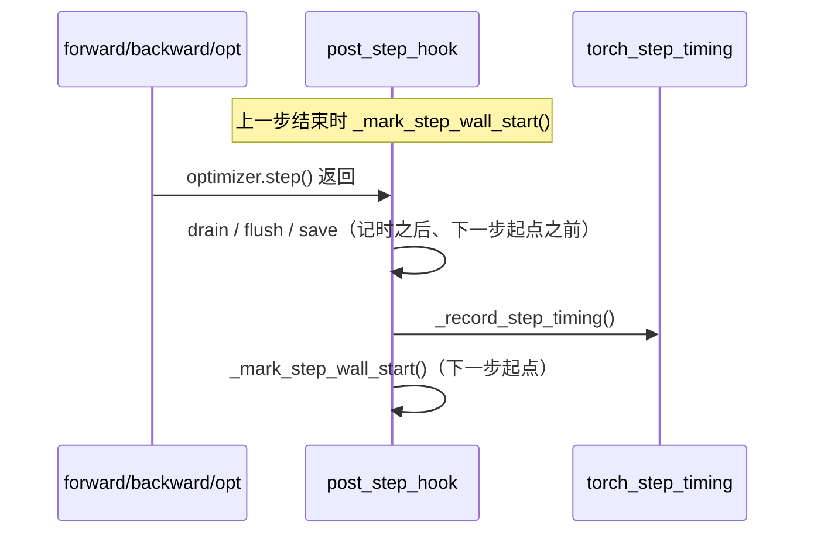

# Overhead 测量与公式定义

本文是 Probing **instrumentation overhead** 的顶层设计文档：统一术语、公式、测量边界与离线/在线基准方法。实现细节见 [性能分析](profiling.zh.md)；表字段见 [SQL 表 — torch_step_timing](../reference/sql-tables.zh.md#python-torch_step_timing)。

**不可变语义与回归测试**（修改公式 / hook 顺序前必读）：[overhead-invariants.zh.md](overhead-invariants.zh.md)。

## 1. 目标与范围

### 要回答的问题

| 问题 | 典型场景 |
|------|----------|
| TorchProbe 模块 hook 让每步慢多少？ | 生产训练、`health_overview`、Web Overhead 面板 |
| Span / memtable 持久化成本？ | `make bench` tracing 层、回归测试 |
| 真实 TinyNet 训练上的端到端增量？ | `make bench` torch_train 层 |
| NCCL profiler 对 collective 延迟的影响？ | `run_nccl_profiler_bench.sh`（离线） |

### 明确不衡量

- **业务吞吐 SLO**（tokens/s、收敛速度）——需用户自有 baseline job 对比
- **NCCL collective 本身的执行时间**（那是训练逻辑，不是探针税）
- **shadow step 上的「纯 PyTorch」**——shadow 仍运行 NCCL/CPU/GPU 等其他采集器

### 与 `probing bench` CLI 的区别

| 入口 | 测量对象 |
|------|----------|
| `make bench` → `examples/bench_instrumentation.py` | Python/Rust **instrumentation** 墙钟开销 |
| `probing bench write`（隐藏 CLI） | memtable **写路径吞吐/延迟**，不是训练 hook 税 |

二者不可互换。

---

## 2. 术语表

| 术语 | 定义 |
|------|------|
| **probed step** | `python.torch_step_timing.is_shadow = 0` 的正常训练步；TorchProbe 模块 hook 按配置执行（shadow 步除外） |
| **shadow step** | `is_shadow = 1` 的基线步；模块/optimizer hook **立即返回**，不写 `python.torch_trace`，但仍写 timing 行 |
| **shadow cadence** | 默认 `4:1`：每 5 个 optimizer step 中 4 个 probed、1 个 shadow（`shadow=4:1`） |
| **sampled step** | probed 且 `sampled = 1`：该步会 flush module 级 trace（可能含 GPU defer/sync） |
| **hook tax（混合）** | 中位数口径：全部 probed step（含采样+非采样）相对 shadow | 噪声较大，保留兼容 |
| **dispatch overhead** | 中位数口径：仅 `sampled=0` 的 probed step 相对 shadow | **推荐主指标**，抗采样步干扰 |
| **sampled overhead** | 中位数口径：仅 sampled probed step 相对 shadow | 重路径（含 flush/sync） |
| **total overhead（摊销）** | 加权口径：`(1−rate)×dispatch_overhead + rate×sampled_overhead`（Web UI） |
| **in-run** | 训练进程内，靠 `python.torch_step_timing` 持续对比 |
| **offline** | 独立基准脚本，A/B 或 paired 对比 |

---

## 3. 通用公式

### 3.1 相对 overhead（比值法）

适用于 TorchProbe in-run 与多数离线场景：

$$
\text{overhead\_pct} = \left(\frac{M_{\text{probed}}}{M_{\text{shadow}}} - 1\right) \times 100
$$

其中 $M$ 为聚合函数（见下表）。当 $M_{\text{shadow}} = 0$ 时结果无定义，SQL 用 `nullif(..., 0)` 处理。

### 3.2 相对 baseline（离线 A/B）

$$
\text{vs\_baseline\_pct} = \left(\frac{T_{\text{measured}}}{T_{\text{beline}}} - 1\right) \times 100
$$

### 3.3 绝对增量（paired 训练基准）

$$
\Delta T = T_{\text{instrumented}} - T_{\text{baseline}}, \quad T_{\text{inst\_med}} = \text{median}(T_{\text{baseline}}) + \text{median}(\Delta T)
$$

### 3.4 NCCL 延迟增量

$$
\text{pct\_delta}(ref, x) = 100 \times \frac{x - ref}{ref}
$$

正值表示 profiled 模式更慢（延迟更高或吞吐更低）。

---

## 4. 运行时测量：TorchProbe Shadow Step

### 4.1 机制

启用 `PROBING_TORCH_PROFILING=on`（默认含 `shadow=4:1`）后，每个 optimizer step 在 `python.torch_step_timing` 写一行。

**Shadow 判定**（`shadow_step_in_cycle`）：

```text
cycle_len = shadow_normal + shadow_baseline   # 默认 4 + 1 = 5
is_shadow = (cycle_index % cycle_len) >= shadow_normal
```

默认下 index 0–3 为 probed，index 4 为 shadow。

### 4.2 计时窗口（`step_duration_sec`）

使用 `time.perf_counter()` 墙钟，**非** GPU kernel 时间。



**边界定义**：

- **起点**：上一 optimizer step 的 `post_step_hook` 末尾调用 `_mark_step_wall_start()`
- **终点**：当前 step 的 `post_step_hook` 内 `_record_step_timing()` 调用时刻（**早于** `_drain_deferred()`）

因此 `step_duration_sec` 覆盖：**整步训练计算 + 本步 hook 收尾**（含 sampled 步当步的 trace flush），**不含**前几步 deferred GPU event 的 `elapsed_time` 回收（回收在记时之后、下一步起点之前执行）。

**与 `train.step` span 的区别**：后者来自 `python.trace_event`，度量 span 包裹的计算区间，**不含** hook 派发与落盘；Web UI 同时展示两者，不可直接对比数值。

### 4.3 各 step 类型下 hook 行为

| 类型 | 模块 hook | 写 torch_trace | timing 行 |
|------|-----------|----------------|-----------|
| discovery（首步） | 注册模块 | 否 | 特殊路径 |
| probed + 非采样 | 短路（无 module 记录） | 否 | `is_shadow=0, sampled=0` |
| probed + 采样 | 全量执行 | 是 | `is_shadow=0, sampled=1` |
| shadow | 立即 return | 否 | `is_shadow=1` |

**重要**：`hook_tax` 比较的是 **probed 步（含采样与非采样混合）** vs **shadow** 的中位数。`sampled_overhead` 仅取 `sampled=1` 的 probed 子集，反映「重路径」开销。

---

## 5. 指标目录

### 5.1 In-run 指标

| 指标 | 分子 $M_{\text{probed}}$ | 分母 $M_{\text{shadow}}$ | 聚合 | 窗口 | 消费方 |
|------|-------------------------|-------------------------|------|------|--------|
| **hook_tax_pct** | 全部 probed `step_duration_sec` | shadow | **median** | 滚动 **80** 步 | `health_overview`（混合，兼容） |
| **dispatch_overhead_pct** | probed 且 `sampled=0` | shadow | **median** | 滚动 **80** 步 | **推荐告警口径** |
| **sampled_overhead_pct** | probed 且 `sampled=1` | shadow | **median** | 滚动 **80** 步 | `health_overview`、Web |
| **Hook tax / Dispatch（Web）** | dispatch（`sampled=0`）优先展示 | shadow | **median** | 最近 **80** 步 | Web 侧栏 / 面板 |
| **Total overhead（Web 摊销）** | dispatch + sampled 按采样率加权 | — | **加权 %** | 最近 80 步 | Web 面板 |
| **Sampled overhead（Web）** | probed 且 `sampled=1` | shadow | **median** | 最近 80 步 | Web 面板 |

**推荐 SQL（滚动窗口 + 分层指标）**：

```sql
WITH bounds AS (
  SELECT GREATEST(COALESCE(MAX(local_step), 0) - 80, 1) AS win_start
  FROM python.torch_step_timing
)
SELECT
  round((median(CASE WHEN is_shadow = 0 AND sampled = 0 THEN step_duration_sec END)
        / nullif(median(CASE WHEN is_shadow = 1 THEN step_duration_sec END), 0) - 1) * 100, 2)
    AS dispatch_overhead_pct,
  round((median(CASE WHEN is_shadow = 0 THEN step_duration_sec END)
        / nullif(median(CASE WHEN is_shadow = 1 THEN step_duration_sec END), 0) - 1) * 100, 2)
    AS hook_tax_pct,
  round((median(CASE WHEN is_shadow = 0 AND sampled = 1 THEN step_duration_sec END)
        / nullif(median(CASE WHEN is_shadow = 1 THEN step_duration_sec END), 0) - 1) * 100, 2)
    AS sampled_overhead_pct,
  sum(CASE WHEN is_shadow = 0 AND sampled = 0 THEN 1 ELSE 0 END) AS dispatch_n,
  sum(CASE WHEN is_shadow = 0 THEN 1 ELSE 0 END) AS probed_n,
  sum(CASE WHEN is_shadow = 1 THEN 1 ELSE 0 END) AS shadow_n
FROM python.torch_step_timing, bounds
WHERE local_step >= bounds.win_start AND local_step > 1;
```

**显示规则**（Web）：$|\text{pct}| < 0.5$ 显示为 `≈0%`；需 `shadow_n ≥ 5` 且 `dispatch_n ≥ 16` 才视为稳定估计（见 §5.2、§11）。

### 5.2 样本量与可信度

| 条件 | 行为 |
|------|------|
| `shadow_baseline = 0`（`shadow=off`） | 无法计算 overhead % |
| `shadow_n < 5` | UI / 技能提示「样本不足」；百分比仅供参考 |
| `dispatch_n < 16`（默认 rate=0.05 时约需 320 步窗口） | `dispatch_overhead` 方差大，优先看趋势勿读单点 |
| `probed_n = 0` 或 `shadow_n = 0` | 跳过比率断言（soak） |
| $\|hook\_tax - dispatch\_overhead\| > 10\text{pp}$ | 提示检查采样率 / GPU defer（混合指标被采样步拉高） |

### 5.3 辅助指标

| 指标 | 公式 / 来源 | 用途 |
|------|-------------|------|
| `train_step_median_ms` | `median(span_end.time - span_start.time)`，`name='train.step'` | 计算区间参考（非 hook 税） |
| `nccl.profiler_counters` | 最新一行计数器 | 数据完整性（非 overhead %） |

---

## 6. 离线基准：`make bench`

脚本：`examples/bench_instrumentation.py`。须在 **probing 注入进程**内运行：

```bash
PROBING=1 make bench          # 完整
PROBING=1 make bench-quick    # --quick
```

### 6.1 参数

| 参数 | full（默认） | `--quick` |
|------|-------------|-----------|
| span_iters | 300 | 80 |
| probe_steps | 40 | 12 |
| train batches | 30 | 8 |
| warmup（外层轮次） | 2 | 1 |
| runs（外层轮次） | 5 | 3 |

### 6.2 三层测量

#### 层 A — tracing

对每个场景：

1. 内层 warmup `warmup` 次 + 计时 `runs` 次
2. 取 **median(总墙钟秒)**
3. `vs_baseline_pct` 相对 `span (no backend)`（`PROBING_SPAN_BACKENDS` 空）

| 场景 | 迭代内容 |
|------|----------|
| empty loop | 空循环基线 |
| span (no backend) | `probing.span`，无持久化 |
| span (memtable) | span + memtable 落盘 |
| span + event | span + event 行 |
| train.step span triple | forward / backward / optimizer 三个 span + `probing.step()` |

**每迭代微秒**：

$$
\text{per\_iter\_us} = \frac{\text{median\_sec}}{\text{iterations}} \times 10^6
$$

#### 层 B — torch_probe（合成）

- 单假模块 `_FakeMod`，`DelayedRecord.save` 打桩
- **无** 外层 warmup/runs；一次跑 `probe_steps` 步取 timing **median**
- baseline：`hooks only (trace_spans=off, shadow=off)`
- `shadow=4:1` 场景额外输出 `hook_tax_pct`（与 §3.1 同公式，按 cycle index 分桶）

> **局限**：无真实 backward/GPU；数值用于 **回归对比** 与配置敏感度，不能等同于生产大模型 overhead。

#### 层 C — torch_train（TinyNet）

- 设备：CUDA 可用则用 GPU，否则 CPU
- 每轮 **背靠背**：先无 hook baseline，再带 phase/TorchProbe
- 每场景内 2 步 warmup + `batches` 步计时
- 报告 `paired_delta_ms` 与合成 `inst_med = median(base) + median(Δ)`

### 6.3 JSON 导出

```bash
PROBING=1 python examples/bench_instrumentation.py --json-out /tmp/bench.json
```

---

## 7. NCCL Profiler Overhead（仅离线）

**无 in-run shadow**。运行时只看 `nccl.profiler_counters` 健康度。

### 7.1 E2E AllReduce / AllGather

脚本：`examples/nccl_profiler_overhead.py`；编排：`examples/run_nccl_profiler_bench.sh`。

| 模式 | 环境 |
|------|------|
| baseline | 无 `NCCL_PROFILER_PLUGIN`、无 `PROBING` |
| profiled | 插件 + `PROBING=2` + `PROBING_NCCL_INFLIGHT_THRESHOLD_SECS=0` |

**流程**：

1. `warmup_iters = 20`
2. `bench_iters = 200`（默认 msg 1 MiB）
3. 每次 collective 前后 `cuda.synchronize()`
4. 输出 `latency_us_{mean,p50,p99}`、`throughput_gbs`
5. `--compare` 用 §3.4 算 `latency_*_pct`、`throughput_pct`

### 7.2 微基准（Rust Criterion）

`probing/extensions/nccl-profiler/benches/callback_path.rs`：callback 路径、slot pool、`now_ns`——**组件级**，不与 E2E 数值直接对照。

---

## 8. 其他子系统

| 子系统 | 测量方法 | 公式 / 阈值 |
|--------|----------|-------------|
| **Span + memtable** | `tests/regression/profiling/test_span_overhead.py` | `T_on < T_off × 8 + 0.05s`（300 iter） |
| **TorchProbe module spans** | 同上 | `med_on < med_off × 6 + 0.02s`（20 steps） |
| **memtable 写路径** | `probing bench write` | 吞吐 / 可选延迟 reservoir |
| **pprof** | `probing.pprof.sample_freq` | 定性：SIGPROF 频率越高开销越大 |
| **PROBING_SPAN_LOCATION** | 无自动化公式 | 定性：`inspect.stack()` 显著增开销 |

**隔离栈成本**：`PROBING_SPAN_BACKENDS=none` 或 bench 中 `configure_backends([])`。

---

## 9. 阈值与门禁（当前仓库）

| 门禁 | 条件 | 位置 |
|------|------|------|
| 诊断 warning | `dispatch_overhead_pct > 5%`（稳定口径） | `health_overview` |
| 诊断 info（混合偏高） | `hook_tax_pct > 5%` 且 `dispatch_overhead_pct ≤ 5%` | 可选：采样步导致 |
| soak 失败 | `hook_tax_pct > 75%`（默认 `--max-hook-tax-pct`） | `examples/soak_assert.py` |
| CI 回归 | span 倍数上界（§8） | `test_span_overhead.py` |

> **注意**：5%（告警）、75%（soak）、8×（回归）服务于不同目的，**不是**统一 SLO。发布前应结合目标硬件与模型自行标定。

---

## 10. 已知偏差与解释

1. **Shadow 非真空基线**：NCCL lite hook、CPU/GPU 周期性采集、span 等仍在 shadow 步运行；`hook_tax` 仅隔离 **TorchProbe 模块 hook 路径**。
2. **采样步膨胀**：sampled probed 步的 `step_duration_sec` 可能含 deferred GPU `elapsed_time` drain；用 `sampled_overhead` 看重路径，勿与非采样 probed 混读。
3. **窗口已对齐**：Web / `health_overview` 默认均为最近 80 步；全历史 SQL 方差更大。
4. **合成 bench ≠ 生产**：`bench_instrumentation` torch_probe 层无真实模型；torch_train 层仅 TinyNet。
5. **多 rank**：各 rank 独立写 `local_step`；联邦查询需注意 `rank` 切片。
6. **discovery 步**：`local_step = 1` 通常应过滤（`WHERE local_step > 1`）。

---

## 11. 抗噪声与稳定性

### 11.1 噪声来源

| 来源 | 影响 | 缓解 |
|------|------|------|
| **采样步混入** | `sampled=1` 步含 trace flush、GPU defer/sync，墙钟远高于非采样步 | 用 **`dispatch_overhead`**（`sampled=0`）作 hook 税主指标 |
| **训练步本身抖动** | 数据加载、collective、checkpoint 等导致 step 时长尖峰 | **median** 优于 mean；滚动窗口 |
| **窗口过短** | 全表或 <20 步时 median 方差大 | 默认 **80 步**滚动窗口（Web / health 对齐） |
| **shadow 样本稀少** | 默认 4:1 下 80 步仅 ~16 个 shadow 点 | 要求 `shadow_n ≥ 5`；长跑 job 更可信 |
| **冷启动 / discovery** | 首步注册模块、JIT、缓存预热 | 过滤 `local_step > 1`；离线 bench 用 warmup |
| **混合 probed 聚合** | `hook_tax` 把轻/重路径平均 | 分层报告 dispatch / sampled / blended |
| **OS 调度 / 频率缩放** | 墙钟偶发毛刺 | 离线 bench 多轮 median；in-run 看趋势勿盯单步 |
| **Deferred 回收阻塞 hook** | GPU `elapsed_time` + memtable 写在 `post_step_hook` 内 | 记时后再 drain；默认 **`PROBING_TORCH_DEFER_ASYNC=1`** 后台线程 + 有界队列 |

### 11.2.1 异步 deferred 回收（中期）

默认开启（``PROBING_TORCH_DEFER_ASYNC=1``）。主线程在 ``_record_step_timing`` 之后只做非阻塞 ``event.query()`` 分区，将 ready 的 ``DelayedRecord`` 入队；后台 daemon 线程执行 ``elapsed_time`` + ``save()``。队列满时回退到同步 ``save()``。

| 环境变量 | 默认 | 含义 |
|----------|------|------|
| ``PROBING_TORCH_DEFER_ASYNC`` | ``1`` | ``0`` 关闭后台线程（测试 / 调试） |
| ``PROBING_TORCH_DEFER_QUEUE_SIZE`` | ``4096`` | 有界队列深度 |

进程退出时 ``atexit`` 会 ``flush`` 队列。测试可调用 ``flush_deferred_drain()``。

### 11.2 稳定性设计原则

1. **分层而非混合**：dispatch（轻路径）与 sampled（重路径）分开；`hook_tax` 仅作兼容汇总。
2. **稳健聚合**：in-run 默认 **median**；摊销 overhead 用 `(1−rate)×dispatch + rate×sampled`，**不用** `mean(probed)/mean(shadow)`（步长抖动 + 小样本 shadow 会严重失真）。
3. **滚动窗口**：消费方统一 `WINDOW = 80`（约 16 个 shadow 周期 @ 4:1），避免冷启动与远古 outlier 污染。
4. **成对对比**：离线 torch_train 用 **背靠背 paired Δ**，抵消 run 间漂移。
5. **周期对齐**：shadow 按固定 cadence 插入，probed/shadow 经历相同 NCCL/GPU 背景采集。
6. **显式可信度门控**：样本不足时不报警，只提示 Collecting / 仅供参考。

### 11.3 指标选用指南

| 目的 | 推荐指标 | 原因 |
|------|----------|------|
| 日常告警 / 侧栏 | `dispatch_overhead_pct` | 与 shadow 路径最接近，抗采样噪声 |
| 评估采样配置代价 | `sampled_overhead_pct` | 隔离重路径 |
| 兼容旧面板 / soak | `hook_tax_pct`（混合） | 保守上界，易偏高 |
| 发布前回归 | `make bench` + CI 倍数上界 | 可控环境、可重复 |
| 长期趋势 | 滚动 80 步 + 每 5min 采样一点 | 避免逐步抖动 |

### 11.4 调参建议（提高稳定性）

```bash
# 更稳的 shadow 基线（更多 shadow 步，略增 cadence 开销）
PROBING_TORCH_PROFILING=on,shadow=8:2,rate=0.05

# 仅看轻路径时 temporarily 提高 rate 可增加 dispatch_n（更重）
# 诊断 SQL 时务必加窗口：
# WHERE local_step >= (SELECT max(local_step) - 80 FROM python.torch_step_timing)
```

### 11.5 未来增强（未实现）

- **Trimmed mean / winsorize**：去掉 probed 时长 top/bottom 5% 后再算比值
- **按 cadence 周期聚合**：每 5 步一组先算组内 median，再跨组 median
- **EWMA 平滑**：Web 侧栏显示指数滑动平均，降低逐步跳动
- **置信区间**：bootstrap 或 shadow 周期自助法给出 ± 区间
- **NCCL in-run shadow**：与 TorchProbe 对称的 collective 基线

---

## 12. 操作指南

### 启用 in-run overhead

```bash
# 默认：rate=0.05, shadow=4:1
PROBING=1 PROBING_TORCH_PROFILING=on python train.py

# 或运行时配置
# SET probing.torch.profiling = 'on,shadow=4:1,rate=0.05';
```

### 降低开销（优先级）

1. 降低 `rate` / `layer_rate`
2. 关闭 `trace_spans`、`sync=on`、`backward=on`
3. `shadow=off` 仅当不需要 in-run 估计
4. 关闭 torch profiling，仅保留基础探针

### 快速冒烟

```bash
PROBING=1 python examples/torch_probe_overhead_smoke.py   # 无 GPU
PROBING=1 make bench-quick
```

---

## 13. 实现索引

| 组件 | 路径 |
|------|------|
| Shadow 逻辑与计时 | `python/probing/profiling/torch_probe.py` |
| 离线基准 | `examples/bench_instrumentation.py` |
| Web SQL | `web/src/overhead/sql.rs` |
| Web 格式化 | `web/src/overhead/metrics.rs` |
| 技能 SQL | `skills/health_overview/steps.yaml` |
| soak 断言 | `examples/soak_assert.py` |
| NCCL E2E | `examples/nccl_profiler_overhead.py` |

---

## 相关文档

- [性能分析实现](profiling.zh.md) — TorchProbe 采样、表结构
- [Tracing Span](tracing-spans.zh.md) — span 分层与 bench 入口
- [NCCL Profiler](nccl-profiler.zh.md) — 插件 ABI 与计数器
- [常见问题 — High Overhead](../guide/troubleshooting.zh.md)
