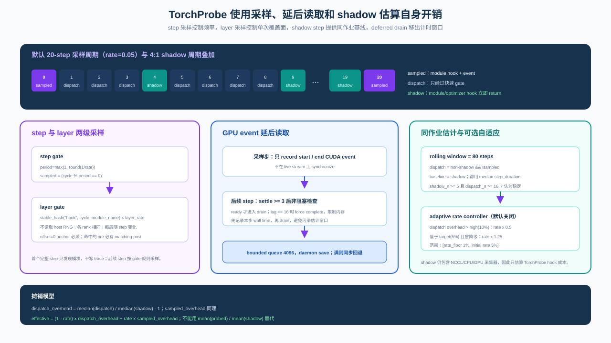
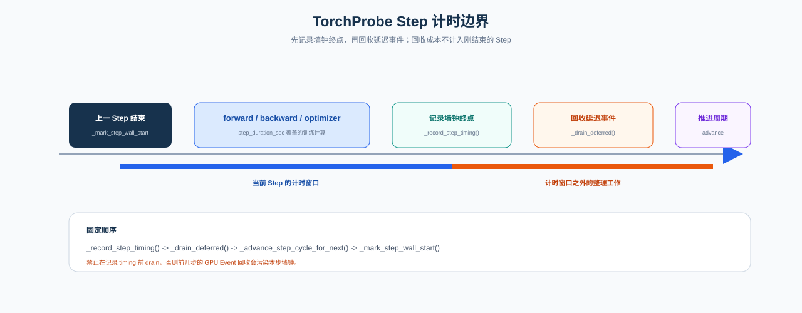

# 开销控制与测量架构

观测开销不是采集器运行时间的一个简单计数。hook 派发、被采样 step 的重路径、GPU 时间读取、MEMT
写入和 NCCL 回调跨越不同执行边界。如果把它们混成一个百分比，既无法指导采样决策，也无法判断回归
来自哪里。Probing 因而先在架构上隔离成本，再为每条路径定义可解释的测量方法。

实现见[性能采集架构](profiling.zh.md)，字段契约见
[SQL 表 — torch_step_timing](../reference/sql-tables.zh.md#python-torch_step_timing)。

## 1. 成本如何被拆开

TorchProbe 的每个 optimizer step 先进入 probed 或 shadow 路径。shadow step 仍保留完整训练负载和
其他采集器，但 TorchProbe module/optimizer hook 在入口短路；它因此是同一次作业内的交错基线，而
不是“没有任何观测的纯训练”。

probed step 再分成两条路径。未命中采样时只支付 hook dispatch 和 step timing，命中采样时还要记录
module 事件、整理结果并写表。前者代表长期运行中每步都可能支付的固定成本，后者代表按采样率偶发的
重路径成本。把两者分开，是因为降低采样率只能摊薄重路径，不能消除 hook 已经挂到模型树上的派发成本。

运行中 shadow 只能隔离 TorchProbe。Span/MEMT 的组件成本通过独立 instrumentation benchmark 测量，
完整训练路径通过成对端到端基准验证。NCCL profiler 没有运行中 shadow，因为关闭 NCCL 回调会改变
被测通信路径本身；它必须用相同 collective 的离线 A/B 衡量。

## 2. 控制路径为什么这样组织



step gate 与 layer gate 分别控制“多久深入一次”和“一次深入多少层”。step gate 只依赖 step 序号，
所有 rank 因而命中同一批 step；layer gate 使用 `(step, layer)` 的确定性哈希，在保留跨 rank 可比性的
同时降低单步覆盖面。默认 `rate=0.05`、`layer_rate=1.0`，意味着少量 step 保留完整 module 关系，
而不是每步只得到彼此无法拼接的零散 layer。

GPU event 的记录与读取被拆开。采样 step 只提交 event，经过 settle 窗口后再读取 elapsed time；默认
异步 worker 使用容量 4096 的有界队列。队列满时同步回退而不是无限占用内存，进程退出时 flush，
从而在资源有界和数据不静默丢失之间取得明确平衡。

shadow 默认按 `4:1` 交错插入，使 probed 与 baseline 经历相近的数据、collective 和系统噪声。自适应
采样默认关闭；显式开启后，只有 `shadow_n ≥ 5` 且 `dispatch_n ≥ 16` 才允许调整，并且不能超过用户
设置的初始 rate。控制器因此只能在有足够证据时降低成本，不能自行扩大观测强度。

## 3. 计时边界与统计语义



`step_duration_sec` 从上一 optimizer `post_step_hook` 末尾的 `_mark_step_wall_start()` 开始，到当前
`post_step_hook` 中的 `_record_step_timing()` 结束。随后才执行 `_drain_deferred()`，最后推进状态并
开始下一步。这个顺序保证当前 step 包含本步训练计算和 hook 收尾，却不把前几步 GPU event 的回收
成本错误归给当前 step。

`train.step` span 测量用户包裹的计算区间，不包含 hook 派发和持久化；`step_duration_sec` 则有意覆盖
这些边界成本。两者回答的问题不同，不能直接相减或互相替代。

运行时使用中位数抵抗数据加载、collective 和调度毛刺。设 $M_s$ 为 shadow step 时长中位数，
$M_d$ 为未采样 probed step 中位数，$M_p$ 为采样 probed step 中位数，则：

$$
\text{dispatch} = \left(\frac{M_d}{M_s}-1\right)\times100\%, \qquad
\text{sampled} = \left(\frac{M_p}{M_s}-1\right)\times100\%
$$

采样率为 $r$ 时，摊销后的有效开销是：

$$
\text{effective}=(1-r)\times\text{dispatch}+r\times\text{sampled}
$$

不能改成 `mean(probed)/mean(shadow)`：probed 集合混合了轻重路径，shadow 样本又更少，均值会同时受
采样比例和长尾 step 支配。历史 `hook_tax` 使用全部 probed step 的中位数，只保留作兼容和保守上界。

## 4. 什么时候测量可信

Web 与诊断 skill 使用最近 80 个 step，使窗口同时覆盖多个 shadow 周期又不被很早的冷启动污染。
`shadow_n < 5` 或 `dispatch_n < 16` 时只展示正在收集或低置信提示，不用百分比触发稳定告警；
`shadow=off` 时分母不存在，运行中开销百分比本身无定义。绝对值小于 `0.5%` 显示为 `≈0%`，避免把
计时分辨率和自然抖动包装成精确差异。

噪声处理服从来源分离。采样重路径不混入 dispatch；step 尖峰用滚动中位数抑制；discovery、JIT 和
缓存预热从稳定窗口排除；deferred drain 在计时之后执行；跨 rank 先分别计算本 rank 的分层指标，
不能把不同负载的 step 直接混成一个总体均值。

`nccl.profiler_counters`、队列满和写入失败描述数据完整性，不是 overhead 百分比。缺少事件时必须先
排除采集缺口，再解释为“没有额外成本”。

## 5. 离线验证为什么仍然必要

运行中测量贴近生产负载，但只能看到 TorchProbe 相对 shadow 的增量。离线 benchmark 因而分三层：
tracing 层隔离 span 栈与持久化，合成 TorchProbe 层验证 hook 和采样状态机，TinyNet 层用背靠背 paired
delta 验证真实 forward/backward/optimizer 组合。三层不是三个产品指标，而是从组件到端到端逐步定位
回归的证据链。

NCCL 采用另一条验证链：相同消息大小、warmup 和同步边界下运行 baseline 与 profiled collective，
比较 latency 和 throughput；Criterion 只衡量 callback、slot pool 和时钟读取等组件成本，不能代替
collective 端到端结果。

仓库中的 5% 诊断 warning、75% soak 上界和组件倍数门禁服务于不同层次。它们不是统一性能 SLO，
也不能替代目标模型与硬件上的发布前标定。

## 6. 修改时必须保持的不变量 {#change-invariants}

下面的表是变更安全契约，而不是另一套开销模型。

| 不变量 | 必须保持 | 守护位置 |
|--------|----------|----------|
| 主百分比 | `median(dispatch) / median(shadow) - 1`，不能换成 `mean(probed)/mean(shadow)` | `web/src/overhead/metrics.rs` |
| 摊销开销 | `(1 − rate) × dispatch + rate × sampled` | `amortized_blends_dispatch_and_sampled_by_rate` |
| hook 顺序 | `_record_step_timing()` → `_drain_deferred()` → advance → `_mark_step_wall_start()` | Python overhead/sampling regression tests |
| 异步回收 | `PROBING_TORCH_DEFER_ASYNC=1` 为默认；有界队列、满时同步回退、退出 flush | `test_deferred_drain_worker.py` |
| 稳定性门控 | `shadow_n ≥ 5` 且 `dispatch_n ≥ 16` 才能解释为稳定百分比 | Web metrics 与 `health_overview` |
| UI 语义 | Typical=dispatch，Effective=采样率加权；`abs(pct)<0.5%` 显示 `≈0%` | Web formatting/copy tests |

修改公式、hook 顺序或异步回收默认值后运行：

```bash
cd web && cargo test overhead
PROBING=0 pytest tests/regression/profiling/test_overhead_invariants.py \
  tests/regression/profiling/test_torch_probe_sampling.py \
  tests/regression/profiling/test_deferred_drain_worker.py -q
```

## 相关文档

- [性能采集架构](profiling.zh.md)
- [数据层](data-layer.zh.md)
- [NCCL Profiler 架构](nccl-profiler.zh.md)
- [SQL 表参考](../reference/sql-tables.zh.md)
