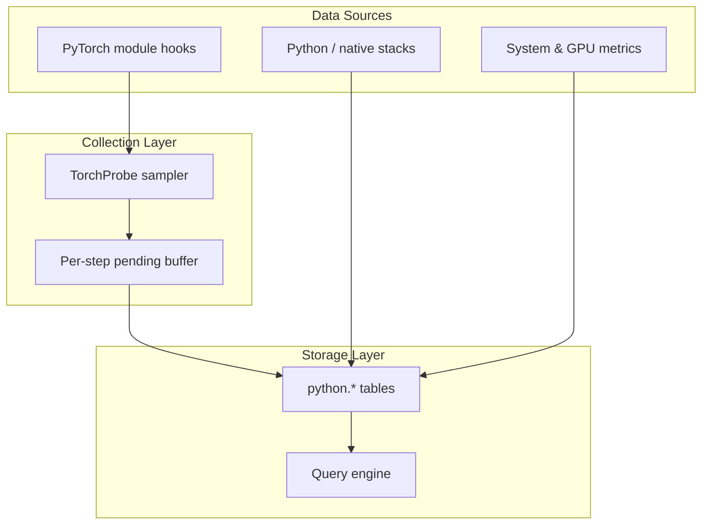

# Profiling Implementation

Probing provides profiling capabilities for AI workloads with minimal overhead and SQL-queryable storage.

## Overview

The profiling system collects performance data through:

- Hook-based and periodic collectors
- Statistical sampling (long-running telemetry, not episodic trace windows)
- Columnar table storage (memtable / Arrow-backed tables)
- SQL query interface

## Data Collection Architecture



## PyTorch Profiling (TorchProbe)

### Design

TorchProbe targets **always-on, module-level training telemetry** after probe injection or `PROBING_TORCH_PROFILING=on`. It is complementary to episodic tools such as `torch.profiler` / Kineto (op/kernel Chrome traces). For on-demand Kineto capture exposed as **virtual SQL tables** (not memtable), see **[Torch Profiler SQL](torch-profiler-sql.md)**.

There is **no warmup schedule API**. Skip cold-start steps in SQL when needed:

```sql
SELECT * FROM python.torch_trace WHERE local_step > 10;
```

### Hooks

By default, Probing installs:

- Forward pre/post hooks on every `nn.Module` in the model tree
- Optimizer pre/post step hooks

**Backward timing is off by default.** With `backward=on`, probing times each module's *own* backward as the interval between **grad_output ready** (a hook on the forward output tensor — fires just before the module's backward) and **grad_input ready** (a hook on the forward input tensor — fires just after). Plain tensor `register_hook` callbacks are inplace-safe, unlike module backward hooks, which crash when downstream layers use inplace activations (AlexNet/ResNet ReLU). Modules whose input does not require grad (e.g. the first layer) record ~0 backward since the interval cannot be measured. Enable via `PROBING_TORCH_PROFILING=on,backward=on` only when needed.

### Sampling

The first complete training step is **discovery**: modules are registered, no rows are written. Sampling begins on subsequent steps.

`rate` sets the **step sampling density**: exactly one step out of every `round(1/rate)` is sampled, evenly spaced and starting at the first probed step. This is *stratified* (not i.i.d.), so a low rate never leaves long gaps — data appears immediately and at a steady cadence (e.g. `rate=0.01` samples every 100th step, `rate=0.05` every 20th). The schedule is derived from the step index (no host RNG, no per-process seed), so every rank samples the *same* steps — distributed traces stay aligned and training stays reproducible. Non-sampled steps short-circuit: module/optimizer hooks and the GPU flush are skipped (wall timing in `torch_step_timing` is still written).

On a sampled step, each layer is recorded independently with probability `layer_rate` (the optional second field, e.g. `0.1:0.3` = sample every 10th step, and within it hit each layer with 30% chance). Default `layer_rate=1.0` = full snapshot. The per-layer decision is a deterministic hash of *(step, layer)* — it looks random and varies per layer, yet is reproducible and identical across ranks. The offset-`0` anchor (first hook in the step) is always recorded so every sampled step has a time reference.

Grammar: `rate[:layer_rate]` — `rate` is the step density, `layer_rate` the per-layer hit probability. A leading `random:` / `ordered:` mode token is still accepted for back-compat and treated as `random` (the legacy per-step rotating-module `ordered` mode has been removed).

Default when enabled (`PROBING_TORCH_PROFILING=on`): **`rate=0.05`, `layer_rate=1.0`** (full snapshot on 5% of steps). Use `1.0` for every step, `0.05:0.1` for 5% of steps sampling 10% of layers.

**Shadow baseline steps (default `shadow=4:1`):** every 4 probed training steps are followed by 1 step where TorchProbe hooks are fully bypassed (no module-level `python.torch_trace` rows). NCCL, CPU/GPU sampling, and other collectors are unchanged. Each step writes one row to `python.torch_step_timing` (`is_shadow=1` for baseline steps). Disable with `shadow=off`.

Estimate overhead (formulas and methodology: **[Overhead measurement](overhead.md)**):

```sql
SELECT
  round(median(CASE WHEN is_shadow = 0 THEN step_duration_sec END)
        / nullif(median(CASE WHEN is_shadow = 1 THEN step_duration_sec END), 0) - 1, 4) * 100
    AS overhead_pct
FROM python.torch_step_timing
WHERE local_step > 1;
```

Hook overhead is reduced by sampling; forward hooks remain registered on all modules (except on shadow steps, where hooks return immediately).

### NCCL profiler overhead

TorchProbe shadow steps measure **module-hook** overhead only. The NCCL profiler plugin has no in-run shadow baseline today — it always records collective events when enabled. For NCCL AllReduce overhead vs probing, use the offline benchmark:

```bash
./examples/run_nccl_profiler_bench.sh
# or: python examples/torch_probe_overhead_smoke.py  # Torch-only smoke (no GPU)
```

Monitor runtime health via `nccl.profiler_counters` (`pool_exhausted`, `write_errors`, `rows_written`). The Web UI overhead panel links to the offline NCCL bench when the profiler is active.

Records are flushed at the end of each optimizer step (after optional GPU `synchronize()`). Pre/post hook pairs produce two rows; **duration is set on the post row** (`post forward`, `post step`, etc.).

### Collected Data (`python.torch_trace`)

Full column list: [SQL Tables — torch_trace](../reference/sql-tables.md#python-torch_trace).

| Field | Type | Description |
|-------|------|-------------|
| `local_step` | int | Local training step (per rank) |
| global_step | int | Global step (`step_snapshot`) |
| rank | int | `torch.distributed` rank |
| world_size | int | World size |
| role | string | Parallel role key, e.g. `dp=2,pp=1,tp=0` |
| seq | int | Hook sequence within step |
| module | string | Module name |
| stage | string | `pre forward`, `post forward`, `pre step`, `post step` (backward not collected by default) |
| allocated | float | GPU memory allocated (MB); CUDA only |
| max_allocated | float | Peak GPU memory (MB) |
| cached | float | GPU memory reserved (MB) |
| max_cached | float | Peak reserved (MB) |
| time_offset | float | Seconds since step anchor |
| duration | float | Stage duration (seconds); meaningful on post rows |

Use `role` + `global_step` to join with `python.comm_collective` on the same rank.

### Collective rows (`python.comm_collective`)

Lite-mode hooks on `torch.distributed` write one row per collective with `duration_ms`,
`bytes`, `op`, and the same step/role coordinates. See [SQL Tables](../reference/sql-tables.md#python-comm_collective) and [SQL Analytics](../guide/sql-analytics.md#python-comm_collective).

### Enable PyTorch Profiling

```bash
# Environment variable (synced to probing.torch.profiling)
PROBING_TORCH_PROFILING=on python train.py

# Full snapshot on 50% of steps
PROBING_TORCH_PROFILING=0.5 python train.py

# 10% of steps, and within each hit 30% of layers
PROBING_TORCH_PROFILING=0.1:0.3,tracepy=on python train.py
```

Programmatic configuration:

```python
from probing.profiling.torch_probe import configure

configure("on,rate=0.5,layer_rate=0.3")
```

Profiling starts on the first `optimizer.step()` after torch is imported (optimizer post hook).

## Python Stack Profiling

### Backtrace Collection

Feature layout under `probing/extensions/python/src/features/`:

| Dir | Role |
|-----|------|
| `python/` | PyO3: `bridge` / `bindings` / `tracing` |
| `stacktrace/` | Stack capture, merge, tracers |
| `torch/` | Module profiling (`python.torch_trace`) |
| `flamegraph/` | Shared flamegraph render + distributed folded merge |
| `crash/` | Fatal-signal backtrace |

`stacktrace/` pipeline: `StackSnapshot` → `ParsedStacks` → `FoldedStacks`.

| Module | Role |
|--------|------|
| `snapshot` | Capture document + `StackSource` / flags (only signal-writable form) |
| `compact` | Heap-sized sampler bucket payload (used frame lengths only) |
| `fingerprint` | Aggregation key = `tid` + flags + PCs + py keys (no demangle); pprof also filters to main tid |
| `parse` | Snapshot → CallFrames (multi-slot `(tid,seq)` FIFO view cache) |
| `fold` | Parsed/Snapshot → flamegraph / distributed aggregation |
| `metrics` | JSON groups `sampler` (drop / fingerprint / export-fold) vs `view` (parse / cache) |
| `merge` | Python ⊕ native splice + canonicalize |
| `capture` | Thread registry, intern, signal fill (does not own parse/fold) |
| `spy` | CPython ABI / TLS (py-spy-derived) |
| `tracers/vm` | Eval-frame hook (sole Python frame source) |
| `tracers/pprof` | `SIGPROF` sampling (SQL / continuous profiling) |
| `tracers/dynamic` | `SIGUSR2` + command/HTTP on-demand (always via parse) |

On-demand and CPU sampling share one pipeline:

- **Python frames:** only from the **vm tracer** (`PYSTACKS`); symbols are interned under the GIL (full path for source view, basename in flamegraph labels); signal handlers copy pointer keys only.
- **Native frames (Linux):** `SIGPROF` / `SIGUSR2` fill a POD via `fill_raw_snapshot` on a per-thread `SA_ONSTACK` alt stack (in-place into the ring / slot). **macOS:** async `ITIMER_PROF` into Apple libc SIMD (`_platform_strlen`) has caused fixed-PC `SIGILL`; `sample_freq` defaults to rate-limited eval-frame cooperative capture of **`PYSTACKS` only** (no mid-hook SyncWalk — that used to paste `_PyInit__core` / vectorcall under every `[py]` frame). `PROBING_PPROF_SIGPROF=1` forces async SIGPROF. Merge drops CPython call-protocol / extension `PyInit_*` noise. Symbolize/merge run off-signal.
- **metrics JSON:** `sampler.*` (ring drop / fingerprint / fold-on-**export**) vs `view.*` (parse / `(tid,seq)` cache)—do not read a burst of export `parse_calls` as per-sample demangle cost.
- **Fetch paths:** dynamic (command/HTTP) or pprof (SQL / `sample_freq`); both read Python frames recorded by the vm tracer.
- **Reuse:** when sampling is active, the main-thread HTTP/flamegraph path reuses the latest per-thread snapshot when available.
- **Main-thread HTTP path:** prefer the latest mixed snapshot; **never `SIGUSR2` the main tid while `sample_freq` is active** (Distributed included). Only when sampling is off may `PROBING_STACK_SIGUSR2_MAIN=1` enable on-demand signal; otherwise fall back to bare `PYSTACKS`. Cross-thread on-demand still uses `SIGUSR2`.
- **Distributed flamegraph:** with sampling on, export only aggregated sampler buckets per rank (empty buckets → empty graph; no on-demand fallback).

TorchProbe module hooks are independent. Distributed CPU mixed-mode flamegraphs: `GET /apis/training/distributed_stack_flamegraph/json` (Web: **Stacks → Distributed**). Legacy torch module API `/apis/training/distributed_flamegraph/json` remains.

## System Metrics

Host CPU, memory, GPU utilization, and related metrics are collected on configurable intervals via environment variables such as `PROBING_GPU_SAMPLE_MS`.

**Variable / tensor watch (`probing.inspect.trace`):** logs go to the Python logger by default. Set `PROBING_TRACE_STDOUT=1` to emit updates on **stdout** instead (useful for quick local debugging; avoid in production training logs).

## Data Storage

Torch traces and other probe data are stored in **columnar probe tables** (e.g. `python.torch_trace`), queryable through the engine. Retention and federation follow memtable / server configuration—not a fixed-size in-process ring buffer.

## Query Interface

```sql
-- Skip discovery / warm-up steps
SELECT module, stage, AVG(duration) AS avg_sec
FROM python.torch_trace
WHERE local_step > 1 AND duration > 0
GROUP BY module, stage
ORDER BY avg_sec DESC;

-- Per-module flamegraph input uses median(duration) on post rows
SELECT module, stage, median(CAST(duration AS DOUBLE))
FROM python.torch_trace
WHERE module <> 'None' AND stage LIKE 'post %'
GROUP BY module, stage;
```

## Performance Overhead

Overhead depends on model size (all modules carry forward hooks), sampling mode/rate, and optional features (`sync`, `tracepy`, variable watch). Use lower `rate`, disable torch profiling when not needed, and filter early steps in SQL rather than adding a warmup schedule.

| Scenario | Typical impact |
|----------|----------------|
| Torch profiling off | Baseline probe overhead only |
| `on` (default `0.05`, full snapshot) | Low; ~5% of steps sampled |
| `0.05:0.1` | Very low; 5% of steps, 10% of layers |
| `1.0` | Higher; full snapshot every step |
| `sync=on` | Higher; synchronizes GPU each hook |
