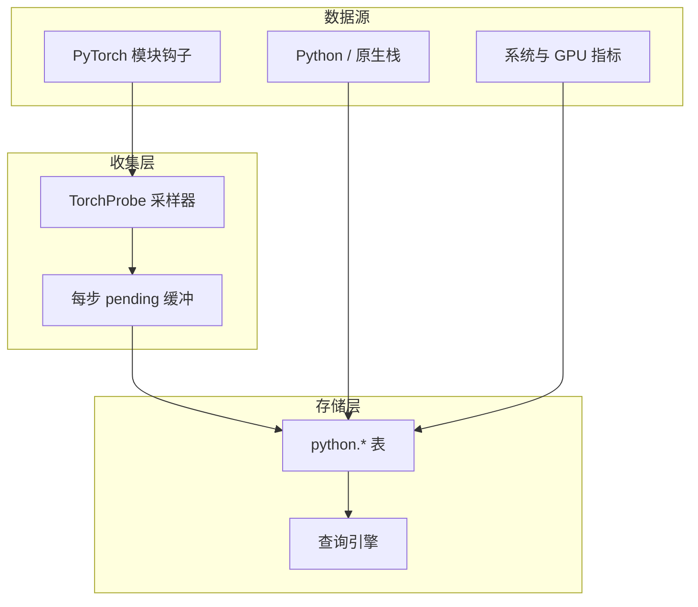

# 性能分析实现

Probing 为 AI 工作负载提供低开销、可 SQL 查询的性能数据采集能力。

## 概览

性能分析系统通过以下方式收集数据：

- 基于钩子与周期性的采集器
- 统计采样（长期遥测，而非短时 trace 窗口）
- 列式表存储（memtable / Arrow 表）
- SQL 查询接口

## 数据收集架构



## PyTorch 分析（TorchProbe）

### 设计定位

TorchProbe 面向**注入后长期开启的 module 级训练遥测**（`PROBING_TORCH_PROFILING=on`）。与 episodic 工具（`torch.profiler` / Kineto 的 op/kernel Chrome trace）互补，而非替代。按需 Kineto 采集以**虚拟 SQL 表**暴露（不写 memtable）见 **[Torch Profiler SQL](torch-profiler-sql.zh.md)**。

**不提供 warmup schedule API**。跳过冷启动步请在 SQL 中过滤：

```sql
SELECT * FROM python.torch_trace WHERE local_step > 10;
```

### 钩子

默认安装：

- 模型树上每个 `nn.Module` 的 forward pre/post 钩子
- Optimizer 的 pre/post step 钩子

**默认不启用 backward 计时。** 开启 `backward=on` 时,对每个模块的 backward 计时取「grad_output 就绪(前向输出张量的 grad hook,在该模块反向**开始前**触发)」到「grad_input 就绪(前向输入张量的 grad hook,在反向**结束后**触发)」的区间。使用普通 tensor `register_hook` 回调,`inplace` 安全(不使用 module backward hook,避免 AlexNet/ResNet 等 `inplace` 激活导致 autograd 崩溃)。输入不需要梯度的模块(如首层)因无法测量区间,记为 ~0。生产环境请谨慎开启。

### 采样策略

第一个完整训练 step 为 **discovery**：只注册模块,不写库。从后续 step 开始采样。

`rate` 为 **step 级采样密度**：每 `round(1/rate)` 个 step 采样 1 个,等间距、从首个 probed step 开始(stratified 分层采样,非 i.i.d.,低采样率也不会长时间无数据)。调度仅由 step 序号决定(不使用宿主 RNG、无进程种子),因此各 rank 采样**相同**的 step——分布式 trace 对齐、训练可复现。未采样的 step 短路:跳过 module/optimizer hook 与 GPU flush(仍写 `torch_step_timing` 的墙钟时间)。

被采样的 step 内,每个 layer 以概率 `layer_rate`(可选第二段,默认 `1.0` = 全量快照)独立命中,判定为 (step, layer) 的确定性哈希——看起来随机、逐层变化,但可复现且跨 rank 一致。offset `0` 锚点(本 step 第一个钩子)始终记录,保证每个采样 step 都有时间基准。

文法:`rate[:layer_rate]`。仍接受前缀 `random:`/`ordered:` 以兼容旧配置(一律按 `random` 处理;旧的逐 step 轮转模块的 `ordered` 模式已移除)。

启用时的默认值(`PROBING_TORCH_PROFILING=on`)：**`rate=0.05`,`layer_rate=1.0`**(约 5% 的 step 做全量快照)。`1.0` 表示每步都采样,`0.05:0.1` 表示 5% 的 step、每步采 10% 的 layer。

**Shadow 基线 step（默认 `shadow=4:1`）**：每 4 个正常训练 step 之后插入 1 个完全跳过 TorchProbe hook 的 step（不写 module 级 `python.torch_trace`）。NCCL、CPU/GPU 等其它采集不变。每个 step 写一行 `python.torch_step_timing`（shadow step 的 `is_shadow=1`）。可用 `shadow=off` 关闭。

估算开销（公式与测量方法见 **[开销测量](overhead.zh.md)**）：

```sql
SELECT
  round(median(CASE WHEN is_shadow = 0 THEN step_duration_sec END)
        / nullif(median(CASE WHEN is_shadow = 1 THEN step_duration_sec END), 0) - 1, 4) * 100
    AS overhead_pct
FROM python.torch_step_timing
WHERE local_step > 1;
```

采样降低记录开销；forward 钩子仍挂在全部子模块上（shadow step 上 hook 立即返回，零开销）。

### NCCL profiler 开销

Shadow step 仅衡量 **TorchProbe 模块 hook** 开销。NCCL profiler 插件目前没有 in-run shadow 基线，启用后会持续记录 collective 事件。NCCL AllReduce 与 probing 的开销对比请用离线 benchmark：

```bash
./examples/run_nccl_profiler_bench.sh
# 或：python examples/torch_probe_overhead_smoke.py  # 仅 Torch 冒烟（无需 GPU）
```

运行时健康度见 `nccl.profiler_counters`（`pool_exhausted`、`write_errors`、`rows_written`）。Web UI 开销面板在 NCCL 活跃时会提示离线 bench 入口。

记录在每个 optimizer step 结束时批量落盘（可选 GPU `synchronize()`）。pre/post 成对产生两行；**时长在 post 行**（`post forward`、`post step` 等）上有效。

### 采集字段（`python.torch_trace`）

完整列说明：[SQL 表 — torch_trace](../reference/sql-tables.zh.md#python-torch_trace)。

| 字段 | 类型 | 描述 |
|------|------|------|
| step | int | 本地训练步（每 rank） |
| global_step | int | 全局步（`step_snapshot`） |
| rank | int | `torch.distributed` rank |
| world_size | int | world size |
| role | string | 并行角色 key，如 `dp=2,pp=1,tp=0` |
| seq | int | step 内钩子序号 |
| module | string | 模块名 |
| stage | string | `pre forward`、`post forward`、`pre step`、`post step`（默认不采 backward） |
| allocated | float | GPU 已分配内存 (MB)，仅 CUDA |
| max_allocated | float | GPU 峰值内存 (MB) |
| cached | float | GPU 预留内存 (MB) |
| max_cached | float | 峰值预留 (MB) |
| time_offset | float | 相对本 step 锚点的秒数 |
| duration | float | 阶段耗时（秒）；post 行有意义 |

可用 `role` + `global_step` 与同 rank 的 `python.comm_collective` JOIN。

### 集合通信（`python.comm_collective`）

对 `torch.distributed` 的 lite 模式钩子每条 collective 写一行，含 `duration_ms`、`bytes`、`op`
及相同 step/role 坐标。见 [SQL 表](../reference/sql-tables.zh.md#python-comm_collective) 与
[SQL 分析](../guide/sql-analytics.zh.md#python-comm_collective)。

### 启用 PyTorch 分析

```bash
# 环境变量（同步为 probing.torch.profiling）
PROBING_TORCH_PROFILING=on python train.py

# 50% step，全量快照
PROBING_TORCH_PROFILING=0.5 python train.py

# 10% step，每步采 30% 的 layer
PROBING_TORCH_PROFILING=0.1:0.3,tracepy=on python train.py

# 开启 backward 模块计时（默认关闭，可能影响 autograd）
PROBING_TORCH_PROFILING=1.0,backward=on python train.py
```

编程配置：

```python
from probing.profiling.torch_probe import configure

configure("on,rate=0.5,layer_rate=0.3")
```

在 torch 导入后首次 `optimizer.step()` 时通过 optimizer post hook 启动。

## Python 堆栈分析

按需或周期性栈采集（SIGUSR2 / 同步 walk）写入 `python.backtrace`。CPU 采样（pprof，`probing.pprof.sample_freq`）与 TorchProbe 模块钩子相互独立。

## 系统指标

通过 `PROBING_GPU_SAMPLE_MS` 等环境变量配置间隔，采集主机 CPU、内存、GPU 利用率等。

**变量/张量 watch（`probing.inspect.trace`）：** 默认写入 Python logger；设置 `PROBING_TRACE_STDOUT=1` 可改为 **stdout** 输出（本地调试方便，生产训练日志慎用）。

## 数据存储

探针数据存入**列式探针表**（如 `python.torch_trace`），由查询引擎访问。保留与联邦策略由 memtable / server 配置决定，而非进程内固定大小环形缓冲区。

## 查询示例

```sql
-- 跳过 discovery / 冷启动
SELECT module, stage, AVG(duration) AS avg_sec
FROM python.torch_trace
WHERE local_step > 1 AND duration > 0
GROUP BY module, stage
ORDER BY avg_sec DESC;

-- 火焰图聚合（post 行上的 median duration）
SELECT module, stage, median(CAST(duration AS DOUBLE))
FROM python.torch_trace
WHERE module <> 'None' AND stage LIKE 'post %'
GROUP BY module, stage;
```

## 性能开销

开销取决于模型规模（全树 forward 钩子）、采样模式/rate、以及 `sync`、`tracepy`、变量监视等选项。降低 `rate`、关闭 torch profiling、在 SQL 中过滤早期 step，而不是引入 warmup schedule。

| 场景 | 典型影响 |
|------|----------|
| 关闭 torch profiling | 仅基础探针开销 |
| `on`（默认 `0.05`，全量快照） | 较低；约 5% step 被采样 |
| `0.05:0.1` | 极低；5% step、每步 10% 的 layer |
| `1.0` | 较高；每步全量快照 |
| `sync=on` | 较高；每个钩子同步 GPU |
