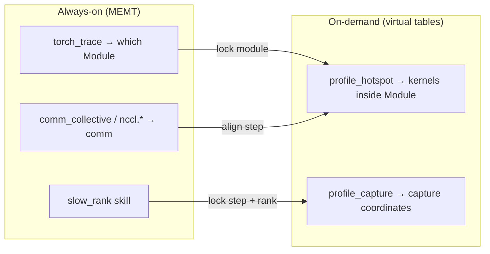

# Torch Profiler → SQL (conclusion-driven virtual tables)

Turn on-demand **`torch.profiler`** capture into **SQL that answers diagnostic questions** — not a
mirror of Kineto events. Virtual table schemas are derived from **conclusions we need**; the
Adaptor compiles timeline data into those conclusion slots. Full Chrome timelines stay on HTTP/UI.

Read with [Profiling](profiling.md), [Federated query engine](federation.md), [NCCL Profiler](nccl-profiler.md).

中文: [中文版](/zh/design/torch-profiler-sql/)

---

## 1. Design principles

### 1.1 Needs-first, not profiler-first

| ❌ Wrong starting point | ✅ Right starting point |
|------------------------|-------------------------|
| Mirror Kineto fields as SQL columns | Define **conclusions** diagnostics require |
| One `traceEvents[]` row per SQL row | Pre-aggregate **time buckets** for those conclusions |
| Single-node timeline viewer | **Cross-rank comparable** facts at the same `local_step` + `global.*` |
| Table names reflect implementation | Table names reflect **analytical questions** |

**Adaptor role:** at finalize, **compile** Kineto / EventList into conclusion fact rows; SQL never
parses Chrome JSON.

### 1.2 Fit in the existing diagnostic stack



| Existing conclusion | Source | Profiler SQL adds |
|--------------------|--------|-------------------|
| Which **module** is slow | `python.torch_trace` | Which **kernels/ops** under that module |
| Which **rank** is slow | `slow_rank` / `global.python.comm_collective` | Whether the slow rank has a **different kernel profile** |
| NCCL **culprit/victim** | `nccl.proxy_ops` | Whether **compute** is also abnormal on that rank |
| Overall **step slowdown** | `python.torch_step_timing` | **GPU time composition** for a step (compute/mem/sync/…) |

---

## 2. Diagnostic conclusions catalog (SSOT)

**Q1–Q8** below are the acceptance criteria for virtual tables, skills, and the Adaptor.

### Q1 — Where does GPU time go on this step?

**Conclusion:** Top kernels/ops by time for a given `local_step` or capture.

**Typical trigger:** drill-down after `module_bottleneck`.

```sql
SELECT bucket_name, bucket_kind, self_us, pct_of_capture, calls
FROM python.profile_hotspot
WHERE capture_id = @capture_id AND bucket_kind IN ('kernel', 'cpu_op')
ORDER BY self_us DESC
LIMIT 20;
```

### Q2 — Time composition: compute / memcpy / runtime / other?

```sql
SELECT bucket_kind, sum(self_us) AS us, sum(pct_of_capture) AS pct
FROM python.profile_hotspot
WHERE capture_id = @capture_id
GROUP BY bucket_kind
ORDER BY us DESC;
```

`bucket_kind` is an Adaptor mapping (§7), not raw Kineto `cat`.

### Q3 — How much slower is a rank on the **same kernel** vs cluster median?

**Core distributed conclusion** — turning single-node timeline into cluster analysis.

```sql
WITH per_rank AS (
  SELECT _rank, bucket_name, sum(self_us) AS us
  FROM global.python.profile_hotspot
  WHERE local_step = @step AND bucket_kind = 'kernel'
  GROUP BY _rank, bucket_name
),
median AS (
  SELECT bucket_name, median(us) AS med_us
  FROM per_rank
  GROUP BY bucket_name
)
SELECT p._rank, p.bucket_name, p.us,
       m.med_us, p.us - m.med_us AS delta_us,
       (p.us - m.med_us) / nullif(m.med_us, 0) AS delta_ratio
FROM per_rank p
JOIN median m ON p.bucket_name = m.bucket_name
WHERE p.us > m.med_us * 1.2
ORDER BY delta_us DESC
LIMIT 30;
```

- High `delta_ratio` on few ranks → **straggler** kernel slowness  
- All ranks high → **shared** algorithmic slowness

### Q4 — Does the slow rank have a **different hotspot set**?

Compare slow rank vs a reference rank on the same step (see §2 Q4 in zh doc for full query).

### Q5 — Can module hotspots be tied to kernels?

Join `python.torch_trace` with `profile_capture` / `profile_hotspot` on `local_step`.  
v2: `module_hint` column when `with_stack=true`.

### Q6 — Shared slowness vs single-rank anomaly?

Cross-rank spread (`max - min`) per `bucket_name` on `global.python.profile_hotspot`.

### Q7 — Is the capture aligned with the right training step / collectives?

Query `profile_capture` against latest `torch_trace` step and `comm_collective` row counts.

### Q8 — Is this capture trustworthy (truncated / failed)?

```sql
SELECT capture_id, status, truncated, event_count, error
FROM python.profile_capture
WHERE capture_id = @capture_id;
```

---

## 3. Conclusions → virtual tables (minimal schema)

Two core virtual tables (+ federated mirrors). **No raw event table** in v1.

### 3.1 `python.profile_capture`

One row per profiler window. **Federation anchor.**

| Column | Serves |
|--------|--------|
| `capture_id` | Primary filter |
| `local_step`, `global_step` | Align with torch_trace / comm / nccl |
| `rank`, `world_size`, `role` | Coordinates |
| `trigger` | Audit (skill / manual) |
| `steps_profiled`, `wall_us` | Window metadata |
| `status`, `truncated`, `event_count`, `error` | Q8 data quality |

Federated: `global.python.profile_capture` + `_host`, `_addr`, `_rank`, `_role`.

### 3.2 `python.profile_hotspot`

**One row = one time bucket aggregated for one capture on one rank.**

| Column | Serves |
|--------|--------|
| `capture_id`, `local_step`, `global_step`, `rank` | Keys |
| `bucket_kind` | Q2 — `kernel`, `cpu_op`, `cuda_runtime`, `memcpy`, `collective`, `other` |
| `bucket_name` | Q1, Q3–Q6 |
| `self_us` | **Primary sort metric** (exclusive time when available) |
| `wall_us`, `calls` | Secondary |
| `pct_of_capture` | Q1, Q2 |
| `module_hint` | Q5 (v2) |

Federated: `global.python.profile_hotspot` — primary surface for **Q3–Q6**.

### 3.3 Intentionally omitted (v1)

| Omitted | Why | Alternative |
|---------|-----|-------------|
| Raw `traceEvents` table | Millions of rows, no direct conclusion | HTTP timeline |
| Kineto `pid`/`tid` mirror | Not operator-meaningful | `bucket_kind` |
| Precomputed `rank_delta` table | Keep flexibility in SQL/skills | §2 query patterns |

---

## 4. Distributed analysis patterns

### 4.1 Recommended workflow

1. `slow_rank` or `module_bottleneck` locks `@step` (and optionally `@slow_rank`)
2. Coordinated `profile/start` at that step (v2: all ranks)
3. Adaptor fills `profile_capture` + `profile_hotspot` on each rank
4. Run Q3–Q6 on `global.python.profile_hotspot`

### 4.2 Federation contract

| Rule | Detail |
|------|--------|
| Alignment keys | `local_step` + `capture_id`; same `trigger` / `global_step` for one diagnostic action |
| Missing ranks | Contribute zero rows; existing `PROBING_FANOUT_STRICT` semantics |
| Labels | `_rank`, `_host`, `_role` for Q3–Q6 |
| NCCL join | Same `global_step` on `global.nccl.proxy_ops` (time-window join v2) |

### 4.3 Planned skills

| Skill | Prerequisite | Conclusions |
|-------|--------------|-------------|
| `kernel_bottleneck` (new) | `module_bottleneck` | Q1, Q2, Q5 |
| `kernel_straggler` (new) | `slow_rank` | Q3, Q4, Q6 |

---

## 5. Trigger and memory (summary)

| Item | Design |
|------|--------|
| Trigger | HTTP, REPL, MCP, skill chain |
| Window | Default `steps=1`; `local_step` written to `profile_capture` |
| Store | In-process session; Adaptor outputs **only §3 rows** |
| Limits | Env caps; `truncated=true` retains hotspot aggregates |
| Chrome | UI only |

---

## 6. Implementation layering

```text
Questions / SQL patterns (§2)
        ↓
Virtual schemas (§3) ← TableProvider / global.*
        ↓
KinetoSqlAdaptor: timeline → profile_capture + profile_hotspot rows
        ↓
ProfilerController + SessionStore + raw torch.profiler
```

---

## 7. Adaptor mapping (appendix)

Kineto is **input**, not **output schema**.

| Source | → `profile_hotspot` |
|--------|---------------------|
| CUDA kernel name | `bucket_kind=kernel`, `bucket_name` |
| ATen op | `bucket_kind=cpu_op` |
| memcpy APIs | `bucket_kind=memcpy` |
| sync APIs | `bucket_kind=cuda_runtime` |
| `nccl*` kernels | `bucket_kind=collective` |
| self cuda/cpu time | `self_us` |
| total cuda/cpu time | `wall_us` |
| count | `calls` |

---

## 8. Control API (draft)

| Method | Path |
|--------|------|
| `POST` | `/apis/pythonext/pytorch/profile/start` |
| `POST` | `/apis/pythonext/pytorch/profile/stop` |
| `GET` | `/apis/pythonext/pytorch/profile/status` |
| `GET` | `/apis/pythonext/pytorch/timeline` |

---

## 9. Implementation phases (by conclusion priority)

| Phase | Deliverable | Validates |
|-------|-------------|-----------|
| **P0** | Controller + Adaptor → hotspot rows | Q1, Q2, Q8 local |
| **P1** | Virtual tables + local SQL | Q5, Q7 |
| **P2** | `global.*` + `kernel_bottleneck` skill | Q1–Q2 federated |
| **P3** | `kernel_straggler` + coordinated trigger | Q3, Q4, Q6 |
| **P4** | `module_hint` + nccl time join | Q5 refined |

---

## 10. Risks

| Risk | Mitigation |
|------|------------|
| Wrong-step conclusions | `profile_capture` step fields; Q7 templates |
| Misaligned federation | v2 coordinated capture; check `ranks_seen` in skills |
| Over-reliance on `self_us` | Document vs `wall_us`; Chrome for drill-down |
| Profiler perturbation | Short windows; skills label as intrusive measurement |

---

## 11. Related code (today)

| Component | Path |
|-----------|------|
| REPL profiler | `python/probing/repl/torch_magic.py` |
| HTTP timeline | `python/probing/handlers/pythonext.py` |
| Module conclusions | `skills/module_bottleneck/` |
| Rank conclusions | `skills/slow_rank/` |
| Virtual table infra | `probing/core/src/core/data_source.rs` |
