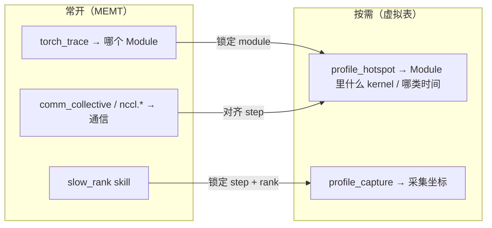
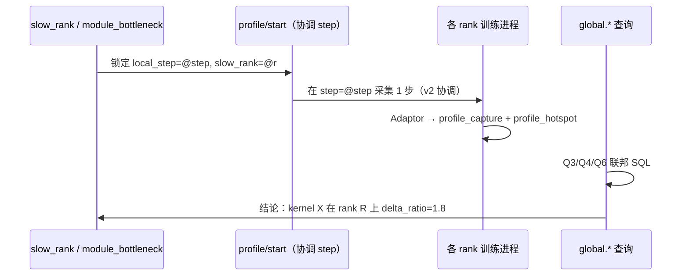

# Torch Profiler → SQL（结论驱动的虚拟表）

将按需 **`torch.profiler`** 采集变成 **可回答诊断问题的 SQL 能力**，而不是 Kineto 事件的镜像。
虚拟表从 **「我们想得出什么结论」** 反推 schema；Adaptor 负责把 timeline 填进这些结论槽位。
完整 Chrome timeline 仍走 HTTP/UI。

阅读：[性能分析](profiling.zh.md)、[联邦查询引擎](federation.zh.md)、[NCCL Profiler](nccl-profiler.zh.md)。

英文版：[torch-profiler-sql.md](torch-profiler-sql.md)

---

## 1. 设计原则

### 1.1 需求驱动，而非 Profiler 驱动

| ❌ 错误起点 | ✅ 正确起点 |
|------------|------------|
| Kineto 有哪些字段就建哪些列 | 诊断需要哪些 **结论** |
| `traceEvents[]` 一行进 SQL 一行 | 为结论预聚合 **时间桶（time bucket）** |
| 单节点 timeline 浏览器 | **同一 `local_step` 跨 rank 可比较** 的事实表 + `global.*` |
| 表名反映实现（`profiler_kernel`） | 表名反映分析问题（`profile_hotspot`） |

**Adaptor 的角色**：在 finalize 时把 Kineto / EventList **编译**成结论事实行；SQL 层不再理解 Chrome JSON。

### 1.2 与现有诊断栈的分工



| 已有结论 | 数据源 | Profiler SQL 补什么 |
|----------|--------|---------------------|
| 哪个 **Module** 慢 | `python.torch_trace` | 该 Module 对应哪些 **kernel/op** |
| 哪个 **rank** 慢 | `slow_rank` / `global.python.comm_collective` | 慢 rank 的 **kernel 画像是否不同** |
| NCCL **culprit/victim** | `nccl.proxy_ops` | 慢 rank 上 **compute 是否也异常**（排除/确认 compute-bound） |
| 训练是否 **整体变慢** | `torch_step_timing` | 某步 **GPU 时间构成**（compute/mem/sync/其他） |

---

## 2. 诊断结论清单（SSOT）

下列 **Q1–Q8** 是虚拟表必须支撑的结论。实现与 skill 以本表为验收标准。

### Q1 — 本步 GPU 时间主要花在哪？

**结论**：给定 `local_step`（或最近一次 capture），按 kernel/op **排序的耗时 Top-K**。

**典型触发**：`module_bottleneck` 发现热点 module 后的钻取。

**本地 SQL 范式**：

```sql
SELECT bucket_name, bucket_kind, self_us, pct_of_capture, calls
FROM python.profile_hotspot
WHERE capture_id = @capture_id AND bucket_kind IN ('kernel', 'cpu_op')
ORDER BY self_us DESC
LIMIT 20;
```

---

### Q2 — 时间构成：compute / memcpy / runtime / 其他？

**结论**：一步 profile 窗口内的 **类别占比**（用于判断是算力、访存还是调度）。

**本地 SQL 范式**：

```sql
SELECT bucket_kind, sum(self_us) AS us, sum(pct_of_capture) AS pct
FROM python.profile_hotspot
WHERE capture_id = @capture_id
GROUP BY bucket_kind
ORDER BY us DESC;
```

`bucket_kind` 由 Adaptor 映射（见 §7），不是 Kineto 原始 `cat` 字段。

---

### Q3 — 慢 rank 在 **相同 kernel** 上比集群中位 rank 慢多少？

**结论**：跨节点 **同 step、同 kernel 名** 的 rank 间差异 — 这是「单节点 timeline → 分布式分析」的核心。

**联邦 SQL 范式**：

```sql
WITH per_rank AS (
  SELECT _rank, bucket_name, sum(self_us) AS us
  FROM global.python.profile_hotspot
  WHERE local_step = @step AND bucket_kind = 'kernel'
  GROUP BY _rank, bucket_name
),
median AS (
  SELECT bucket_name, median(us) AS med_us
  FROM per_rank
  GROUP BY bucket_name
)
SELECT p._rank, p.bucket_name, p.us,
       m.med_us, p.us - m.med_us AS delta_us,
       (p.us - m.med_us) / nullif(m.med_us, 0) AS delta_ratio
FROM per_rank p
JOIN median m ON p.bucket_name = m.bucket_name
WHERE p.us > m.med_us * 1.2
ORDER BY delta_us DESC
LIMIT 30;
```

**解读**：

- `delta_ratio` 大且仅个别 rank → **straggler 型** kernel 慢（数据/卡/调度）
- 所有 rank 都高 → **算法/输入** 共性慢（非 straggler）

---

### Q4 — 慢 rank 的 **热点集合** 是否与其他 rank 不同？

**结论**：不仅「同一个 kernel 更慢」，还有「慢 rank 多了哪些 kernel / 少了哪些 kernel」。

**联邦 SQL 范式**（慢 rank 来自 `slow_rank` 或人工指定 `@slow_rank`）：

```sql
SELECT h.bucket_name, h.self_us AS slow_us,
       (SELECT sum(self_us) FROM global.python.profile_hotspot g
        WHERE g.local_step = @step AND g.bucket_name = h.bucket_name
          AND g._rank = @median_rank) AS median_rank_us
FROM global.python.profile_hotspot h
WHERE h.local_step = @step AND h._rank = @slow_rank
ORDER BY slow_us DESC
LIMIT 20;
```

---

### Q5 — Module 热点能否对应到底层 kernel？

**结论**：把 `torch_trace` 的 module 级慢点与 profile 窗口内的 op/kernel **关联**（v1 以 **同一步、时间邻域** 为主；精确栈映射为 v2）。

**本地 SQL 范式**：

```sql
SELECT t.module, t.duration AS module_ms, h.bucket_name, h.self_us / 1e3 AS kernel_ms
FROM python.torch_trace t
JOIN python.profile_capture c ON t.local_step = c.local_step
JOIN python.profile_hotspot h ON h.capture_id = c.capture_id
WHERE t.local_step = @step AND t.stage = 'post forward'
ORDER BY t.duration DESC, h.self_us DESC
LIMIT 50;
```

v2：Adaptor 在 `with_stack=true` 时填充 `module_hint` 列，支持等值 JOIN。

---

### Q6 — 这是 **全 rank 共性慢** 还是 **单 rank 异常**？

**结论**：对同一 `bucket_name`，看跨 rank 的 **离散度**（std / max-min）。

**联邦 SQL 范式**：

```sql
SELECT bucket_name,
       min(self_us) AS min_us, max(self_us) AS max_us,
       max(self_us) - min(self_us) AS spread_us,
       count(DISTINCT _rank) AS ranks_seen
FROM global.python.profile_hotspot
WHERE local_step = @step AND bucket_kind = 'kernel'
GROUP BY bucket_name
HAVING spread_us > @threshold
ORDER BY spread_us DESC;
```

---

### Q7 — Profile 窗口是否与训练 step / collective **对齐**？

**结论**：确认 capture 的 `local_step` / `global_step` 与通信、module trace **同一坐标系**，避免「拿错步」下结论。

**SQL 范式**：

```sql
SELECT c.capture_id, c.local_step, c.global_step, c.rank, c.trigger,
       (SELECT max(local_step) FROM python.torch_trace) AS latest_torch_step,
       (SELECT count(*) FROM python.comm_collective
        WHERE global_step = c.global_step) AS coll_rows
FROM python.profile_capture c
ORDER BY c.ended_at_us DESC
LIMIT 5;
```

---

### Q8 — 这次 profile 是否可信（截断 / 失败）？

**结论**：Agent 在出结论前必须检查 **数据质量**。

```sql
SELECT capture_id, status, truncated, event_count, error
FROM python.profile_capture
WHERE capture_id = @capture_id;
```

`truncated = true` 时 Q1–Q6 仅作 **方向性** 参考，skill 应降级表述。

---

## 3. 结论 → 虚拟表（最小 schema）

只为支撑 §2 的查询，定义 **两张核心虚拟表**（+ 联邦镜像）。**不**暴露原始 event 表为 v1 默认面。

### 3.1 `python.profile_capture`（采集锚点）

一次 `torch.profiler` 窗口 = 一行。联邦 JOIN 的 **主键锚点**。

| 列 | 类型 | 服务于 |
|----|------|--------|
| `capture_id` | text | Q1–Q8 过滤 |
| `local_step`, `global_step` | int | 与 torch_trace / comm / nccl 对齐（Q5、Q7） |
| `rank`, `world_size`, `role` | | 分布式坐标 |
| `trigger` | text | 审计（skill / manual） |
| `steps_profiled` | int | 窗口长度 |
| `wall_us` | bigint | Q2 分母 |
| `started_at_us`, `ended_at_us` | bigint | 时间 |
| `status` | text | Q8 |
| `truncated` | bool | Q8 |
| `event_count` | int | Q8 |
| `error` | text | Q8 |

联邦：`global.python.profile_capture` + `_host`, `_addr`, `_rank`, `_role`。

### 3.2 `python.profile_hotspot`（结论事实表）

**一行 = 在一个 capture、一个 rank 上，一个时间桶的聚合结果。**

| 列 | 类型 | 服务于 |
|----|------|--------|
| `capture_id` | text | 关联 capture |
| `local_step`, `global_step` | int | 无 capture_id 时按 step 查（Q3、Q6） |
| `rank` | int | 本地；联邦用 `_rank` |
| `bucket_kind` | text | Q2 — 见下表 |
| `bucket_name` | text | Q1、Q3、Q4、Q6 |
| `self_us` | bigint | **主排序指标** — 不含子节点重叠（优先 Kineto self） |
| `wall_us` | bigint | 含子树 wall time（可选对比） |
| `calls` | int | 调用次数 |
| `pct_of_capture` | double | Q1、Q2 — `self_us / capture.wall_us` |
| `module_hint` | text | Q5（v2，stack 开启时） |

**`bucket_kind` 枚举（Adaptor 映射，非 Kineto 原文）**：

| `bucket_kind` | 含义 | 典型结论 |
|---------------|------|----------|
| `kernel` | CUDA kernel | Q1、Q3、Q6 |
| `cpu_op` | ATen CPU op | Q1 |
| `cuda_runtime` | CUDA API / sync | Q2 — 调度/同步瓶颈 |
| `memcpy` | D2D/H2D 等 | Q2 — 访存 |
| `collective` | 若 Kineto 标出 NCCL kernel | 与 `nccl.*` 交叉验证 |
| `other` | 未分类 | 兜底 |

联邦：`global.python.profile_hotspot` — **Q3–Q6 的主战场**。

### 3.3 故意不做的表（v1）

| 不做 | 原因 | 替代 |
|------|------|------|
| 原始 `traceEvents` 表 | 百万行、无结论 | HTTP timeline |
| 按 Kineto `pid/tid` 镜像 | 对运维无意义 | `bucket_kind` |
| 预计算 `rank_delta` 表 | 结论应留在 SQL/skill 层灵活组合 | §2 范式查询 |

---

## 4. 分布式分析模式

### 4.1 标准工作流（推荐）



### 4.2 联邦契约

| 规则 | 说明 |
|------|------|
| **对齐键** | 优先 `local_step` + `capture_id`；跨 rank 同一「诊断动作」应共享 `trigger` 与 `global_step` |
| **缺失 rank** | 无 capture 的 rank 不参与聚合；`PROBING_FANOUT_STRICT` 行为与现网一致 |
| **列标签** | `_rank`, `_host`, `_role` 用于 Q3–Q6，不写入本地表 |
| **与 NCCL 联立** | 同一 `global_step` 上 JOIN `global.nccl.proxy_ops`（时间窗口 JOIN 为 v2） |

### 4.3 与 skills 的映射（拟议）

| Skill | 先决 skill | 支撑的结论 |
|-------|-----------|------------|
| `kernel_bottleneck`（新） | `module_bottleneck` 或人工 | Q1、Q2、Q5 |
| `kernel_straggler`（新） | `slow_rank` | Q3、Q4、Q6 |
| `health_overview`（扩展） | — | Q7、Q8 元数据行 |

---

## 5. 触发与内存（简述）

结论能力的前提是一次 **短窗口、可对齐** 的采集。

| 项 | 设计 |
|----|------|
| 触发 | HTTP `profile/start`、REPL、MCP、skill 链式调用 |
| 窗口 | 默认 `steps=1`，绑定 `local_step` 写入 `profile_capture` |
| 存储 | 进程内 Session；Adaptor **只产出 §3 两张表** 的行缓存 |
| 上限 | `PROBING_TORCH_PROFILER_MAX_SESSIONS` 等；截断时 `truncated=true`，保留 hotspot 聚合 |
| Chrome | 仅 UI；不进 SQL |

v2：**协调式触发** — 所有 rank 在同一 `local_step` 采集，使 Q3–Q6 语义严格成立。

---

## 6. 实现分层

```text
需求 / SQL 范式（本文 §2）
        ↓
虚拟表 schema（§3）← TableProvider / global.*
        ↓
KinetoSqlAdaptor：timeline → profile_capture + profile_hotspot 行
        ↓
ProfilerController + SessionStore + torch.profiler 原始产物
```

| 层 | 路径（拟议） |
|----|-------------|
| L2 控制 + 适配 | `python/probing/profiling/torch_profiler/` |
| L1 注册 | `ProbeDataSource` / `TableProvider` |
| L4 skill | `skills/kernel_bottleneck/`, `skills/kernel_straggler/` |

---

## 7. Adaptor 映射（实现附录）

Kineto 是 **输入格式**，不是 **输出 schema**。

| Kineto / profiler 来源 | → `profile_hotspot` |
|------------------------|---------------------|
| CUDA kernel 名 | `bucket_kind=kernel`, `bucket_name=name` |
| ATen op | `bucket_kind=cpu_op` |
| `cudaMemcpy*` 等 | `bucket_kind=memcpy` |
| `cudaDeviceSynchronize` 等 | `bucket_kind=cuda_runtime` |
| `nccl*` kernel 名 | `bucket_kind=collective` |
| `self_cuda_time` / `self_cpu_time` | `self_us` |
| `cuda_time_total` | `wall_us` |
| `count` | `calls` |

Chrome `traceEvents` 仅在 EventList 不可用时作 fallback 解析，产出 **相同 hotspot 行**。

---

## 8. 控制面 API（草案）

| 方法 | 路径 |
|------|------|
| `POST` | `/apis/pythonext/pytorch/profile/start` — body 含 `trigger`, `steps`, `align_step` |
| `POST` | `/apis/pythonext/pytorch/profile/stop` |
| `GET` | `/apis/pythonext/pytorch/profile/status` |
| `GET` | `/apis/pythonext/pytorch/timeline` — Chrome，服务 UI |

---

## 9. 实施阶段（按结论优先级）

| 阶段 | 交付 | 验收结论 |
|------|------|----------|
| **P0** | Controller + SessionStore + Adaptor 产出 hotspot 行 | Q1、Q2、Q8 本地 SQL |
| **P1** | `profile_capture` / `profile_hotspot` 虚拟表 + 本地 SQL | Q5、Q7 |
| **P2** | `global.*` + skill `kernel_bottleneck` | Q1–Q2 联邦可选 |
| **P3** | skill `kernel_straggler` + 协调 step 触发 | Q3、Q4、Q6 |
| **P4** | `module_hint` + 与 nccl 时间联立 | Q5 精确化 |

---

## 10. 风险

| 风险 | 缓解 |
|------|------|
| 结论误导（错 step） | `profile_capture` 强制写 step；Q7 查询模板 |
| 联邦不对齐 | v2 协调触发；skill 检查 `ranks_seen` |
| 过度依赖 self_us | 文档说明与 `wall_us` 差异；Chrome 钻取 |
| Profiler 扰动 | 短窗口、skill 明示「干预性测量」 |

---

## 11. 相关代码（当前）

| 组件 | 路径 |
|------|------|
| REPL profiler | `python/probing/repl/torch_magic.py` |
| HTTP timeline | `python/probing/handlers/pythonext.py` |
| 模块级结论 | `skills/module_bottleneck/` |
| Rank 级结论 | `skills/slow_rank/` |
| 虚拟表基础设施 | `probing/core/src/core/data_source.rs` |
