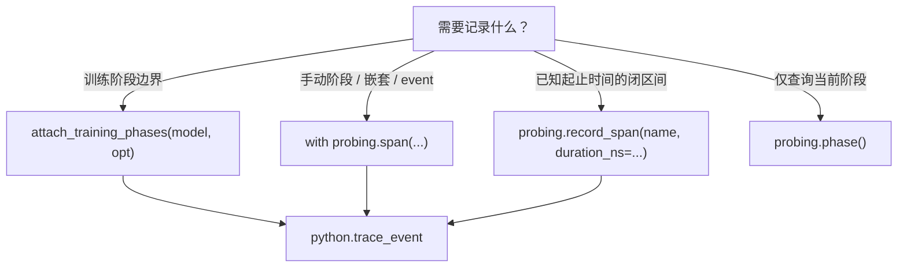

# Span API 设计

训练时间线（粗粒度阶段）与 TorchProbe（细粒度模块 profiling）的分工、公共 API 选型与性能特性。Phase 协作细节见 **[训练阶段](training-phase.zh.md)**。

## 分层

```
probing.span / event / record_span     ← 用户 API
        ↓
_RecordedSpan（Python）                ← 持久化编排、deferred close
        ↓
Rust Span 栈（thread-local）          ← trace_id / span_id / phase / 时间戳
        ↓
SpanRecorder → backends              ← memtable / logger / otel / none
        ↓
python.trace_event（mmap）             ← span_start / span_end / event 行
```

| 层 | 职责 |
|----|------|
| **Rust `Span`** | 线程内嵌套栈、`probing.phase()`、`current_span()` |
| **`probing.span`** | 开栈 + 退出时写 backend（或仅栈，无 backend 时） |
| **`record_span`** | 已知 duration 的闭区间，**不进栈** |
| **`attach_training_phases`** | 自动 forward/backward/optimizer + `train.step` |

## 何时用哪个 API



| API | 进栈 | 写盘 | 典型场景 |
|-----|------|------|----------|
| `with probing.span(...)` | 是 | exit 时（deferred） | 自定义阶段、`probing.event()` 打点 |
| `probing.record_span(...)` | 否 | 立即 | `train.step`、collective 闭区间 |
| `probing.event(...)` | — | 首次 event 时 lazy 写 `span_start` | span 内里程碑 |
| 裸 `Span(...)`（Rust） | 是 | **否** | 内部/测试；请用 `probing.span` |
| `attach_training_phases` | 间接 | 是 | **推荐**：零侵入 iteration 时间线 |

### 与 TorchProbe 的分工

| 能力 | phase hook | TorchProbe |
|------|------------|------------|
| iteration phase（forward/backward/optimizer） | **拥有** | `owns_training_phases` 时跳过 |
| `train.step` 墙钟 | **拥有**（`record_span`） | 不写 |
| 模块 timing / 显存 | — | `python.torch_trace` |
| 模块级 trace span | — | `trace_spans=on`（默认关或采样） |

**推荐组合**：`attach_training_phases` + TorchProbe `on`（`trace_spans` 保持 off）——时间线靠 span，瓶颈靠 `torch_trace`。

## 持久化语义（deferred close）

`with probing.span` 在 `__enter__` **不写盘**；`__exit__` 时：

1. 若 span 生命周期内有过 `event` → 已 lazy 写 `span_start`，再写 `span_end`
2. 否则 → 单次 `record_closed_span`（batch 写 start+end）

因此：**进行中的 span 在 SQL 里不可见**，直到关闭（或有 event）。适合降低热路径开销；live span 查询需接受这一语义。

`record_span` 始终写 closed 记录，适合 `train.step` 等事后已知 duration 的路径。

## 关闭持久化（benchmark / 纯栈）

| 方式 | 效果 |
|------|------|
| `PROBING_SPAN_BACKENDS=none` | 仅 Rust 栈，零写盘 |
| `probing.tracing.configure_backends([])` | 同上（覆盖 env，直到 `reset_backends()`） |
| 未设置 / 空字符串 env | 仍 fallback 到 `memtable` |

无 backend 时：`span_attrs`、`json.dumps`、memtable 构建 **全部跳过**，仅保留栈操作（bench 中 no-backend ≈ 栈成本）。

## 环境变量

| 变量 | 默认 | 说明 |
|------|------|------|
| `PROBING_SPAN_BACKENDS` | `memtable` | `memtable`, `logger`, `otel`, `none`（逗号分隔） |
| `PROBING_SPAN_LOG_LEVEL` | `INFO` | `logger` backend 级别 |
| `PROBING_SPAN_LOCATION` | 关 | `1` 时对每个 span 做 `inspect.stack()`（高开销） |

完整列表见 [环境变量](../reference/env-vars.md#tracing--spans)。

## 性能要点

1. **坐标缓存**：同一 `micro_step` 内 `span_attrs` 复用 step + parallel 字段，不重复 `snapshot()`。
2. **无 backend 快路径**：`persistence_enabled()` 为 false 时跳过 attrs 与 recorder。
3. **Rust 栈 LIFO**：正常 `with` 嵌套用 O(1) pop；乱序退出仍 fallback 全栈搜索。
4. **避免** `PROBING_SPAN_LOCATION=1` 于训练热路径；TorchProbe 变量追踪有独立 stack walk。

本地基准：`make bench-quick` 或 `python examples/bench_instrumentation.py --quick`。

## 查询

物化视图 `SPANS_SQL`（`probing.tracing.SPANS_SQL`）在 `span_start` / `span_end` 上 join 出 `duration_us`。示例：

```sql
SELECT name, phase, local_step, duration_us
FROM ({SPANS_SQL}) AS spans
WHERE name IN ('forward', 'backward', 'optimizer', 'train.step')
ORDER BY start_time DESC
LIMIT 20;
```

（将 `{SPANS_SQL}` 替换为 `probing.tracing.SPANS_SQL` 字符串。）

## 相关文档

- [训练阶段](training-phase.zh.md) — phase 不变量、`train.step`、梯度累积
- [性能分析](profiling.zh.md) — TorchProbe hook 与落表
- [核心模型 — trace_event](../guide/concepts.zh.md) — 表语义
- [环境变量](../reference/env-vars.md) — `PROBING_SPAN_*`
