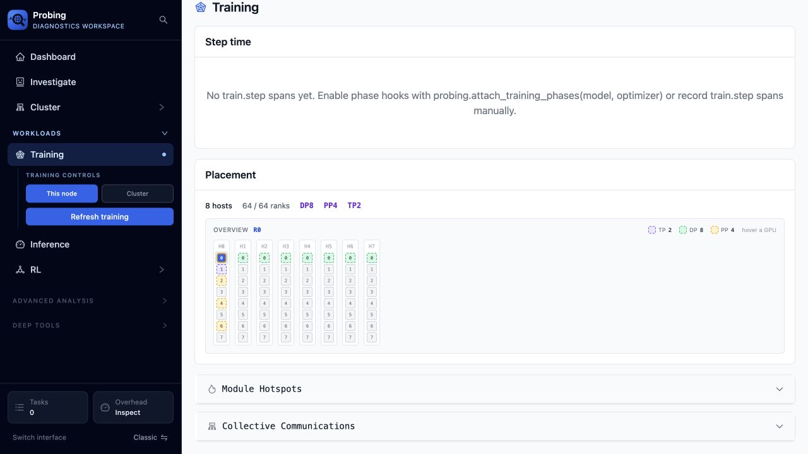

# Validate a 64-rank training placement

This check validates the Training page's placement model and interaction with a
CPU-mocked Megatron topology. It does **not** validate GPU execution, NCCL
transport, bandwidth, or collective latency.

The launcher starts 64 real local worker processes under `torchrun`. Each rank
binds an independent HTTP endpoint and reports its own heartbeat. The eight
host names are logical placement groups rather than eight physical machines.
Torchrun also exposes a real rendezvous TCPStore to **Cluster → Distributed
Status**. Wait counters are not mocked and are available only when the installed
PyTorch build registers the experimental `wait_counter_values` handler.

## Topology under test

| Property | Value |
|---|---:|
| Hosts | 8 |
| Processes per host | 8 |
| World size | 64 |
| Tensor parallelism (TP) | 2 |
| Pipeline parallelism (PP) | 4 |
| Data parallelism (DP) | 8 |

The rank coordinates use this deterministic mapping:

```text
rank = dp * (PP * TP) + pp * TP + tp
tp = rank % 2
pp = (rank // 2) % 4
dp = rank // 8
host = rank // 8
local_rank = rank % 8
```

Consequently, rank 0 has coordinates `D0 P0 T0`. Its expected groups are:

- TP: ranks `0, 1` — 2 ranks
- PP: ranks `0, 2, 4, 6` — 4 ranks
- DP: ranks `0, 8, 16, 24, 32, 40, 48, 56` — 8 ranks

## Evidence

The node API returned 64 rows, 8 distinct hosts, and 64 distinct parallel-role
keys. Its boundary roles were `rank 0 = dp=0,pp=0,tp=0` and
`rank 63 = dp=7,pp=3,tp=1`.

On the page, the summary reports `8 hosts`, `64 / 64 ranks`, `DP8`, `PP4`, and
`TP2`. Rank 0 is selected in the screenshot. The rendered state contains one
focus cell, one additional TP cell, three additional PP cells, and seven
additional DP cells; including the focus cell, those are group sizes 2, 4, and
8 respectively.



## Automated checks

The web unit test constructs the same 64 nodes and checks the inferred host,
rank, and parallel dimensions. The fake-runtime unit test runs all 64
coordinate combinations through the CPU Megatron mock and checks that all role
keys are unique.

```bash
cd web
cargo test placement_summarizes_64_rank_megatron_topology

cd ..
PROBING=0 .venv/bin/pytest \
  tests/unit/probing/fakes/test_fakes.py \
  -k 64_rank_tp2_pp4_dp8 -q
```

These tests and the screenshot cover different boundaries: the Python test
checks role generation, the Rust test checks placement inference and group
membership, and the browser check covers the final rendered interaction.
