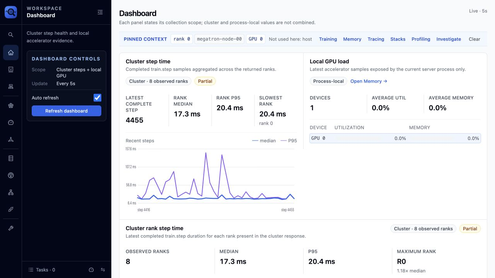
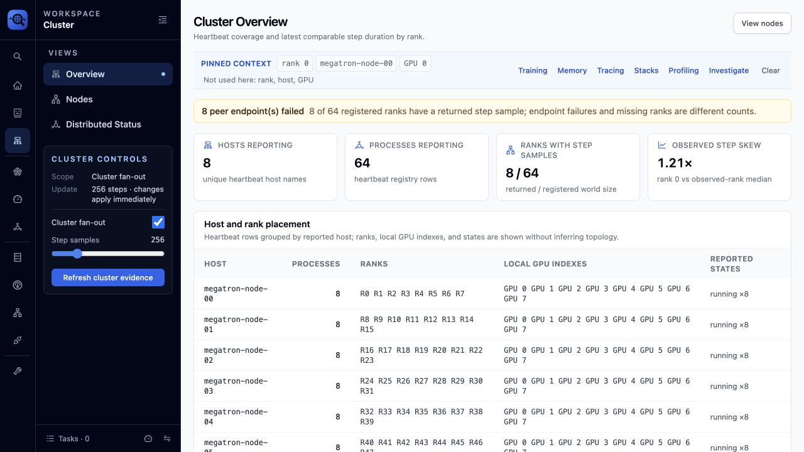
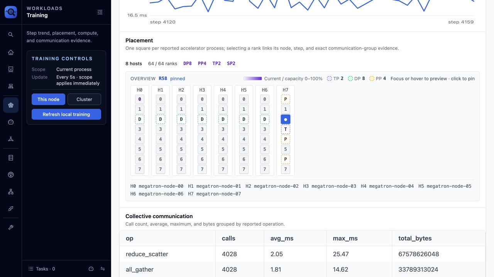
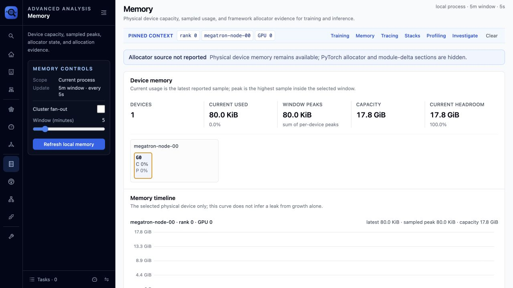
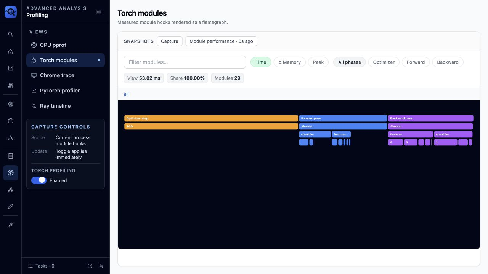
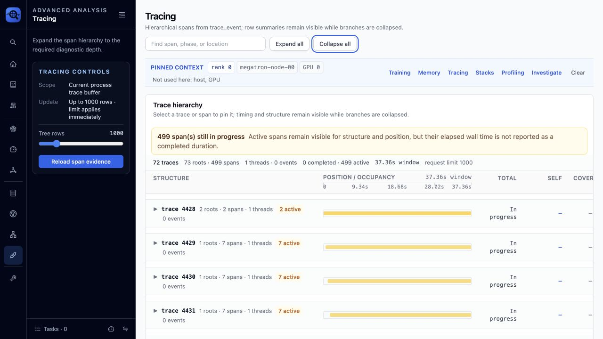
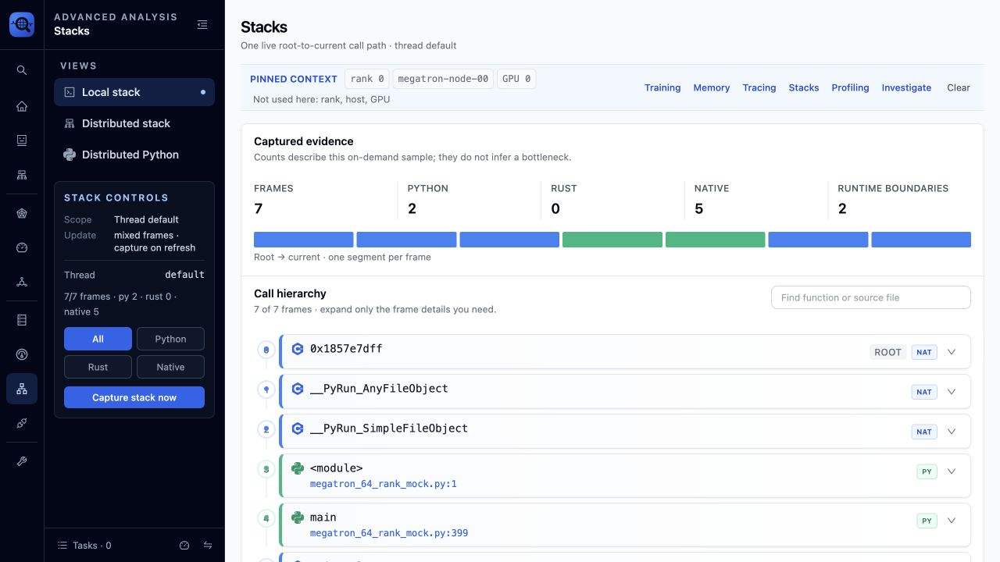
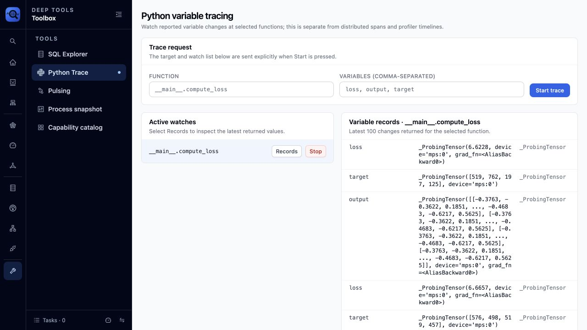

# Next Web UI 用户指南

Next Web UI 用于浏览运行中 Python 进程或分布式任务的诊断证据。它不会根据单个
指标替用户下结论；每个页面都应说明数据的范围、新鲜度、覆盖率和来源，让用户决定
下一步检查什么。

## 启动与连接

启用 Probing 启动任务，然后在浏览器中打开 HTTP 地址：

```bash
PROBING=1 PROBING_PORT=18080 python train.py
```

对于 Linux 上已经运行的进程，可以先执行注入：

```bash
probing -t <pid> inject
```

可以通过 `PROBING_SERVER_ADDR` 指定监听地址。只要服务能够从其他机器访问，就应
设置 `PROBING_AUTH_TOKEN`，并避免把端点暴露到不可信网络。详见
[环境变量](../reference/env-vars.zh.md)。

下面的命令不依赖 ImageNet 数据集，可以重复验证 Torch profiling：

```bash
PROBING=1 PROBING_PORT=9922 \
PROBING_TORCH_PROFILING=0.01,backward=on \
PYDEVD_DISABLE_FILE_VALIDATION=1 \
python examples/imagenet/imagenet_with_span.py \
  -a alexnet -b 4 --dummy --no-validate
```

打开 `http://127.0.0.1:9922`。`0.01` 表示以确定性调度每 100 个 step 做一次
完整 module 快照；`backward=on` 额外测量每个 module 的 backward 区间。
`--dummy` 去掉数据集依赖，文件校验变量只负责隐藏 debugger 警告。如果环境没有
`python` 命令，可以换成 `.venv/bin/python`。需要有限时长的演示时可以再加
`--max-steps <N>`。

## 先读数据口径，再读图表

左侧 rail 选择工作区，展开区只放当前页面的控制项。页面标题区和证据上下文说明：

- **Scope**：本地进程、选中 rank，还是集群 fan-out。
- **Window**：当前视图使用的样本范围或时间窗口。
- **Freshness**：证据最后一次观测或刷新的时间。
- **Coverage**：注册 rank 中有多少真正返回了可比较数据。
- **Context**：跨页面延续的 rank、host/GPU、step、span 和时间窗口。

不要把本地指标当作集群聚合，也不要把缺失数据理解成健康的零值。部分结果仍然有用，
但缺少哪些 peer 本身也是证据的一部分。

## 推荐调查路径

1. 在 **Dashboard** 确认口径，找到慢 rank 或资源压力。
2. 在 **Cluster** 检查成员、endpoint 和 rank 覆盖率。
3. 在 **Training** 比较 step 趋势并核对物理/并行 placement。
4. 在 **Memory** 区分设备压力和 allocator 行为。
5. 在 **Tracing** 定位占用时间的 span 或区间。
6. 在 **Stacks** 或 **Profiling** 找到活跃调用路径或热点代码。
7. 当问题适合可重复诊断流程时，使用 **Investigate** 运行 skill。

选择操作形成调查上下文，而不是装饰性交互。选中 rank 或 GPU 后，支持该字段的目标页面
应继续围绕它展示证据；不支持时，页面应明确说明，而不是静默改变语义。

## Dashboard：先确认范围



Dashboard 有意分开集群 step 证据和进程本地 GPU 负载。比较数值前先比较标签。Rank
区域分别展示返回样本数和注册 rank 数；部分集群不会被包装成完整分布。

这个页面用于选择下一项证据：step 历史进入 Training，rank 缺失进入 Cluster，设备
压力进入 Memory。Dashboard 不替代这些专用页面。

## Cluster：区分注册与观测



Cluster Overview 把成员关系和测量结果分开：

- **Registered processes/ranks** 来自 heartbeat 注册。
- **Observed ranks** 是当前查询和窗口内返回可比较样本的 rank。
- **Endpoint failures** 是 fan-out 请求失败数，不能等同于缺失 rank 数。

Placement 表把 host、endpoint 和 rank 关联起来。如果注册完整而观测不完整，应先检查
新鲜度、endpoint 状态和查询范围，再解释 rank 偏斜。

## Training：趋势与 Placement



Step time 只给关键统计和趋势，在保留异常点的同时避免堆叠结论。Placement 每个方格
对应一个已上报的 accelerator 进程，并按物理 host 和本地 GPU 位置分组。选择或悬停
方格会高亮它所属的 TP、DP、PP 精确通信组及组大小。

截图使用 CPU mock：8 个逻辑 host、每个 host 8 个 rank，`world_size=64`、
`TP=2`、`PP=4`、`DP=8`、`SP=2`。它只验证 rank 映射、通信组归属和渲染，
**不验证**真实 GPU 执行、NCCL 带宽或 collective 延迟。详见
[64-rank Placement 验证](../examples/training-placement-validation.zh.md)。

## Memory：不要混淆数据源



Memory 页面比较选中设备的当前占用、观测峰值、容量和余量。设备遥测和 PyTorch
allocator 具有不同口径；allocator 未上报时，界面会明确显示缺失，不会从设备占用反推。

高峰值代表压力，但不必然代表泄漏。做优化决策前，应在可比较窗口中确认持续增长，
并关联 step、span 或 allocation。详见[内存分析](memory-analysis.zh.md)。

## Profiling：按问题选择证据粒度



Profiling 包含五种彼此独立的视图。应根据待回答的问题选择，而不是默认选择看起来最
复杂的图：

| 视图 | 证据与范围 | 适合回答的问题 |
|---|---|---|
| CPU pprof | 当前进程在一个窗口内累计的 SIGPROF 统计采样 | 哪些 Python/native 调用路径经常占用 CPU？ |
| Torch modules | 来自 `python.torch_trace` 的 `nn.Module` 和 optimizer 抽样 hook | 哪个 forward、backward 或 optimizer module 主导了被采样 step？ |
| Chrome trace | 当前进程 trace buffer 中已经存在的事件 | buffer 事件在时间上如何分布？它不是分布式 span 树。 |
| PyTorch profiler | 显式触发、限定 optimizer step 数的 Kineto capture | 短异常窗口中哪个 CPU op、GPU kernel、runtime 或 memcpy 占用时间？ |
| Ray timeline | 显式捕获的 Ray task 事件 | 哪个 Ray task 或 worker 区间造成调度延迟？ |

左侧控制面板会说明动作影响的范围和生效时机。例如 Torch module 开关立即生效，
PyTorch profiler 的 step 数只影响**下一次显式 capture**。PyTorch profiler 与
TorchProbe 是两个独立 collector：上面的启动命令不会自动开启 Kineto；同时开启时，
二者开销会叠加。

在 **Torch modules** 中，可以用 `Time`、`Δ Memory`、`Peak` 切换指标，再按
Optimizer、Forward、Backward 过滤阶段。Flamegraph 宽度表示当前 payload 内的
占比，不是整个训练任务的占比。把结果外推前，需要同时检查快照数、采样策略、step/rank
上下文和 overhead。1% step 采样不会捕获未命中采样 step 的孤立尖峰。

`backward=on` 会增加 tensor grad hook，因此保持显式开启。定位完 backward 不平衡后，
应关闭它或降低采样率。采样及 shadow baseline 语义详见
[Profiling](../design/profiling.zh.md)和
[开销测量](../design/overhead.zh.md)。

## Tracing：保留层次与时间信息



折叠行仍保留数量、时间摘要和位置/占用条。只展开定位所需的分支，从 training step
逐层进入 module、operation 或子 span。活动中的 span 会明确显示尚未结束；界面不会
为它推断一个“完成时长”。

## Stacks：检查采样时刻的调用路径



Stacks 是某个时刻的捕获证据。先读 frame 类型和捕获摘要，再把调用树展开到需要的
源码行粒度。高频 frame 只说明样本落在哪里，并不能单独证明它造成了慢；需要结合选中
rank、step 和 trace 时间区间解释。

## Python Trace：追踪指定变量的变化



Python Trace 是当前进程内、有明确目标的变量 watch。它独立于分布式 span、Torch
module profiling 和 debugger REPL。保持上面的示例任务运行，然后：

1. 打开 **Deep tools → Python Trace**。
2. Function 输入 `__main__.compute_loss`。
3. Variables 输入 `loss, output, target`。
4. 点击 **Start trace**，等待几个 batch，再点击 **Records**。
5. 获取所需证据后立即点击 **Stop**。

Catalog 用于发现完整函数名和可用 local。Trace 记录选中变量上报的变化，并不是在每一
行保存全部 local。每条记录包含函数、源码行、变量名、字符串表示、类型和时间戳。
Tensor 可能显示为 `_ProbingTensor`，这是观察 tensor 变化时使用的 tracing wrapper。

优先追踪标量、shape、counter、loss 和小型标识符。大型 tensor 的字符串虽然会截断，
仍可能增加开销并暴露业务数据。UI 默认启动 silent watch，值会写入页面所读的数据源，
不会打印到目标进程终端。Watch 只作用于当前进程；比较分布式行为时，需要在目标 rank
上分别执行。

## 空、部分与不可用状态

| 界面状态 | 含义 | 下一步 |
|---|---|---|
| No rows | 当前来源、范围和窗口中没有匹配样本 | 检查 collector、上下文和刷新时间 |
| Unsupported / not reported | 当前来源不能提供该测量 | 启用 collector 或换用其他证据源 |
| Partial coverage | 部分 peer 返回数据，部分没有 | 检查缺失 endpoint 和 heartbeat 新鲜度 |
| Active span | operation 尚未上报结束 | 只使用结构/位置，不推断最终时长 |
| Request error | 查询或 endpoint 请求失败 | 显式重试，再带错误进入 Troubleshooting |

集群刷新可能 fan-out 到大量进程，因此高成本页面使用显式刷新。错误与部分数据应同时
保留：隐藏其中任何一个，都会改变用户能够得出的结论。

## 截图来源

本文截图由浏览器自动化从本地 Next Web UI 获取，分辨率为 1280x720。分布式示例由
`examples/megatron/megatron_64_rank_mock.py` 生成；Profiling 和 Python Trace
截图由上面的 ImageNet 命令生成。测试实际捕获了 29 个 AlexNet module 节点，以及
`loss`、`output`、`target` 的变量变化。duration、新鲜度、step 编号和部分覆盖率等
数值来自实时观测，不同运行之间可能变化。
