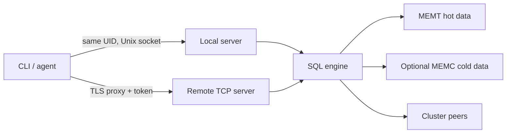

# Operations overview

Runtime guidance for exposing and maintaining a Probing endpoint. Usage workflows live in
the [User Guide](../guide/index.md); exact settings live in
[Environment Variables](../reference/env-vars.md).

## Operating model

The local and remote listeners have different trust boundaries. Local access is authorized
by operating-system peer credentials. TCP authentication is opt-in and transport encryption
must be provided by the deployment environment.

## Runbook index

| Task | Document |
|------|----------|
| Install and select an activation mode | [Installation](../installation.md) |
| Configure a remote endpoint and health checks | [Production deployment](deployment.md) |
| Define local, TCP, MCP, and eval access | [Security](security.md) |
| Diagnose connection, query, and data problems | [Troubleshooting](../guide/troubleshooting.md) |
| Tune storage and federation limits | [Environment variables](../reference/env-vars.md) |
| Understand partial cluster results | [Federated query engine](../design/federation.md) |

## Health model

| Endpoint | Meaning | Expected status |
|----------|---------|-----------------|
| `GET /health` | HTTP process is accepting requests | `200` with `{"status":"ok"}` |
| `GET /ready` | SQL engine initialization completed | `200` when ready; `503` while starting or failed |

Both endpoints are public on the TCP listener so load balancers can call them. A ready
endpoint does not prove that every collector has emitted rows or every cluster peer is alive.

## Failure semantics to monitor

- A cluster response marked `partial`, or listing failed nodes or dropped peer batches, is
  incomplete. Public HTTP query paths return status `503` while retaining the response body.
- `PROBING_FANOUT_STRICT=1` converts partial federation into a query failure.
- Reader-pinned memtable writes can be dropped after a bounded wait; see
  [Data Layer](../design/data-layer.md#single-writer-model).
- `/ready` reports engine initialization failure unless `PROBING_ENGINE_FAIL_FAST=1` makes
  the target process exit instead.

Use [Production deployment](deployment.md#deployment-checklist) as the minimum review before
exposing a remote endpoint.
