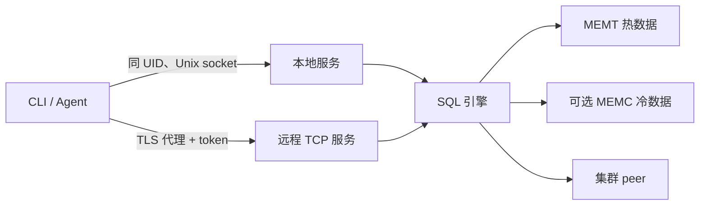

# 运维概览

本节说明如何暴露和维护 Probing endpoint。使用流程见[用户指南](../guide/index.zh.md)，
精确配置项见[环境变量](../reference/env-vars.zh.md)。

## 运行模型

本地 listener 与远程 listener 的信任边界不同：本地访问使用操作系统 peer credential
鉴权；TCP 认证需要显式启用，传输加密由部署环境提供。

## Runbook 索引

| 任务 | 文档 |
|------|------|
| 安装并选择启用方式 | [安装指南](../installation.zh.md) |
| 配置远程 endpoint 与健康检查 | [生产部署](deployment.zh.md) |
| 确定本地、TCP、MCP 与 eval 权限 | [安全](security.zh.md) |
| 排查连接、查询和数据问题 | [常见问题](../guide/troubleshooting.zh.md) |
| 调整存储与 federation 限制 | [环境变量](../reference/env-vars.zh.md) |
| 理解集群部分结果 | [联邦查询引擎](../design/federation.zh.md) |

## 健康模型

| Endpoint | 含义 | 预期状态 |
|----------|------|----------|
| `GET /health` | HTTP 进程可接收请求 | `200` 与 `{"status":"ok"}` |
| `GET /ready` | SQL 引擎初始化完成 | 就绪为 `200`；启动中或失败为 `503` |

两个 endpoint 在 TCP listener 上均为公开路径，供负载均衡器调用。ready 不代表每个采集器
都已有数据，也不代表所有集群 peer 都存活。

## 需要监控的失败语义

- 标记为 `partial`，或包含失败节点、丢弃 peer batch 的集群响应并不完整；公共 HTTP 查询
  路径返回 `503`，同时保留响应 body。
- `PROBING_FANOUT_STRICT=1` 会将 federation 部分结果转为查询失败。
- reader pin 超过有界等待后，memtable 写入可能被丢弃；见[数据层](../design/data-layer.zh.md)。
- `/ready` 会报告 engine 初始化失败；设置 `PROBING_ENGINE_FAIL_FAST=1` 后则退出目标进程。

远程暴露 endpoint 前，至少完成[生产部署检查清单](deployment.zh.md)。
