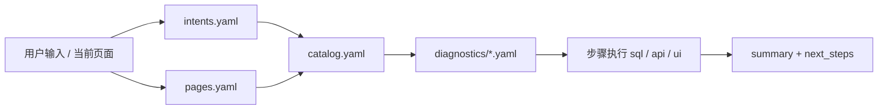

# Probing Playbooks

结构化诊断剧本（Playbook），供 **CLI**、**Python 工具链** 和 **Web Investigation Agent** 共用同一套 YAML。

## 目录结构

```
playbooks/
├── catalog.yaml                 # 索引：分类、优先级、关联表/页面
├── semantic/
│   ├── intents.yaml             # 用户说法 → playbook id（关键词路由）
│   ├── pages.yaml               # Web 页面 → 建议 playbook
│   └── tables.yaml              # 表/列语义，供 LLM grounding
└── diagnostics/
    ├── health_overview.yaml     # 7 个诊断 playbook 本体
    ├── training_hang.yaml
    └── ...
```

## 路由链路

用户输入或当前页面，按以下顺序收敛到具体 playbook：



| 层 | 文件 | 作用 |
|----|------|------|
| 意图 | `semantic/intents.yaml` | 中英文关键词 → 一个或多个 playbook id |
| 页面 | `semantic/pages.yaml` | 路由 id → 标题、描述、建议 playbook |
| 索引 | `catalog.yaml` | 优先级排序、分类、关联表、相关 playbook |
| 本体 | `diagnostics/*.yaml` | 参数、步骤、解读规则、总结模板 |

**Web Agent 路由（无 LLM 时）**

1. 显式指令：`/slow_rank`、`run slow_rank`
2. 关键词：`match_playbooks()` = intent 打分 + playbook `metadata.triggers.keywords`
3. 当前页面：`pages.yaml` 中的 `suggested_playbooks` 作为上下文提示

**有 LLM 时**：system prompt 注入 catalog + intents + 当前页面 snapshot，模型返回 JSON 选定 `playbook_id` 与参数。

## Playbook 格式（`apiVersion: probing.dev/v1`）

每个诊断文件包含两个顶层段：

| 段 | 内容 |
|----|------|
| `metadata` | id、标题、分类、tags、`triggers.keywords`、人类可读说明 |
| `spec` | 参数、前置条件、步骤、interpretation、summary、next_steps |

### 步骤类型

| `type` | 执行方式 | 用途 |
|--------|----------|------|
| `sql` | `POST /query` | 只读分析（主要手段） |
| `api` | HTTP GET/POST | 栈、火焰图、overview |
| `config` | `SET probing.*` | 开启采样后再查 |
| `eval` | `/apis/pythonext/eval` | 最后手段；Agent 需确认 |
| `ui` | 仅 Web | 导航、打开面板、设置调查上下文 |

### 参数与变量

步骤 SQL 使用 `{param}` 占位符，由 `spec.parameters` 默认值和运行时覆盖展开。

Runner 内置变量：

| 变量 | 含义 |
|------|------|
| `{pid}` | 目标进程 id |
| `{global_prefix}` | 集群 fan-out 时为 `global.`，否则空 |
| `{comm_table}` / `{table_comm}` | 单进程或 global collective 表 |
| `{step_recent}` | 最近 step 窗口子查询 |

### SQL 安全

- `sql` 步骤仅允许 `SELECT` / `WITH` / `SHOW` / `DESCRIBE`
- 无聚合时自动补 `LIMIT`
- Agent 模式下改采样的 `config` 步骤需 UI 确认

### Interpretation 规则

`spec.interpretation.rules` 提供**确定性**结论（与 LLM 叙述并行）：

```yaml
interpretation:
  rules:
    - id: straggler_ratio
      when: "step:rank_latency | column:avg_ms | max/min(ratio) > 1.5"
      severity: warning
      message: "最慢 rank 的平均 collective 延迟是中位数的 1.5 倍以上"
```

> Web Agent 与 CLI `probing doctor` 均执行 `interpretation.rules`（Rust + Python `interpret.py`）。

## 现有 Playbook 一览

| id | 分类 | 典型场景 |
|----|------|----------|
| `health_overview` | 分诊 | 不知道从哪查，一键健康检查 |
| `training_hang` | 可靠性 | 训练卡住、loss 不动 |
| `slow_rank` | 分布式 | straggler、某 rank 拖后腿 |
| `memory_leak` | 内存 | 显存阶梯上涨、OOM 前兆 |
| `module_bottleneck` | 性能 | 某 PyTorch 模块过慢 |
| `comm_bottleneck` | 分布式 | NCCL / collective 瓶颈 |
| `gpu_pressure` | 内存 | GPU 利用率与显存余量 |

完整元数据见 `catalog.yaml`；用户说法映射见 `semantic/intents.yaml`。

## 新增 Playbook

1. 新建 `diagnostics/my_playbook.yaml`
2. 在 `catalog.yaml` 的 `playbooks` 中注册（含 `priority`、`pages`、`tables`）
3. 如有新数据源，更新 `semantic/tables.yaml` 同义词
4. 如有常见用户说法，在 `semantic/intents.yaml` 增加 intent
5. 如在特定页面常用，更新 `semantic/pages.yaml`
6. Web：在 `web/src/agent/playbook.rs` 通过 `include_dir!` 自动嵌入 `playbooks/diagnostics/`（无需手写列表）
7. 校验：`python -m probing.playbooks validate`

## 消费者集成

### Python

```python
from probing.playbooks.loader import (
    load_catalog, load_playbook, match_playbooks,
    load_intents, load_pages, validate_all,
)
```

- `load_catalog()` — 按 priority 排序的索引
- `match_playbooks(query)` — intent + 关键词打分
- `validate_all()` — 占位符与 SQL 只读检查

### Web Agent

| 模块 | 职责 |
|------|------|
| `web/src/agent/routing.rs` | 嵌入 catalog / intents / pages YAML |
| `web/src/agent/cluster.rs` | 集群节点探测、`cluster_query` fan-out |
| `web/src/agent/playbook.rs` | 嵌入 diagnostics YAML，加载与匹配 |
| `web/src/agent/runner.rs` | 执行 sql / api / ui 步骤（`global.*` → cluster fan-out） |
| `web/src/agent/page_tools.rs` | 按路由拉 live snapshot 注入 LLM |
| `web/src/agent/llm.rs` | `async-openai` 选 playbook + 总结 |

**UI 入口**

- 浮层：**⌘J / Ctrl+J** 或 Agent 按钮（不挤占主内容，约 ⅓ 屏宽）
- 全页：侧边栏 **Agent** → `/agent`
- LLM：⚙ 设置 API（默认 DeepSeek）；未配置则纯关键词路由

**页面感知**：Agent 读取当前路由 + SQL/API snapshot（含 cluster 节点摘要），在 playbook 选择与总结中作为上下文；步骤结果以卡片展示（DataFrame、cluster fan-out 标注、跳转链接）。

**集群诊断**：

- 检测到多节点时自动 `use_global=true`（单机则 false）
- SQL 含 `global.*` 或步骤 `cluster: true` 时走 `/apis/cluster/query` fan-out
- 步骤卡片显示 `cluster fan-out · N nodes queried`

### CLI

```bash
# List playbooks
probing -t <pid> doctor list

# Run a playbook (sql + api steps; ui steps skipped)
probing -t <pid> doctor run health_overview
probing -t <pid> doctor run slow_rank --set step_window=30 --global
```

与 Web 共用 YAML；执行 `sql` / `api` / `config` 步骤（`ui` 仅在 Web 中运行）。`interpretation.rules` 在终端以 `[SEVERITY]` 行输出。

## 设计原则

1. **Playbook 优先于自由 SQL** — LLM 选剧本填参数，而非从零写查询
2. **证据链** — 每步具名输出，写入 `summary_template`
3. **优雅降级** — `requires` + `on_empty: skip|warn|abort`
4. **同一 YAML，多消费者** — CLI/Python 跑 sql/api/config；Web 额外跑 `ui`
